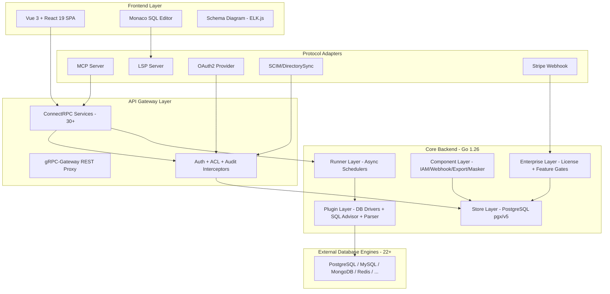

# Software Requirements Specification (SRS)
# Bytebase — Database CI/CD for DevOps Teams

| Metadata       | Value                                    |
|----------------|------------------------------------------|
| Product Name   | Bytebase                                 |
| Document Date  | 2026-05-08                               |
| Source         | Source code analysis                      |

---

## 1. Giới thiệu

### 1.1 Mục đích
Tài liệu SRS mô tả chi tiết yêu cầu phần mềm cho Bytebase — nền tảng Database CI/CD mã nguồn mở, được CNCF Landscape công nhận. Tài liệu phục vụ làm cơ sở cho thiết kế, triển khai và kiểm thử hệ thống.

### 1.2 Phạm vi
Bytebase cung cấp workspace cộng tác dựa trên web để quản lý vòng đời schema database, bao gồm: schema migration, SQL review, SQL editor, data masking, audit logging, và tích hợp CI/CD. Hỗ trợ 22+ database engines.

### 1.3 Thuật ngữ

| Thuật ngữ    | Định nghĩa                                                        |
|-------------|---------------------------------------------------------------------|
| Issue       | Đơn vị công việc thay đổi database (chứa Plan + Rollout)           |
| Plan        | Kế hoạch thay đổi schema, bao gồm SQL statements                   |
| Rollout     | Quá trình triển khai Plan qua các stages/tasks                      |
| Task        | Đơn vị thực thi nhỏ nhất (CREATE, MIGRATE, EXPORT)                 |
| TaskRun     | Một lần chạy cụ thể của Task                                       |
| PlanCheck   | Kiểm tra tự động trước deployment (SQL review, lint)                |
| Sheet       | SQL script được lưu trữ (worksheet)                                 |
| Instance    | Một database server (connection endpoint)                           |
| Environment | Môi trường triển khai (dev, staging, production)                    |
| Project     | Đơn vị tổ chức chứa databases, issues, members                     |

---

## 2. Kiến trúc hệ thống

### 2.1 Tổng quan kiến trúc



### 2.2 Thành phần Backend

| Package                    | Chức năng                                           | Files chính                        |
|----------------------------|-----------------------------------------------------|-------------------------------------|
| `backend/server/`          | HTTP server (Echo v5 + H2C)                         | `server.go`, `grpc_routes.go`      |
| `backend/api/v1/`          | 30+ gRPC service implementations                   | `*_service.go` (79 files)          |
| `backend/api/auth/`        | Authentication interceptor                          | JWT + Cookie + OAuth2              |
| `backend/api/mcp/`         | Model Context Protocol server                       | AI agent integration               |
| `backend/api/lsp/`         | Language Server Protocol                             | SQL auto-complete, diagnostics     |
| `backend/api/oauth2/`      | OAuth2 authorization server                          | Authorization code flow            |
| `backend/store/`           | Data access layer (PostgreSQL)                      | 74 files, composite PK support     |
| `backend/runner/`          | Async background runners                            | 8 runners (see §2.3)              |
| `backend/component/`       | Shared components                                    | 12 components (see §2.4)          |
| `backend/plugin/db/`       | Database driver plugins                              | 22 engine directories              |
| `backend/plugin/advisor/`  | SQL review/lint engine                               | 9 engine-specific rule sets        |
| `backend/plugin/parser/`   | SQL parser (ANTLR v4)                                | Per-engine parsers                 |
| `backend/plugin/idp/`      | Identity Provider plugins                            | OIDC, SAML, LDAP                   |
| `backend/enterprise/`      | License & feature gate management                   | `license.go`, `plan.yaml`         |
| `backend/migrator/`        | Self-migration cho Bytebase metadata DB              | `migrator.go`, `LATEST.sql`       |

### 2.3 Background Runners

| Runner               | Chức năng                                      | Trigger                    |
|----------------------|------------------------------------------------|----------------------------|
| `taskrun.Scheduler`  | Thực thi database tasks (CREATE, MIGRATE, EXPORT) | Bus events, polling       |
| `plancheck.Scheduler`| Chạy pre-deployment checks (SQL lint)          | Plan creation/update       |
| `schemasync.Syncer`  | Đồng bộ schema metadata từ instances           | Periodic, on-demand        |
| `approval.Runner`    | Xử lý luồng phê duyệt tự động                 | Issue state changes        |
| `notifylistener.Listener` | PostgreSQL LISTEN/NOTIFY cho real-time events | PG notifications      |
| `cleaner.DataCleaner`| Dọn dẹp dữ liệu hết hạn                      | Periodic                   |
| `heartbeat.Runner`   | Health check cho replica instances              | Periodic                   |
| `monitor.MemoryMonitor` | Giám sát memory usage                       | Periodic                   |

### 2.4 Component Layer

| Component        | Chức năng                                        |
|-----------------|---------------------------------------------------|
| `iam`           | IAM Manager — RBAC + CEL-based policy evaluation  |
| `webhook`       | Webhook Manager — IM notifications                |
| `dbfactory`     | Database connection factory                        |
| `export`        | Data export (CSV, Excel, JSON)                     |
| `masker`        | Data masking engine                                |
| `sheet`         | Sheet/Worksheet management                         |
| `secret`        | External secret manager integration                |
| `config`        | Server profile & configuration                     |
| `bus`           | Internal message bus (pub/sub)                     |
| `telemetry`     | Telemetry & metrics collection                     |
| `sampleinstance`| Sample database instances for demo                 |
| `ghost`         | gh-ost integration for online schema change        |

---

## 3. Yêu cầu chức năng chi tiết

### 3.1 FR-01: Instance Management Service

**Source**: `backend/api/v1/instance_service.go` (43,007 bytes), `proto/v1/v1/instance_service.proto`

| Operation              | Method                      | Mô tả                                    |
|------------------------|-----------------------------|-------------------------------------------|
| CreateInstance         | POST /v1/instances          | Tạo database instance mới                 |
| GetInstance            | GET /v1/instances/{id}      | Lấy thông tin instance                    |
| ListInstances          | GET /v1/instances           | Liệt kê instances (filter, pagination)    |
| UpdateInstance         | PATCH /v1/instances/{id}    | Cập nhật instance config                  |
| DeleteInstance         | DELETE /v1/instances/{id}   | Xóa instance                              |
| SyncInstance           | POST /v1/instances/{id}:sync | Đồng bộ metadata từ remote               |
| BatchSyncInstances     | POST /v1/instances:batchSync | Đồng bộ hàng loạt                        |
| AddDataSource          | POST /v1/instances/{id}/dataSources | Thêm data source              |
| TestConnectionForInstance | POST /v1/instances:testConnection | Kiểm tra kết nối            |

**Hỗ trợ kết nối**: SSL/TLS, SSH Tunnel, IAM Authentication (GCP/AWS), Read-only connections.

### 3.2 FR-02: Issue/Plan/Rollout Pipeline

**Source**: `backend/api/v1/issue_service.go`, `plan_service.go`, `rollout_service.go`

**Luồng xử lý**:
```
CreatePlan → CreateIssue → PlanCheck (auto) → Approve → CreateRollout → TaskRun
```

| Service          | Operations chính                                       |
|-----------------|--------------------------------------------------------|
| PlanService     | Create, Get, List, Update, Search plans                 |
| IssueService    | Create, Get, List, Update, Search, Approve, Reject      |
| RolloutService  | Create, Get, List, Preview, BatchRun, BatchCancel tasks  |

**Task Types** (from `storepb.Task`):
- `DATABASE_CREATE` — Tạo database mới
- `DATABASE_MIGRATE` — Thực thi migration (DDL/DML)
- `DATABASE_EXPORT` — Export data

### 3.3 FR-03: SQL Service

**Source**: `backend/api/v1/sql_service.go` (64,362 bytes)

| Operation        | Mô tả                                              |
|-----------------|-----------------------------------------------------|
| Query           | Thực thi SELECT query với masking                   |
| AdminExecute    | Execute query ở admin mode (WebSocket streaming)    |
| Export          | Export query results                                 |
| Check           | SQL review/lint check                                |
| Parse           | Parse SQL thành AST                                  |
| Differize       | Tính diff giữa 2 SQL statements                    |
| Pretty          | Format SQL                                           |
| StringifyMetadata | Chuyển schema metadata thành DDL                  |

**AI Features** (`sql_service_ai.go`):
- Natural Language → SQL translation
- Query explanation
- Query optimization suggestions

### 3.4 FR-04: Authentication & Authorization

**Source**: `backend/api/v1/auth_service.go` (77,936 bytes)

| Operation         | Mô tả                                             |
|------------------|----------------------------------------------------|
| Login            | Email/password login → JWT + refresh token          |
| Logout           | Invalidate session                                  |
| CreateUser       | User registration                                   |
| GetUser/ListUsers| User management                                    |
| UpdateUser       | Update profile, password, MFA settings              |

**Authentication Methods**:
- Email/Password (bcrypt/argon2)
- OAuth2/OIDC (Google, GitHub, GitLab, custom)
- SAML 2.0
- LDAP
- Service Account (API key)
- Workload Identity (OIDC federation)
- Two-Factor (TOTP via pquerna/otp)

**Authorization** (`backend/component/iam/`, `backend/api/v1/acl.go`):
- Workspace-level roles: Owner, DBA, Developer
- Project-level roles: Owner, Developer, Querier, Exporter, Viewer
- Custom roles (Enterprise)
- CEL-based policy expressions
- Predefined role definitions (`backend/store/predefined_roles.go`)

### 3.5 FR-05: SQL Review Engine

**Source**: `backend/plugin/advisor/`

| Component              | Mô tả                                           |
|-----------------------|--------------------------------------------------|
| `advisor.go`          | Core advisor interface                            |
| `sql_review.go`       | SQL review orchestrator                           |
| `builtin_rules.go`    | Built-in rule definitions                         |
| `pg/`, `mysql/`, etc. | Engine-specific rule implementations              |

**Supported engines**: PostgreSQL, MySQL, TiDB, Oracle, MSSQL, Snowflake, OceanBase, Redshift

**Rule categories** (200+ rules): Naming convention, Statement type, Table design, Column type, Index, Performance, Security, Compatibility.

### 3.6 FR-06: Data Masking

**Source**: `backend/api/v1/masking_evaluator.go`, `document_masking.go`, `query_result_masker.go`

| Capability                | Mô tả                                          |
|--------------------------|-------------------------------------------------|
| Column-level masking     | Masking rules per column, per database           |
| Masking algorithms       | Full, Partial, Hash, Range, Custom               |
| Access grants            | Users can request unmask access                  |
| Classification-based     | Auto-masking based on data classification        |
| Document masking         | Masking for NoSQL documents (MongoDB, CosmosDB)  |

### 3.7 FR-07: Database Driver Plugin Interface

**Source**: `backend/plugin/db/driver.go`

```go
type Driver interface {
    Open(ctx, dbType, config) (Driver, error)
    Close(ctx) error
    Ping(ctx) error
    GetDB() *sql.DB
    Execute(ctx, statement, opts) (int64, error)
    QueryConn(ctx, conn, statement, queryContext) ([]*QueryResult, error)
    SyncInstance(ctx) (*InstanceMetadata, error)
    SyncDBSchema(ctx) (*DatabaseSchemaMetadata, error)
    Dump(ctx, out, dbMetadata) error
}
```

**22 Driver implementations**: PostgreSQL, MySQL, TiDB, ClickHouse, MongoDB, Redis, Snowflake, Oracle, SQL Server, Spanner, BigQuery, CockroachDB, CosmosDB, DynamoDB, Elasticsearch, Hive, Databricks, Trino, StarRocks, SQLite, Cassandra, Redshift.

### 3.8 FR-08: Project & Workspace Management

| Service             | Operations                                         |
|--------------------|-----------------------------------------------------|
| ProjectService     | CRUD projects, manage members, webhooks, VCS         |
| WorkspaceService   | Workspace settings, branding, announcements          |
| EnvironmentService | Environment ordering, tiers, policies               |
| DatabaseService    | Database metadata, changelog, schema, catalog        |
| DatabaseGroupService | Logical grouping of databases                     |

### 3.9 FR-09: Audit & Monitoring

| Component            | Mô tả                                            |
|---------------------|---------------------------------------------------|
| AuditInterceptor    | Auto-capture tất cả gRPC calls                    |
| AuditLogService     | Query, filter, export audit logs                   |
| Actuator Service    | Server health, version, debug info                 |
| Telemetry           | Anonymous usage metrics (opt-out available)         |
| Prometheus metrics  | `prometheus/client_golang` integration             |

---

## 4. API Specification

### 4.1 Protobuf Service Definitions

30+ services defined in `proto/v1/v1/`:

| Proto File                        | Service                    | RPCs |
|-----------------------------------|----------------------------|------|
| `instance_service.proto`          | InstanceService            | 10+  |
| `database_service.proto`          | DatabaseService            | 15+  |
| `issue_service.proto`             | IssueService               | 8+   |
| `plan_service.proto`              | PlanService                | 6+   |
| `rollout_service.proto`           | RolloutService             | 10+  |
| `sql_service.proto`               | SQLService                 | 8+   |
| `auth_service.proto`              | AuthService                | 6+   |
| `project_service.proto`           | ProjectService             | 10+  |
| `setting_service.proto`           | SettingService             | 4+   |
| `user_service.proto`              | UserService                | 6+   |
| `sheet_service.proto`             | SheetService               | 4+   |
| `worksheet_service.proto`         | WorksheetService           | 6+   |
| `review_config_service.proto`     | ReviewConfigService        | 4+   |
| `release_service.proto`           | ReleaseService             | 4+   |
| `org_policy_service.proto`        | OrgPolicyService           | 6+   |
| `access_grant_service.proto`      | AccessGrantService         | 4+   |
| `audit_log_service.proto`         | AuditLogService            | 2+   |
| `group_service.proto`             | GroupService               | 5+   |
| `role_service.proto`              | RoleService                | 4+   |
| `idp_service.proto`               | IdentityProviderService    | 5+   |
| `subscription_service.proto`      | SubscriptionService        | 3+   |
| `ai_service.proto`                | AIService                  | 2+   |
| `workspace_service.proto`         | WorkspaceService           | 3+   |
| `workload_identity_service.proto` | WorkloadIdentityService    | 4+   |
| `service_account_service.proto`   | ServiceAccountService      | 4+   |

### 4.2 API Transport

| Protocol    | Endpoint     | Use Case                            |
|-------------|-------------|--------------------------------------|
| ConnectRPC  | `/bytebase.v1.*` | Primary API (HTTP/2 + HTTP/1.1) |
| REST        | `/v1/*`      | REST gateway (auto-generated)        |
| WebSocket   | `/v1:adminExecute` | Streaming SQL execution        |
| gRPC Reflection | Standard | Service discovery                   |

### 4.3 Authentication Flow

```
Request → Auth Interceptor
  ├── Extract token (Authorization header / Cookie)
  ├── Validate JWT signature (HMAC-SHA256)
  ├── Check token expiry
  ├── Load user from store
  └── Set context (user, workspace)
       → ACL Interceptor
            ├── Resolve resource permissions
            ├── Evaluate IAM policies (CEL)
            └── Allow / Deny
                 → Audit Interceptor
                      └── Log request + response metadata
                           → Service Handler
```

---

## 5. Data Model

### 5.1 Core Entities (from `backend/store/`)

| Entity                | Table               | Key Fields                           |
|----------------------|---------------------|--------------------------------------|
| Workspace            | `workspace`         | id, resource_id, title               |
| Project              | `project`           | id, resource_id, title, workflow     |
| Environment          | `environment`       | id, resource_id, title, order        |
| Instance             | `instance`          | id, resource_id, engine, host, port  |
| Database             | `database`          | id, project, instance, name          |
| Issue                | `issue`             | project+id, plan, status, assignee   |
| Plan                 | `plan`              | project+id, config (JSONB)           |
| Task                 | `task`              | project+id, type, status, payload    |
| TaskRun              | `task_run`          | project+id, status, result           |
| PlanCheckRun         | `plan_check_run`    | project+id, type, status, result     |
| Sheet                | `sheet`             | id, creator, statement               |
| Principal/User       | `principal`         | id, email, type, mfa_config          |
| Role                 | `role`              | id, resource_id, permissions         |
| Policy               | `policy`            | id, type, resource, payload          |
| AuditLog             | `audit_log`         | id, action, user, resource, time     |
| Setting              | `setting`           | name, value (JSONB)                  |

### 5.2 Composite Primary Keys

Nhiều bảng sử dụng composite PK `(project, id)` để hỗ trợ multi-tenancy:
- `plan`, `issue`, `task`, `task_run`, `plan_check_run`, `release`, `db_group`

> **Quan trọng**: Mọi WHERE/JOIN/DELETE phải bao gồm TẤT CẢ cột PK.

### 5.3 JSONB Storage Pattern

Các cột JSONB lưu trữ protobuf JSON (camelCase keys via `protojson.Marshal`):
- `plan.config` → Plan configuration
- `task.payload` → Task-specific payload
- `task_run.result` → Execution result
- `policy.payload` → Policy rules
- `setting.value` → Setting values

---

## 6. Yêu cầu phi chức năng

### 6.1 Performance

| Metric                         | Target             | Implementation                       |
|--------------------------------|--------------------|---------------------------------------|
| API response (p99)             | < 500ms            | Connection pooling (pgx), caching     |
| SQL query timeout              | Configurable       | `durationpb.Duration` per query       |
| Max concurrent tasks           | 50+                | Goroutine-based scheduler             |
| REST max response              | 100MB              | gRPC `MaxCallRecvMsgSize`             |
| Graceful shutdown              | 10 seconds         | `gracefulShutdownPeriod` constant     |

### 6.2 Security

| Requirement                    | Implementation                                    |
|--------------------------------|---------------------------------------------------|
| Authentication                 | JWT (HS256) + refresh token + secure cookies      |
| Authorization                  | CEL-based IAM + predefined roles                  |
| Data at rest                   | PostgreSQL encryption + external secret managers  |
| Data in transit                | H2C (HTTP/2 cleartext), TLS for DB connections    |
| CSP                            | Custom Vite plugin for CSP hash generation        |
| Input validation               | protovalidate interceptor on all RPCs             |
| Panic recovery                 | ConnectRPC `WithRecover` handler                  |

### 6.3 Reliability

| Requirement                    | Implementation                                    |
|--------------------------------|---------------------------------------------------|
| HA mode                        | External PostgreSQL + multiple server replicas    |
| Advisory locks                 | PostgreSQL advisory locks for distributed locking |
| Self-migration                 | Automatic schema migration on startup             |
| Error handling                 | Structured errors with gRPC status codes          |
| Health monitoring              | Actuator service + memory monitor                 |

### 6.4 Scalability

| Dimension                      | Strategy                                          |
|--------------------------------|---------------------------------------------------|
| Database engines               | Plugin driver pattern (register/open)             |
| SQL review rules               | Per-engine advisor plugins                        |
| API surface                    | Protobuf-first, auto-generated REST + SDK         |
| Identity providers             | Plugin-based IDP (OIDC/SAML/LDAP)                |

---

## 7. Deployment Requirements

### 7.1 System Requirements

| Component          | Minimum                  | Recommended                |
|-------------------|--------------------------|----------------------------|
| CPU               | 2 cores                  | 4+ cores                   |
| Memory            | 4GB RAM                  | 8GB+ RAM                   |
| Storage           | 10GB                     | 50GB+ (SSD)                |
| PostgreSQL        | 14+ (embedded or external)| 16+ external for HA       |
| Network           | Outbound HTTPS           | + access to database instances |

### 7.2 Environment Variables

| Variable            | Mô tả                                          | Required |
|--------------------|--------------------------------------------------|----------|
| `PG_URL`           | PostgreSQL connection string                      | HA mode  |
| `PORT`             | Server port (default: 8080)                       | No       |
| `DATA_DIR`         | Data directory path                               | No       |
| `DEBUG`            | Enable debug mode                                 | No       |

### 7.3 Docker Deployment

```bash
docker run --init \
  --name bytebase \
  --publish 8080:8080 \
  --volume ~/.bytebase/data:/var/opt/bytebase \
  bytebase/bytebase:latest
```

### 7.4 Kubernetes Deployment

```bash
helm install bytebase bytebase/bytebase
```

---

## 8. Testing Requirements

### 8.1 Backend Testing

| Type                | Tool/Framework        | Location                        |
|--------------------|-----------------------|---------------------------------|
| Unit tests         | Go `testing`          | `*_test.go` throughout backend  |
| Integration tests  | testcontainers-go     | `backend/tests/`                |
| Collision tests    | Custom fixture        | `backend/tests/` (composite PK) |
| Lint               | golangci-lint         | `.golangci.yaml`                |

### 8.2 Frontend Testing

| Type                | Tool/Framework        | Location                        |
|--------------------|-----------------------|---------------------------------|
| Unit tests         | Vitest                | `frontend/tests/`               |
| E2E tests          | Playwright            | `frontend/tests/`               |
| Type checking      | vue-tsc + tsc         | `tsconfig.*.json`               |
| Lint               | ESLint + Biome        | `biome.json`, `eslint.config.mjs`|

### 8.3 Proto Validation

| Tool   | Config         | Commands                     |
|--------|---------------|-------------------------------|
| buf    | `buf.yaml`    | `buf lint proto`, `buf format -w proto` |

---

## 9. Traceability Matrix

| SRS Requirement | PRD Feature  | URD Requirement | Proto Service              | Implementation                           |
|-----------------|-------------|-----------------|----------------------------|------------------------------------------|
| FR-01           | DCM-01~13   | UR-D01~D12      | Instance/Database/Rollout  | `instance_service.go`, `rollout_service.go` |
| FR-02           | DCM-01      | UR-V01          | Plan/Issue/Rollout         | `plan_service.go`, `issue_service.go`    |
| FR-03           | SQL-01~15   | UR-V02~V12      | SQLService                 | `sql_service.go`                         |
| FR-04           | SEC-01~21   | UR-S01~S15      | Auth/Role/Workspace        | `auth_service.go`, `acl.go`             |
| FR-05           | DCM-06      | UR-D04          | ReviewConfig               | `backend/plugin/advisor/`               |
| FR-06           | SEC-15~16   | UR-S02          | DatabaseCatalog/OrgPolicy  | `masking_evaluator.go`                  |
| FR-07           | —           | UR-D01          | Instance                   | `backend/plugin/db/driver.go`           |
| FR-08           | ADM-01~12   | UR-P01~P11      | Project/Workspace/Setting  | `project_service.go`                    |
| FR-09           | SEC-07,10   | UR-S03          | AuditLog/Actuator          | `audit.go`, `actuator_service.go`       |

---

> **Document generated**: 2026-05-08 — Based on source code analysis of Bytebase repository.
