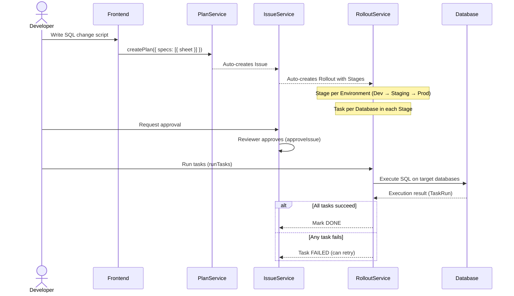
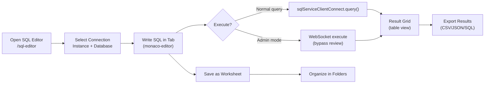
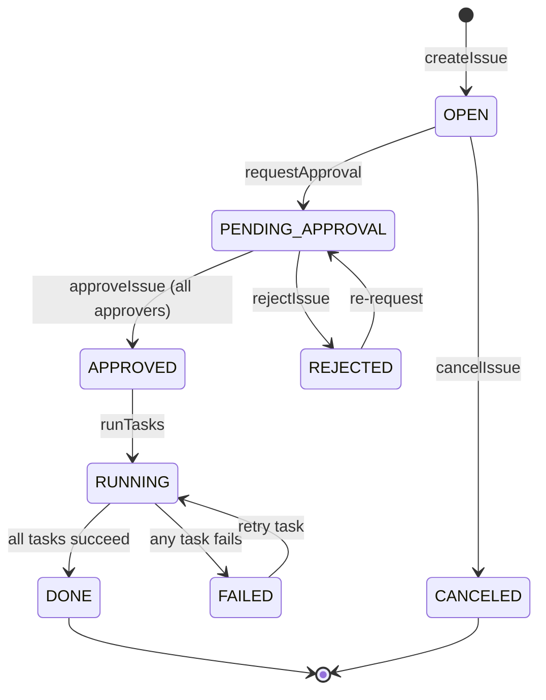
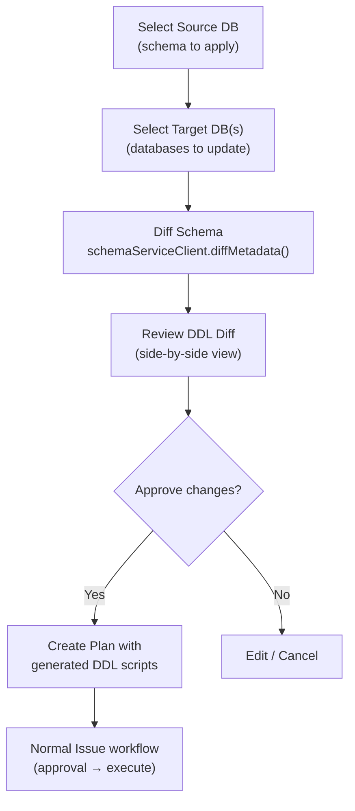
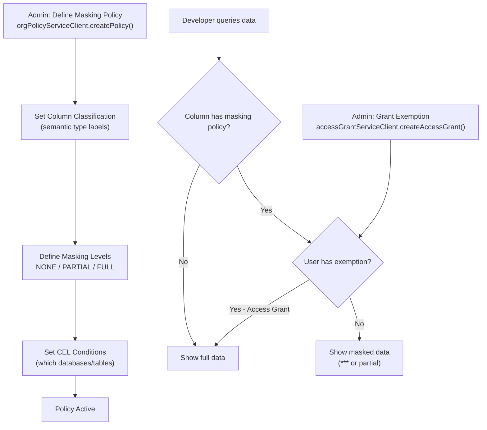
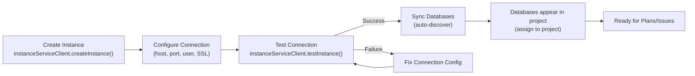

# Business Workflow Diagrams

---

## 1. Database Change Workflow (Plan → Issue → Rollout)

This is the primary workflow — most features revolve around this flow.

---

## 2. SQL Editor Workflow

---

## 3. Approval Workflow

### Approval Rules
- Approval templates define required approver roles per environment
- Each approval step can require: `PROJECT_OWNER`, `DBA`, or custom role
- Approval is per-Issue, not per-Task
- `APPROVED` status unblocks `runTasks`

---

## 4. Schema Sync Workflow

---

## 5. Data Masking Workflow

---

## 6. Instance Connection Lifecycle

