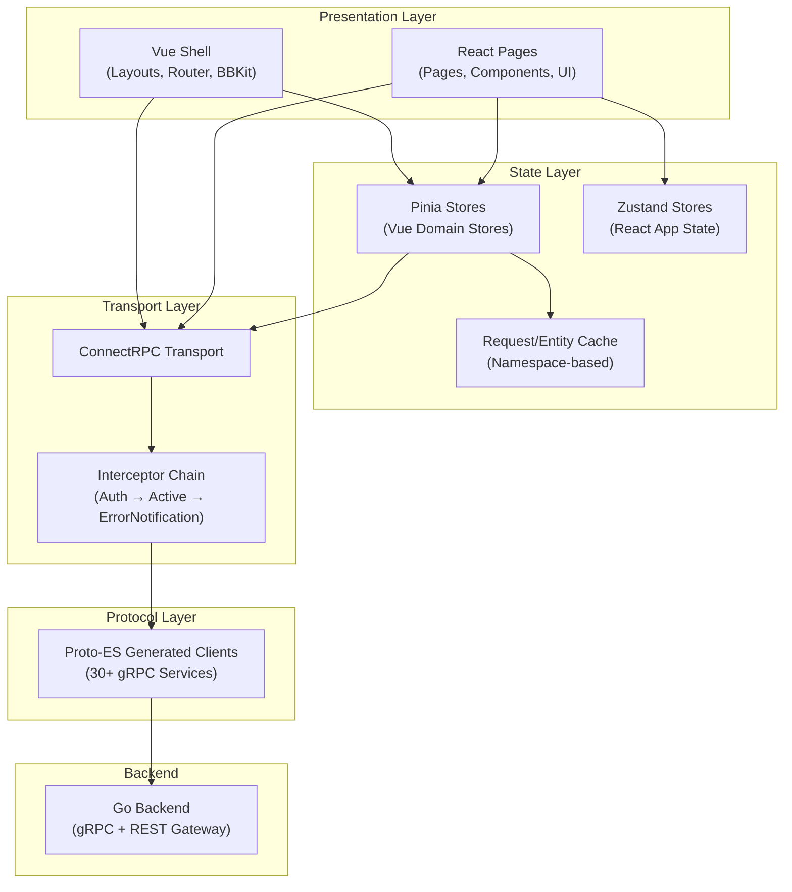
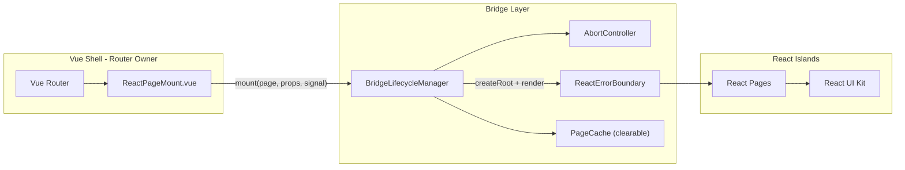
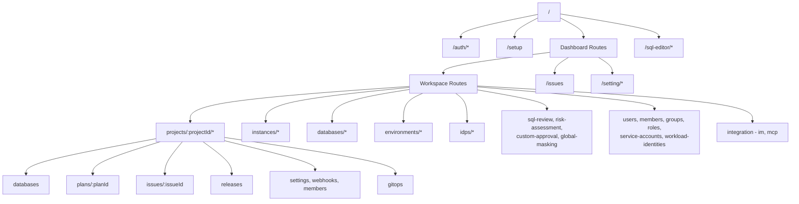
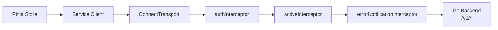
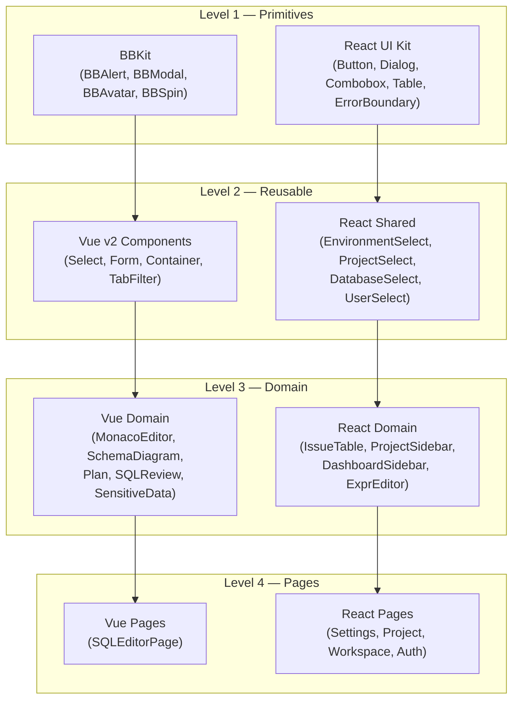
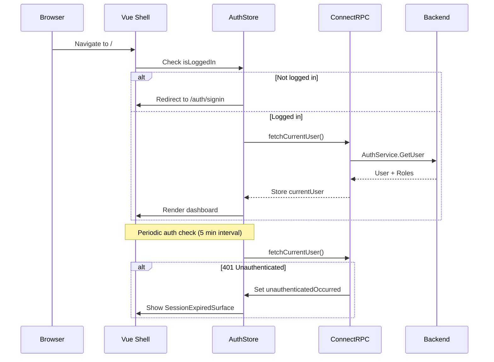

# Bytebase Frontend — Architecture Document

> **Version**: 2.0.0  
> **Date**: 2026-05-14  
> **Scope**: Toàn bộ mã nguồn frontend tại `vnp-bytebase/frontend/`

---

## 1. Tổng quan (Overview)

Bytebase Frontend là một **Single Page Application (SPA)** phục vụ giao diện quản trị cơ sở dữ liệu doanh nghiệp. Ứng dụng sử dụng kiến trúc **hybrid dual-framework** — Vue 3 làm shell chính và React 19 cho các trang mới — cho phép migration dần dần mà không gây regression.

### 1.1 Technology Stack

| Layer | Technology | Version |
|---|---|---|
| **Build** | Vite | 7.3.2 |
| **Framework (Shell)** | Vue 3 (Composition API) | 3.5.29 |
| **Framework (New Pages)** | React 19 | 19.2.4 |
| **State (Vue)** | Pinia | 3.0.4 |
| **State (React)** | Zustand | 5.0.12 |
| **Routing** | Vue Router 4 | 4.6.4 |
| **UI Components (Vue)** | Naive UI | 2.44.1 |
| **UI Components (React)** | Custom (shadcn-inspired) | — |
| **Styling** | TailwindCSS 4 | 4.2.1 |
| **API Transport** | ConnectRPC (gRPC-Web) | 2.1.1 |
| **Protocol Buffers** | @bufbuild/protobuf | 2.11.0 |
| **i18n (Vue)** | vue-i18n | 11.2.8 |
| **i18n (React)** | i18next + react-i18next | 25.x / 16.x |
| **Code Editor** | Monaco Editor (VSCode API) | 30.0.0 |
| **Testing** | Vitest + Playwright | 4.0.18 / 1.59.1 |
| **Linting** | ESLint + Biome | 10.x / 2.4.6 |
| **Language** | TypeScript | 6.0.2 |

---

## 2. Kiến trúc tầng (Layered Architecture)



### 2.1 Các tầng chi tiết

| Tầng | Thư mục | Trách nhiệm |
|---|---|---|
| **Presentation** | `src/views/`, `src/react/pages/`, `src/components/`, `src/react/components/` | Render UI, handle user interactions, layout orchestration |
| **State** | `src/store/`, `src/react/stores/` | Domain state management, entity caching, request deduplication |
| **Transport** | `src/connect/` | API client creation, interceptor chain, token refresh |
| **Protocol** | `src/types/proto-es/` | Auto-generated TypeScript classes từ `.proto` definitions |
| **Utilities** | `src/utils/`, `src/composables/`, `src/react/hooks/` | Cross-cutting concerns: datetime, CEL, permissions, storage |

---

## 3. Cấu trúc thư mục (Directory Structure)

```
frontend/
├── src/
│   ├── main.ts                 # Vue entry point
│   ├── App.vue                 # Root Vue component
│   ├── AuthContext.vue         # Auth wrapper (session check, MFA enforcement)
│   ├── NotificationContext.vue # Global notification provider
│   │
│   ├── auth/                   # Token management (JWT Bearer, standalone mode)
│   ├── bbkit/                  # Legacy Vue UI primitives (BBAlert, BBModal, BBAvatar…)
│   ├── components/             # Vue domain components
│   │   ├── v2/                 # Reusable Vue form/select components
│   │   ├── MonacoEditor/       # SQL editor Monaco integration
│   │   ├── Plan/               # Plan/Rollout management
│   │   ├── SchemaDiagram/      # ER diagram visualization
│   │   └── ...
│   │
│   ├── composables/            # Vue Composition API hooks
│   ├── config/                 # Environment configuration
│   ├── connect/                # ConnectRPC transport + interceptors
│   │   ├── index.ts            # 30+ service client singletons
│   │   ├── methods.ts          # Audit method registry
│   │   ├── middlewares/        # Auth, Active, Error interceptors
│   │   └── refreshToken.ts     # Cross-tab token refresh (Web Locks API)
│   │
│   ├── layouts/                # Layout components
│   │   ├── DashboardLayout.vue # Top-level frame (banners + body)
│   │   ├── BodyLayout.vue      # Main body (sidebar + content + quickstart)
│   │   └── SQLEditorLayout.vue # Full-screen SQL editor layout
│   │
│   ├── locales/                # i18n translation files (en, zh, ja, es, vi)
│   ├── plugins/                # Vue plugins (i18n, dayjs, highlight, naive-ui, AI)
│   │   └── ai/                 # AI-assisted SQL generation plugin
│   │
│   ├── react/                  # React sub-application
│   │   ├── main.tsx            # Standalone React entry (token mode)
│   │   ├── mount.ts            # Vue→React bridge (lazy mount)
│   │   ├── ReactPageMount.vue  # Vue wrapper for React pages
│   │   ├── components/         # React shared components (67+ TSX files)
│   │   │   ├── ui/             # Primitive UI kit (42 components)
│   │   │   ├── sql-editor/     # SQL editor React components
│   │   │   └── ...
│   │   ├── hooks/              # React custom hooks
│   │   ├── layouts/            # React layout (RootLayout)
│   │   ├── pages/              # React page components
│   │   │   ├── settings/       # 35+ workspace setting pages
│   │   │   ├── project/        # 30+ project-scoped pages
│   │   │   ├── workspace/      # Landing, 403, 404
│   │   │   └── auth/           # Signin, Signup, OAuth, 2FA, Password
│   │   ├── plugins/            # React plugins (AI agent)
│   │   ├── router/             # React Router (standalone mode)
│   │   └── stores/             # Zustand stores
│   │
│   ├── router/                 # Vue Router configuration
│   │   ├── index.ts            # Router instance + navigation guards
│   │   ├── auth.ts             # Auth routes (signin, signup, oauth, oidc)
│   │   ├── sqlEditor.ts        # SQL Editor routes
│   │   └── dashboard/          # Dashboard route tree
│   │       ├── workspace.ts    # Workspace-level routes
│   │       ├── projectV1.ts    # Project-scoped routes (30+ routes)
│   │       ├── workspaceSetting.ts  # Settings routes
│   │       └── instance.ts     # Instance routes
│   │
│   ├── store/                  # Pinia state management
│   │   ├── index.ts            # Pinia instance + re-exports
│   │   ├── cache.ts            # Generic request/entity cache
│   │   └── modules/
│   │       ├── v1/             # 33 domain stores (database, project, instance…)
│   │       └── sqlEditor/      # SQL editor state (tabs, worksheets, tree)
│   │
│   ├── types/                  # TypeScript type definitions
│   │   ├── proto-es/           # Generated Protobuf types
│   │   ├── iam/                # IAM permission types
│   │   └── sqlEditor/          # SQL editor domain types
│   │
│   ├── utils/                  # Utility functions
│   │   ├── v1/                 # V1 API utilities
│   │   ├── iam/                # Permission checking
│   │   ├── issue/              # Issue lifecycle helpers
│   │   ├── schemaEditor/       # Schema change utilities
│   │   └── web-storage.ts      # PouchDB-based persistent storage
│   │
│   └── views/                  # Vue view components
│       └── sql-editor/         # SQL Editor (Vue, primary view)
│
├── tests/                      # E2E tests (Playwright)
├── scripts/                    # Build & maintenance scripts
├── public/                     # Static assets
└── patches/                    # npm package patches
```

---

## 4. Kiến trúc Hybrid Vue + React

### 4.1 Bridge Pattern

Ứng dụng triển khai mô hình **Vue Shell + React Islands** thông qua `BridgeLifecycleManager` — một lớp quản lý vòng đời React root có hỗ trợ cancellation, type-safe props, error boundary, và automatic cleanup:



**Quy trình mount (với render versioning):**

1. Vue Router resolve route → load `ReactPageMount.vue`
2. `ReactPageMount.vue` gọi `BridgeLifecycleManager.mount(container, page, signal)`
3. Manager sử dụng `import.meta.glob()` để lazy-load React component
4. React component được render với `StrictMode` + `ReactErrorBoundary` + `I18nextProvider`

**Mount Safety** (SOL-LIM-001, SOL-WEAK-001): `ReactPageMount.vue` sử dụng render versioning (generation counter) để đảm bảo:
- Chỉ render mới nhất được apply, các render cũ tự abort sau mỗi yield point.
- Props được snapshot đồng bộ trước khi bắt đầu async operations.
- DOM container connectivity được verify qua `isConnected` API.
- `AbortController` lifecycle đảm bảo cleanup khi Vue unmount hoặc navigation thay đổi.

### 4.2 State Sharing

| Chiều | Cơ chế |
|---|---|
| Vue → React | Props truyền qua `ReactPageMount.vue`, `useVueState` hook (deep by default) |
| React → Vue | Typed `ShellBridge` pub/sub (thay thế raw `CustomEvent<unknown>`) |
| Shared State | Pinia stores là **single source of truth** cho domain data, React access qua `useVueState` |
| React-only State | Zustand stores chỉ cho React-specific UI state (panels, selections) |

> Xem chi tiết: `specs/v1/weakness/solutions/SOL-WEAK-004-unified-state-bridge.md`

### 4.3 Migration Roadmap (React-First)

| Phase | Mục tiêu | Điều kiện hoàn thành |
|---|---|---|
| Phase 1 | AI Context Codification | `.ai-context/` directory với context files |
| Phase 2 | Eliminate `useVueState` via Zustand migration | `useVueState` calls < 10 |
| Phase 3 | Vue Shell → React Router v7 | Vue-only pages < 20% |
| Phase 4 | Full React SPA | Vue files = 0, Pinia removed |

> **Quy tắc nghiêm cấm**: Không tạo Vue component mới (trừ bug fix existing). Tất cả features mới viết React.

### 4.4 Dual i18n Strategy

- **Locale Manager**: `src/localeManager.ts` — Framework-agnostic singleton, single source of truth cho current locale. Subscribers (vue-i18n, i18next) nhận notification **bidirectionally**.
- **Vue side**: `vue-i18n` với `t()` function từ `src/plugins/i18n.ts`
- **React side**: `i18next` + `react-i18next` với file locale riêng tại `src/react/locales/`
- **Sync**: `LocaleManager.setLocale()` notifies ALL subscribers — no CustomEvent needed.
- **Target**: i18next only (sau khi Vue migration hoàn tất)

---

## 5. Routing Architecture

### 5.1 Route Groups



### 5.2 Layout Strategy (Named Views)

```
DashboardLayout
├── [banner]    → BannersWrapper (React)
└── [body]      → BodyLayout
    ├── [leftSidebar]  → DashboardSidebar / ProjectSidebar (React)
    ├── [content]      → Route Page (React/Vue)
    └── [quickstart]   → Quickstart widget

SQLEditorLayout
├── BannersWrapper (React)
└── ProvideSQLEditorContext (Vue)
    └── SQLEditorPage → TabList, EditorPanel, Sheet
```

### 5.3 Navigation Guards

Router `beforeEach` sử dụng **guard pipeline** (SOL-WEAK-008) — chuỗi composable guard functions thay vì monolith if/else:

1. **Infinite loop prevention** — skip nếu `from.fullPath === to.fullPath`
2. **Error pages bypass** — 403/404 không cần auth
3. **OAuth callback bypass** — cho phép truy cập trực tiếp
4. **OAuth consent guard** — yêu cầu auth cho consent page
5. **Auth redirect** — nếu đã login mà vào auth page → redirect về app
6. **Login enforcement** — nếu chưa login → redirect về signin
7. **2FA enforcement** — nếu workspace yêu cầu MFA → redirect đến setup
8. **Password reset enforcement** — nếu cần đổi mật khẩu
9. **Route registry guard** — kiểm tra route qua auto-registered registry (thay vì hardcoded strings)
10. **Redirect validation** — All redirect URLs (`relay_state`, `redirect`) validated via `sanitizeRedirectUrl()` to prevent open redirect attacks
11. **Fallback** → 404

---

## 6. API Transport Layer

### 6.1 ConnectRPC Architecture



### 6.2 Interceptor Chain

| Interceptor | File | Chức năng |
|---|---|---|
| `authInterceptor` | `middlewares/authInterceptorMiddleware.ts` | Inject auth headers, handle 401 → trigger token refresh, set `unauthenticatedOccurred` |
| `activeInterceptor` | `middlewares/activeInterceptorMiddleware.ts` | Update last activity timestamp (inactivity detection) |
| `errorNotificationInterceptor` | `middlewares/errorNotificationMiddleware.ts` | Display user-facing error notifications |

### 6.3 Service Clients (30+ services)

Tất cả service clients được tạo dưới dạng singleton trong `src/connect/index.ts`:

- `authServiceClientConnect`, `actuatorServiceClientConnect`
- `databaseServiceClientConnect`, `instanceServiceClientConnect`
- `projectServiceClientConnect`, `planServiceClientConnect`
- `issueServiceClientConnect`, `rolloutServiceClientConnect`
- `sqlServiceClientConnect`, `sheetServiceClientConnect`
- `userServiceClientConnect`, `roleServiceClientConnect`
- `worksheetServiceClientConnect`, `settingServiceClientConnect`
- ... và hơn 15 service khác

### 6.4 Cross-Tab Token Refresh

`refreshToken.ts` sử dụng **Resilient Lock Pattern** (Web Locks API + BroadcastChannel):

1. Tạo `BroadcastChannel` listener **TRƯỚC** khi thử acquire lock (eager listener — ngăn message loss).
2. Tab đầu tiên acquire `Web Lock` → call `/v1/auth/refresh`.
3. Lock có **timeout 30s** — nếu tab leader crash, lock tự release.
4. Sau khi thành công → broadcast `"complete"` qua BroadcastChannel.
5. Các tab khác nhận broadcast → done. Timeout 10s → retry (max 2 lần).

**Idempotency**: Auth interceptor chỉ retry **read requests** (`Get*`, `List*`, `Search*`) sau token refresh. Mutation requests KHÔNG được auto-retry để ngăn duplicate side effects.

> Xem chi tiết: `specs/v1/limitations/solutions/SOL-LIM-003-resilient-token-refresh.md`

---

## 7. State Management

### 7.1 Pinia Store Architecture (Vue)

```
store/
├── index.ts          # createPinia() + re-exports
├── cache.ts          # Generic namespace-based request/entity cache
└── modules/
    ├── v1/           # Domain stores
    │   ├── auth.ts           # Authentication state
    │   ├── database.ts       # Database CRUD + cache
    │   ├── project.ts        # Project CRUD + cache
    │   ├── instance.ts       # Instance management
    │   ├── environment.ts    # Environment management
    │   ├── subscription.ts   # License/subscription state
    │   ├── setting.ts        # Workspace settings
    │   ├── permission.ts     # Permission checking
    │   ├── issue.ts          # Issue management
    │   ├── plan.ts           # Plan management
    │   ├── policy.ts         # Org policies
    │   ├── worksheet.ts      # Worksheet/sheet management
    │   └── ... (33 stores total)
    │
    ├── sqlEditor/    # SQL Editor domain
    │   ├── tab.ts           # Tab management (12KB)
    │   ├── worksheet.ts     # Worksheet CRUD (19KB)
    │   ├── tree.ts          # Connection tree
    │   ├── folder.ts        # Folder management
    │   ├── queryHistory.ts  # Query history
    │   ├── editor.ts        # Editor state
    │   ├── webTerminal.ts   # Admin execute terminal
    │   └── uiState.ts       # UI preferences
    │
    └── (18 other module stores)
```

### 7.2 Cache Strategy

`cache.ts` triển khai **bounded LRU cache with TTL**, phân loại theo namespace tiers:

| Tier | Max Entries | TTL | Namespaces |
|---|---|---|---|
| **Heavy** | 30 | 5 min | `dbSchema`, `databaseCatalog` |
| **Standard** | 200 | 10 min | `database`, `instance`, `project`, `issue` |
| **Light** | 500 | 30 min | `environment`, `role`, `group`, `policy` |
| **Session** | Unlimited | Session | `auth`, `subscription`, `workspace` |

- **Request Cache**: Deduplicate in-flight requests (AbortController-based)
- **Entity Cache**: LRU eviction khi vượt max entries, TTL-based expiry
- **Monitor**: Dev-mode cache monitor cảnh báo khi total entities > 500

```typescript
const { getRequest, setRequest, getEntity, setEntity } = useCache<[string], Database>("database");
```

> Xem chi tiết: `specs/v1/limitations/solutions/SOL-LIM-002-bounded-lru-cache.md`

### 7.3 Zustand Store (React)

```
react/stores/
└── app/              # App-level React state
```

React components cũng import Pinia stores trực tiếp qua `useVueState` hook, đảm bảo single source of truth cho domain data.

---

## 8. Component Architecture

### 8.1 Component Hierarchy



### 8.2 React UI Kit (42 components)

Bộ UI kit tự xây dựng dựa trên pattern shadcn/ui + Base UI:

| Category | Components |
|---|---|
| **Feedback** | `alert`, `alert-dialog`, `dialog`, `tooltip`, `popover` |
| **Forms** | `button`, `input`, `number-input`, `textarea`, `select`, `combobox`, `switch`, `radio-group`, `otp-input` |
| **Data Display** | `table`, `badge`, `tree`, `tabs`, `ellipsis-text` |
| **Layout** | `separator`, `sheet`, `segmented-control` |
| **Overlays** | `context-menu`, `dropdown-menu`, `feature-modal` |
| **Utility** | `search-input`, `expiration-picker`, `column-resize-handle`, `layer` |

---

## 9. Authentication & Security

### 9.1 Auth Flow



### 9.2 Dual Auth Modes

| Mode | Transport | Token Storage |
|---|---|---|
| **Cookie (Default)** | `credentials: "include"` | HttpOnly cookies managed by backend |
| **Token (Standalone)** | `Authorization: Bearer` header | Access token in memory, refresh token **encrypted** in localStorage (AES-GCM via Web Crypto API, key in IndexedDB) |

> Xem chi tiết: `specs/v1/limitations/solutions/SOL-LIM-003-resilient-token-refresh.md`

### 9.3 Security Features

- **CSP Nonce**: Backend injects nonce via `<meta name="csp-nonce">`, Naive UI sử dụng cho dynamic styles
- **Cross-tab Token Refresh**: Web Locks API đảm bảo chỉ 1 tab refresh tại một thời điểm, với timeout 30s và fallback mutex cho browsers không hỗ trợ Web Locks
- **Session Monitoring**: `AuthContext.vue` check session mỗi 5 phút (1 phút trong dev)
- **2FA Enforcement**: Router guard bắt buộc setup MFA nếu workspace policy yêu cầu
- **OAuth2 Consent**: Dedicated consent page cho third-party OAuth2 flows (with auth enforcement guard)
- **Open Redirect Prevention**: Unified `sanitizeRedirectUrl()` validates ALL redirect parameters — blocks protocol-relative URLs, encoded schemes, backslash bypasses, và null bytes
- **Logout Resilience**: Retry logic (3 attempts with backoff) đảm bảo server session được invalidate
- **Secure Storage**: `StorageService` cung cấp encrypted storage, PII-free keys, quota monitoring, và TTL-based eviction
- **Auth Error Transparency**: Non-401 errors được log (không silent swallow) để hỗ trợ diagnostics

---

## 10. Build & Deployment

### 10.1 Vite Plugins

| Plugin | Purpose |
|---|---|
| `@vitejs/plugin-legacy` | Polyfills cho browser cũ |
| `@vitejs/plugin-vue` | Vue SFC compilation |
| `@vitejs/plugin-vue-jsx` | Vue JSX support |
| Custom `react-tsx-transform` | React TSX compilation via esbuild |
| `VueI18nPlugin` | i18n message compilation |
| `@tailwindcss/vite` | Tailwind CSS 4 integration |
| `unplugin-vue-components` | Auto-import Vue components |
| `@rollup/plugin-yaml` | YAML file imports |
| `exportCspHashes` | CSP hash export for backend |

### 10.2 Chunk Strategy

| Chunk | Contents | Budget |
|---|---|---|
| `monaco-editor` | Monaco Editor + VSCode API (largest chunk) | 3MB |
| `react-core` | react, react-dom, react-i18next, i18next | — |
| `sql-tools` | sql-formatter + antlr4 | 500KB |
| `ui-framework` | Naive UI | 800KB |
| `utils` | lodash + dayjs | 300KB |
| `main` | Application code | 1.5MB |

> CI gate enforces per-chunk size limits via `scripts/check-bundle-size.mjs` (SOL-LIM-008)

### 10.3 Build Modes

| Mode | Command | Output |
|---|---|---|
| `dev-local` | `pnpm dev` | Dev server + HMR, proxy to `localhost:8080` |
| `release` | `pnpm release` | Prod build → `../backend/server/dist` |
| `release-docker` | `pnpm release-docker` | Prod build → default output |
| `release-aws` | `pnpm release-aws` | AWS-optimized prod build |

### 10.4 Dev Server Proxy

| Path | Target | Protocol |
|---|---|---|
| `/v1:adminExecute` | `ws://localhost:8080` | WebSocket |
| `/lsp` | `ws://localhost:8080` | WebSocket |
| `/api` | `http://localhost:8080/api` | HTTP |
| `/hook` | `http://localhost:8080` | HTTP |
| `/v1` | `http://localhost:8080/v1` | HTTP |

---

## 11. Internationalization (i18n)

### 11.1 Supported Languages

| Code | Language | File Size |
|---|---|---|
| `en-US` | English | 121 KB |
| `zh-CN` | Chinese (Simplified) | 116 KB |
| `ja-JP` | Japanese | 152 KB |
| `es-ES` | Spanish | 137 KB |
| `vi-VN` | Vietnamese | 146 KB |

### 11.2 Architecture

- **Locale Manager**: `src/localeManager.ts` — Framework-agnostic singleton, single source of truth cho current locale. Subscribers (vue-i18n, i18next) nhận notification **bidirectionally**.
- **Vue**: `vue-i18n` loaded via `src/plugins/i18n.ts`, messages from `src/locales/`
- **React**: `i18next` initialized in `src/react/i18n.ts`, messages from `src/react/locales/`
- **Sync**: `LocaleManager.setLocale()` notifies ALL subscribers — no CustomEvent needed.
- **SQL Review**: Separate locale files in `src/locales/sql-review/`
- **Subscription**: Separate locale files in `src/locales/subscription/`
- **CI Check**: `scripts/sync-i18n-keys.mjs` verifies common key consistency across both systems.

> Xem chi tiết: `specs/v1/limitations/solutions/SOL-LIM-007-unified-locale-manager.md`

---

## 12. Testing Strategy

### 12.1 Test Framework

| Tool | Scope | Config |
|---|---|---|
| **Vitest** | Unit + Component tests | `vitest.config.ts` |
| **Playwright** | E2E tests | `playwright.config.ts` |

### 12.2 Test Locations

- Unit tests: Co-located with source files (`*.test.ts`, `*.test.tsx`)
- E2E tests: `frontend/tests/`
- React component tests: `src/react/components/**/*.test.tsx`
- React page tests: `src/react/pages/**/*.test.tsx`

### 12.3 Test Utilities

- `src/react/test-utils/` — React test helpers
- `@vue/test-utils` — Vue component testing
- `jsdom` — DOM environment for unit tests

---

## 13. Constraints & Design Decisions

### 13.1 Architectural Decisions

| Decision | Rationale |
|---|---|
| **Vue + React hybrid** | Gradual migration path — new features in React, existing Vue components maintained. Target: React-only SPA |
| **ConnectRPC over REST** | Type-safe API calls, streaming support, proto-first design |
| **Pinia as shared state** | Single source of truth cho domain data; React access via `useVueState` (deep by default) |
| **Naive UI (Vue only)** | Legacy component library; new components use custom React UI kit |
| **Monaco Editor** | Full IDE-grade SQL editing with LSP support |
| **Web Locks API for token refresh** | Prevent thundering herd across browser tabs, with fallback mutex |
| **TailwindCSS 4** | Utility-first CSS with design token integration via CSS custom properties |
| **BridgeLifecycleManager** | Cancellable, typed bridge mount thay thế fire-and-forget async mount |
| **Guard Pipeline** | Composable guard functions thay vì monolith beforeEach |

### 13.2 Known Constraints

- **Node memory**: Build requires `--max_old_space_size=8000` due to large codebase
- **Monaco chunk size**: Largest bundle chunk, requires manual chunking, true lazy-load on-demand per tab
- **Dual i18n**: Translation maintenance in both `vue-i18n` and `i18next`, mitigated bởi `LocaleManager` bidirectional sync và CI key consistency check (`scripts/sync-i18n-keys.mjs`)
- **Bridge overhead**: React pages sử dụng `BridgeLifecycleManager` với AbortController lifecycle và render versioning
- **Browser minimum**: Chrome 84+, Firefox 79+, Safari 14.1+, Edge 84+ (WeakRef, Web Locks, BroadcastChannel required)
- **Bundle budget**: CI gate enforces per-chunk size limits via `scripts/check-bundle-size.mjs`
- **Open redirect prevention**: Unified `sanitizeRedirectUrl()` validates ALL redirect parameters
- **Component size limit**: Max 500 LOC per component, enforced via ESLint + Biome cognitive complexity rules
- **God components**: 18 components > 1000 LOC identified for decomposition into Container/View/Hooks pattern

### 13.3 Remediation Backlog

| Category | Issues | Solutions | Specs |
|---|---|---|---|
| **AI Development** | 10 issues | 10 solutions (SOL-AI-001~010) | `specs/v1/ai/` |
| **Limitations** | 8 bugs | 8 solutions (SOL-LIM-001~008) | `specs/v1/limitations/` |
| **Weaknesses** | 8 bugs | 8 solutions (SOL-WEAK-001~008) | `specs/v1/weakness/` |

---

## 14. AI Context System

> Xem chi tiết: `specs/v1/ai/solutions/SOL-AI-005-ai-context-system.md`

### 14.1 Context Hierarchy

```
frontend/
├── .ai-context/                     # Root AI context (domain-agnostic)
│   ├── INDEX.md                     # Entry point — first file AI reads
│   ├── FRAMEWORK_MAP.md             # Vue vs React file ownership
│   ├── BRIDGE_CONTRACT.md           # Bridge patterns explained
│   ├── PROTOBUF_PATTERNS.md         # Proto-ES construction rules
│   ├── STATE_GUIDE.md               # State management decision tree
│   ├── CONNECTRPC_GUIDE.md          # ConnectRPC client lookup + error policy
│   ├── GLOSSARY.md                  # Domain terms + object hierarchy
│   ├── WORKFLOWS.md                 # Business workflow diagrams
│   ├── NEW_PAGE_PLAYBOOK.md         # 5-step page creation guide
│   └── MODULE_INDEX.md              # All modules with file counts + entry points
│
├── src/react/pages/{module}/
│   └── .ai-context.md               # Per-module: scope, files, dependencies, tasks
├── src/store/
│   └── .ai-context.md               # Store module mapping
└── src/connect/
    └── .ai-context.md               # ConnectRPC client list, error policy
```

### 14.2 AI Reference Layer

`src/types/ai-ref/` chứa condensed type stubs (~2K LOC) thay thế việc AI đọc 38K LOC proto-es:
- Domain type stubs: `database.ts`, `project.ts`, `instance.ts`, `issue.ts`, ...
- Service map: `service-map.ts` — Domain → Client → Store lookup table
- Auto-generated via `scripts/generate-ai-ref.ts`

### 14.3 AI-Excluded Files

Các files có marker `@ai-exclude` và được liệt kê trong `.aiignore`:
- `src/types/proto-es/` (~38K LOC) — use `src/types/ai-ref/` instead
- `src/plugins/agent/logic/tools/gen/` (~15K LOC) — generated
- `src/plugins/ai/logic/tools/gen/` (~14K LOC) — generated

### 14.4 Component Decomposition Standard

Tất cả components > 500 LOC phải được refactor theo **Container/View/Hooks** pattern:

```
PageName/
├── index.ts                    # Public API
├── PageNamePage.tsx            # Container (< 100 LOC)
├── PageNameView.tsx            # View (< 300 LOC)
├── components/                 # Sub-components (< 200 LOC each)
├── hooks/                      # Business logic hooks (< 150 LOC each)
└── types.ts                    # Local types
```

### 14.5 Scaffold Templates

`src/react/templates/` chứa copy-paste base cho AI:
- `new-page.tsx`, `new-sheet-edit.tsx`, `new-dialog.tsx`
- `new-data-hook.ts`, `new-action-hook.ts`, `new-filter-hook.ts`

---

## 15. Target Architecture (Post-Migration)

```
Target Architecture (SOL-AI-001 Phase 4):
├── React Router v7 (owns all routing)
├── TanStack Query v5 (server state — replaces Pinia cache)
├── Zustand (client state — auth, UI, sqlEditor)
├── ConnectRPC (transport, unchanged)
├── i18next (unified i18n — replaces dual vue-i18n + i18next)
└── Vue (zero files — legacy deleted)
```

**State Architecture Target** (SOL-AI-004):

| Layer | Technology | Scope |
|---|---|---|
| Server State | TanStack Query v5 | Database, Project, Instance, Issue, Plan, User, Policy, Setting |
| Client State | Zustand | Auth, UI preferences, SQL Editor tabs, Notifications |

> Xem chi tiết: `specs/v1/ai/solutions/SOL-AI-004-unified-state-management.md`

---

## 16. Error Handling Architecture

| Layer | Mechanism | Behavior |
|---|---|---|
| **React ErrorBoundary** | `ErrorBoundary` class component wrapping every React mount | Catch render errors → show fallback UI + dispatch notification to Vue shell |
| **Vue Global** | `App.vue > onErrorCaptured` | Show CRITICAL notification for non-interceptor-handled errors |
| **ConnectRPC** | `errorNotificationInterceptor` | Show user-friendly error notification (skip `Unauthenticated`) |
| **Auth** | `authInterceptor` | 401 → token refresh → retry reads only → SessionExpiredSurface |
| **Route** | Navigation guard fallback | Unknown routes → 404 page |
| **Async** | `unhandledrejection` handler | Catch React async errors → CRITICAL notification |

**ConnectError Scoped Suppression** (SOL-WEAK-005): Chỉ 3 codes được silent suppress: `Unauthenticated`, `PermissionDenied`, `Canceled`. Tất cả errors khác (INTERNAL, DATA_LOSS, UNAVAILABLE...) hiển thị notification.

> Xem chi tiết: `specs/v1/limitations/solutions/SOL-LIM-004-unified-error-boundary.md`
