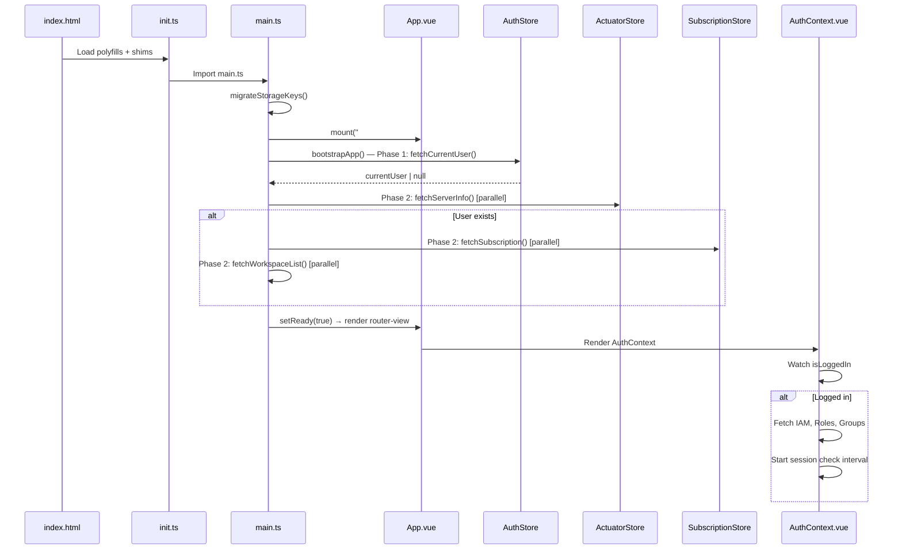
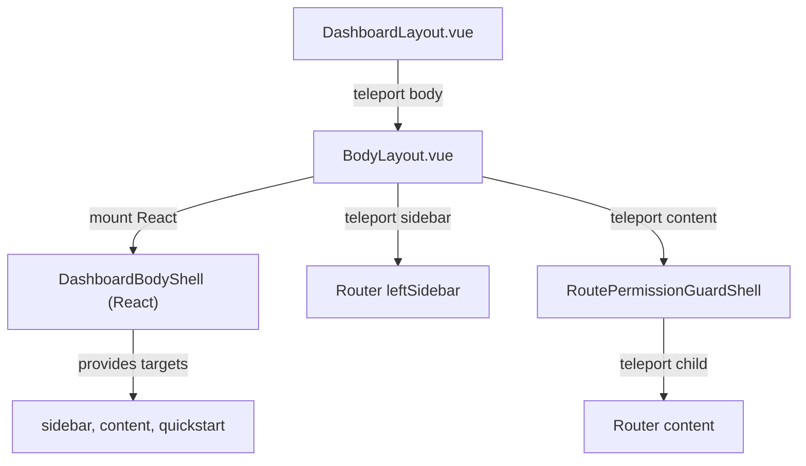
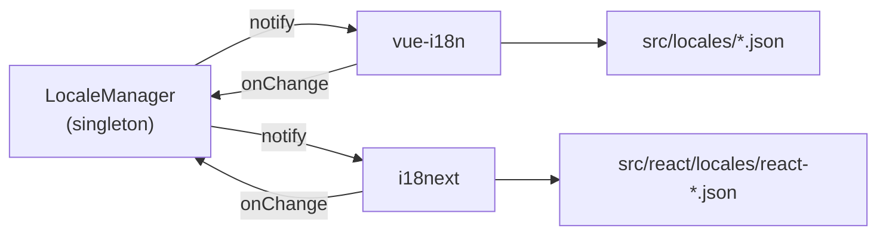
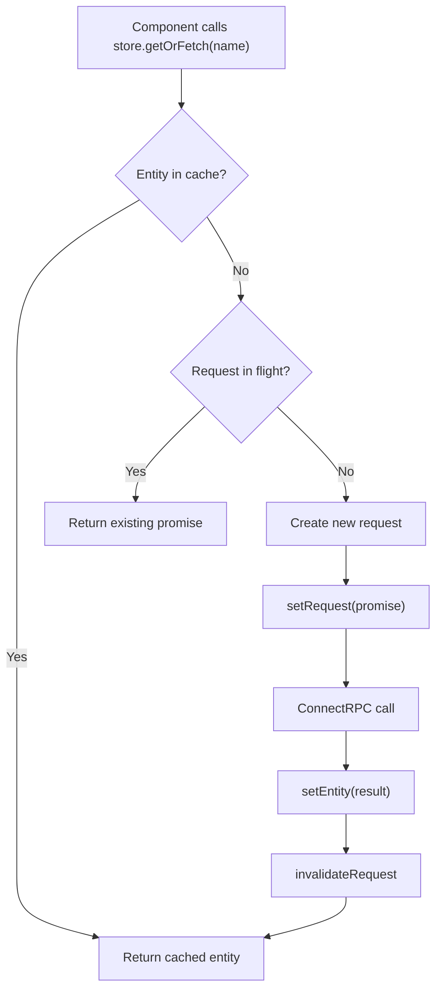

# Bytebase Frontend — Technical Design Document (TDD)

> **Version**: 2.0.0 | **Date**: 2026-05-14  
> **Companion**: [architecture.md](./architecture.md)

---

## 1. Scope & Objectives

Tài liệu này mô tả chi tiết thiết kế kỹ thuật (internal design) của từng module trong frontend Bytebase, bao gồm: data flow, component contracts, state transitions, và integration patterns.

---

## 2. Application Bootstrap Sequence

### 2.1 Progressive Bootstrap (SOL-WEAK-006)



**Key Design Points:**
- **Progressive rendering**: `mount("#app")` ngay lập tức với `AppShellSkeleton` — user thấy branded loading UI thay vì blank page
- **Phased data fetching**: Auth (critical) → parallel non-critical fetches → signal ready
- `migrateStorageKeys()` runs before any store reads — handles renamed localStorage keys
- `AuthContext.vue` performs secondary data fetch (IAM policy, roles, groups) after mount
- **Bootstrap error**: Show `BootstrapErrorPage` với retry button nếu data fetch thất bại

> Xem chi tiết: `specs/v1/weakness/solutions/SOL-WEAK-006-progressive-bootstrap-bundle.md`

---

## 3. Module Designs

### 3.1 Vue ↔ React Bridge (`src/react/BridgeLifecycleManager.ts`)

**Problem**: Incrementally migrate Vue pages to React without breaking existing routing.

**Solution**: `BridgeLifecycleManager` — cancellable, typed bridge mount with error boundary.

```
┌─────────────────────────────────────────────────┐
│ Vue Router resolves route                        │
│   → loads ReactPageMount.vue                     │
│     → BridgeLifecycleManager.mount(container,    │
│         page, signal)                            │
│       → loadCoreDeps() [cached]                  │
│         ├── react                                │
│         ├── react-dom/client                     │
│         ├── react-i18next                        │
│         └── i18n module                          │
│       → loadPage(name) [import.meta.glob]        │
│       → createRoot().render(                     │
│           StrictMode > ReactErrorBoundary >      │
│           I18nextProvider > Page                 │
│         )                                        │
└─────────────────────────────────────────────────┘
```

**Race Condition Prevention** (SOL-LIM-001): Bridge sử dụng monotonically increasing `renderGeneration` counter. Mỗi `render()` call increment counter và capture snapshot của props tại thời điểm gọi. Sau mỗi `await` point, function check `gen !== renderGeneration` — nếu true, một render mới đã bắt đầu và render hiện tại tự terminate. Pattern này thay thế Promise queue vì nó handle cả trường hợp Vue unmount/remount component.

**AbortController Lifecycle** (SOL-WEAK-001): Mỗi mount operation có riêng `AbortController`. Khi Vue unmount hoặc navigation thay đổi, signal abort → cancel mọi pending operations → prevent orphaned React roots.

**Page Resolution Order** (in `resolveReactPagePath`):
1. `./pages/settings/{name}.tsx`
2. `./pages/project/{name}.tsx`
3. `./plugins/agent/components/{name}.tsx`
4. `./pages/workspace/{name}.tsx`
5. `./pages/auth/{name}.tsx`
6. `./components/auth/{name}.tsx`
7. `./components/sql-editor/{name}.tsx`
8. `./components/{name}.tsx`

**Typed Props** (SOL-WEAK-001): Bridge sử dụng `BridgePageBaseProps` interface thay vì `any`. `ReactCoreDeps` interface thay thế `ReactDeps = any`.

**Page Cache Cleanup**: `clearPageCache()` được gọi khi logout để ngăn stale closures persisting across sessions.

---

### 3.2 ConnectRPC Transport (`src/connect/`)

**Design Pattern**: Singleton clients with interceptor chain.

```typescript
// Transport creation (single instance)
const transport = createConnectTransport({
  baseUrl: address,
  useBinaryFormat: !isDev(),  // JSON in dev, binary in prod
  interceptors: [authInterceptor, activeInterceptor, errorNotificationInterceptor],
  fetch: (input, init) => fetch(input, { ...init, credentials: "include" }),
  jsonOptions: { registry: protobufJsonRegistry },
});

// Client singletons (30+)
export const databaseServiceClientConnect = createClient(DatabaseService, transport);
```

**Interceptor Contract:**

| Interceptor | Input | Side Effect | Error Handling |
|---|---|---|---|
| `authInterceptor` | Request headers | Inject auth cookies/token; on 401 → set `unauthenticatedOccurred` flag, attempt `refreshTokens()` | Swallow auth errors, redirect to signin |
| `activeInterceptor` | — | Update `lastActiveTs` in `useLastActivity` composable | Pass-through |
| `errorNotificationInterceptor` | Error response | Push notification via `useNotificationStore` | Filter out `Unauthenticated` codes |

**Token Refresh Design** (`refreshToken.ts`) — Resilient Lock Pattern (SOL-LIM-003):

```
Tab A: create BroadcastChannel BEFORE lock attempt (eager listener)
  → acquire Web Lock "bb_token_refresh" (timeout 30s)
  → POST /v1/auth/refresh
  → BroadcastChannel.postMessage("complete" | "failed")
  → release lock

Tab B: lock unavailable
  → listen BroadcastChannel (created BEFORE lock check)
  → receive "complete" → done
  → receive "failed" → immediate retry
  → timeout 10s → retry (max 2 attempts)

Fallback (no Web Locks API):
  → Promise-based mutex (single-tab only)
```

**Retry Safety** (SOL-LIM-003): Auth interceptor phân loại methods thành safe-to-retry (prefixes: `Get`, `List`, `Search`, `Batch`, `Check`) và mutations (tất cả còn lại). Chỉ safe methods được auto-retry sau token refresh. Mutations throw error cho caller xử lý, ngăn chặn duplicate database changes.

---

### 3.3 State Management Design

#### 3.3.1 Pinia Store Pattern

All v1 stores follow a consistent pattern:

```typescript
export const useDatabaseV1Store = defineStore("database_v1", () => {
  // 1. Cache layer
  const { getEntity, setEntity, getRequest, setRequest } = useCache<[string], Database>("database");

  // 2. Reactive state (for lists, search results)
  const databaseList = ref<Database[]>([]);

  // 3. Fetch with cache-first strategy
  const getOrFetchDatabaseByName = async (name: string) => {
    const cached = getEntity([name]);
    if (cached) return cached;

    const existing = getRequest([name]);
    if (existing) return existing;

    const promise = databaseServiceClientConnect.getDatabase({ name });
    setRequest([name], promise);
    return promise;
  };

  // 4. Mutation with cache invalidation
  const updateDatabase = async (database: Database, updateMask: string[]) => {
    const updated = await databaseServiceClientConnect.updateDatabase({ database, updateMask });
    setEntity([updated.name], updated);
    return updated;
  };

  // 5. Reset for logout
  const reset = () => { databaseList.value = []; };

  return { databaseList, getOrFetchDatabaseByName, updateDatabase, reset };
});
```

#### 3.3.2 Cache Design (`src/store/cache.ts`)

**Bounded LRU cache with TTL** (SOL-LIM-002, SOL-WEAK-002):

| Layer | Storage | Purpose | Key |
|---|---|---|---|
| **Request Cache** | `Map<string, {promise, abortController}>` | Deduplicate in-flight requests | `JSON.stringify(keys)` |
| **Entity Cache** | `LRUEntityCache` (shallowReactive Map + timestamps) | Store resolved entities with LRU eviction | `JSON.stringify(keys)` |

**Flow**: `getRequest → miss → setRequest(promise) → promise.then(setEntity) → invalidateRequest`

**Memory Budget**: Cache system giới hạn tổng memory footprint ~10-15MB qua LRU eviction. Heavy tier (schemas) evict sớm nhất (5 phút) vì entity size lớn. Session tier entities tồn tại suốt session vì chúng nhỏ và critical cho auth/navigation.

**Eviction Engine**: `CacheEvictionEngine` chạy sweep mỗi 60s qua `requestIdleCallback`, xóa entries quá TTL. LRU eviction trigger khi insert vượt `maxSize`.

**Request cleanup**: Rejected promises tự động cleaned up khỏi request cache (fix cached-reject bug). AbortController prevents stale responses.

**Dev Health Monitor**: `window.__BB_CACHE_STATS__()` trong DevTools console hiển thị entity count per namespace.

#### 3.3.3 SQL Editor State

The SQL Editor has the most complex state architecture:

```
sqlEditor/
├── tab.ts        # Tab lifecycle: create, close, switch, persist
│                 # TabState: {id, connection, worksheet, mode, treeState}
├── worksheet.ts  # CRUD worksheets, star/unstar, organize in folders
├── tree.ts       # Connection tree: instances → databases → tables
├── folder.ts     # Folder management for worksheet organization
├── editor.ts     # Editor settings: font size, theme, word wrap
├── queryHistory.ts # Persisted query log
├── webTerminal.ts  # Admin execute WebSocket sessions
└── uiState.ts    # UI preferences (panel sizes, visibility)
```

---

### 3.4 Layout System Design

#### 3.4.1 Teleport-based Composition

The layout system uses Vue `<teleport>` to compose React-rendered shells with Vue router views:



**DashboardBodyShell** (React) renders the visual shell and exposes DOM refs via `onReady` callback:
- `desktopSidebar` / `mobileSidebar` — sidebar mount points
- `content` — main content area
- `quickstart` — quickstart widget slot
- `mainContainer` — scroll container ref

#### 3.4.2 Permission Guard Shell

`RoutePermissionGuardShell` wraps every non-project route content:
1. Reads `route.meta.requiredPermissionList`
2. Checks user permissions via `usePermissionStore`
3. If denied → renders 403 page
4. If allowed → exposes `onReady(target)` DOM ref for content teleport

---

### 3.5 Authentication Module

#### 3.5.1 Auth Store (`store/modules/v1/auth.ts`)

**State:**
```typescript
{
  currentUserName: string | null;    // "users/email@example.com"
  isLoggedIn: boolean;
  unauthenticatedOccurred: boolean;  // triggers SessionExpiredSurface
  requireResetPassword: boolean;
  isSelfEmailUpdate: boolean;        // prevents redirect on email change
}
```

**Auth Modes:**

| Mode | Detected By | Transport |
|---|---|---|
| Cookie (default) | No `BB_AUTH_MODE` env | `credentials: "include"` on fetch |
| Token (standalone) | `BB_AUTH_MODE=token` | `Authorization: Bearer` header via `token-manager.ts` |

#### 3.5.2 Token Manager (`src/auth/token-manager.ts`)

For standalone deployment where frontend and backend are separate:

- **Access token**: Stored in memory (prevents XSS leakage)
- **Refresh token**: **Encrypted** in localStorage via AES-GCM (Web Crypto API), encryption key stored in IndexedDB with `extractable: false` — XSS can read encrypted blob but cannot decrypt (SOL-LIM-003)
- **Auto-refresh**: Scheduled 1 minute before JWT `exp` claim
- **Transport factory**: `createAuthenticatedTransport()` produces ConnectRPC transport with Bearer injection

#### 3.5.3 Auth Error Handling (SOL-WEAK-003)

- **Error transparency**: Non-401 errors từ `fetchCurrentUser()` được log (không silent swallow)
- **Logout resilience**: Retry 3 lần với exponential backoff; nếu tất cả fail, proceed với local cleanup
- **OAuth listener lifecycle**: Event listeners gắn trong `onMounted`, cleanup trong `onUnmounted` (fix HMR leak)

---

### 3.6 Router Module Design

#### 3.6.1 Route Module Registration

```typescript
// router/index.ts
const routes = [
  ...authRoutes,       // /auth/signin, /auth/signup, /auth/oauth-callback, /auth/oidc-callback
  ...setupRoutes,      // /setup (first-time workspace setup)
  ...dashboardRoutes,  // / (all dashboard routes)
  ...sqlEditorRoutes,  // /sql-editor/*
];
```

#### 3.6.2 Project Routes Architecture

Project routes (`projectV1.ts`) define 30+ child routes under `/projects/:projectId/`:

| Route Group | Pages | Notes |
|---|---|---|
| **Landing** | `ProjectLandingPage` | Auto-redirect based on permissions |
| **Databases** | `ProjectDatabasesPage`, `ProjectDatabaseDetailPage`, `DatabaseChangelogDetailPage`, `DatabaseRevisionDetailPage` | Nested instance/database params |
| **Plans** | `ProjectPlanDashboardPage`, `ProjectPlanDetailPage` (3 variants) | Specs view, spec detail |
| **Issues** | `ProjectIssueDashboardPage`, `ProjectIssueDetailPage` | Numeric issueId |
| **Releases** | `ProjectReleaseDashboardPage`, `ProjectReleaseDetailPage` | Release lifecycle |
| **Database Groups** | List, Create, Detail | CEL expression-based grouping |
| **Schema Sync** | `ProjectSyncSchemaPage` | Cross-database schema sync |
| **Security** | `ProjectMaskingExemptionPage`, `ProjectAccessGrantsPage` | Data masking, access control |
| **Settings** | `ProjectSettingsPage`, Webhooks (CRUD), Members, GitOps | Project-level configuration |

#### 3.6.3 Query Preservation (SOL-LIM-006)

**Route-scoped preservation**: Query params chỉ preserved khi explicitly declared trong route meta `preserveQuery`. Thay thế global 5-field watch bằng per-route whitelist:

```typescript
// Route meta declaration
meta: { preserveQuery: ["project", "filter"] }

// Watch uses flush: "post" + nextTick to prevent triggering during same navigation cycle
```

**Redirect validation**: All redirect URLs (`relay_state`, `redirect`) validated via `sanitizeRedirectUrl()` — blocks protocol-relative URLs, encoded schemes, backslash bypasses, và null bytes.

**Store reset**: Domain stores chỉ reset khi logout thực sự (không reset khi visit auth page via back button) — SOL-WEAK-008.

---

### 3.7 SQL Editor Module

#### 3.7.1 Component Architecture

```
SQLEditorLayout.vue
├── BannersWrapper (React)
└── ProvideSQLEditorContext.vue
    ├── Context Setup: provideSQLEditorContext(), provideSheetContext()
    └── SQLEditorPage.vue
        ├── SQLEditorHomePage.vue (no active tab)
        ├── TabList/           # Tab bar with drag-and-drop
        ├── EditorPanel/       # Monaco editor + result grid
        │   ├── EditorCommon/  # Shared editor utilities
        │   └── Result display (table, chart, export)
        └── Sheet/             # Worksheet management panel
```

#### 3.7.2 Context Design

`context.ts` provides SQL Editor-wide context via Vue `provide/inject`:

```typescript
interface SQLEditorContext {
  showConnectionPanel: Ref<boolean>;
  showAIChatBox: Ref<boolean>;
  events: Emittery<SQLEditorEvents>;
  // ... other shared state
}
```

#### 3.7.3 Tab State Machine

```
Tab States:
  CLEAN → user opens connection or worksheet
  DIRTY → user modifies SQL content
  EXECUTING → SQL execution in progress
  EXECUTED → results available

Tab Persistence:
  - Tabs persisted to PouchDB (web-storage.ts)
  - Restored on app reload
  - Debounced save on content change
```

---

### 3.8 Internationalization Design (SOL-LIM-007, SOL-AI-008)

#### 3.8.1 LocaleManager Pattern



`LocaleManager` (`src/localeManager.ts`) là framework-agnostic pub/sub quản lý locale duy nhất. Cả `vue-i18n` và `i18next` subscribe vào manager → **bidirectional sync**, loại bỏ `CustomEvent` locale sync.

#### 3.8.2 Locale Loading

- **Vue**: Compiled at build time by `VueI18nPlugin`, loaded synchronously
- **React**: Shares common keys từ `src/locales/*.json`, React-only keys trong `src/react/locales/react-*.json` (~10KB)
- **Dynamic locales**: `src/locales/dynamic/` for runtime-loaded messages
- **Missing key handler**: Cả 2 systems dùng chung handler → `console.warn` trong dev mode

#### 3.8.3 CI Key Consistency

`scripts/sync-i18n-keys.mjs` cross-validates common translation keys giữa Vue và React locales. Chạy trong CI pipeline để detect key drift sớm.

> Target: Unified i18next (sau khi Vue migration hoàn tất — SOL-AI-008)

---

### 3.9 Plugin Architecture

#### 3.9.1 AI Plugin (`src/plugins/ai/`)

```
plugins/ai/
├── index.ts          # Plugin entry, exports composables
├── components/       # AI chat UI components
├── logic/            # AI interaction logic
├── store/            # AI conversation state (Pinia)
└── types/            # AI-specific type definitions
```

Provides AI-assisted SQL generation integrated with the SQL Editor context.

#### 3.9.2 Agent Plugin (`src/react/plugins/agent/`)

```
react/plugins/agent/
├── AGENT.md          # Agent behavior specification
├── index.tsx         # Plugin entry
├── components/       # Agent window UI
├── dom/              # DOM manipulation utilities
├── logic/            # Agent interaction logic
├── store/            # Zustand store for agent state
└── window.ts         # Floating agent window management
```

Keyboard shortcut: `Ctrl+Shift+A` toggles agent window (handled in `BodyLayout.vue`).

---

## 4. Data Flow Patterns

### 4.1 Entity Fetch Pattern (Cache-First)



### 4.2 Mutation Pattern (Optimistic Update)

```
1. Component dispatches store.update(entity, updateMask)
2. Store calls ConnectRPC service
3. On success: setEntity(updated) → reactive cache update → UI refreshes
4. On error: errorNotificationInterceptor shows notification
```

### 4.3 Permission Check Pattern

```typescript
// Route-level: meta.requiredPermissionList
meta: {
  requiredPermissionList: () => ["bb.databases.list"],
}

// Component-level: RoutePermissionGuardShell / ComponentPermissionGuard
<RoutePermissionGuardShell>  // Checks route meta permissions
<ComponentPermissionGuard>   // Checks arbitrary permission list
```

---

## 5. Design Token System

### 5.1 CSS Custom Properties

Defined in Tailwind config via CSS custom properties:

| Token | Example Variable | Usage |
|---|---|---|
| **Accent** | `--color-accent`, `--color-accent-hover` | Primary action buttons |
| **Main** | `--color-main`, `--color-main-text` | Primary content areas |
| **Control** | `--color-control`, `--color-control-bg` | Form controls |
| **Status** | `--color-info`, `--color-warning`, `--color-error`, `--color-success` | Feedback states |
| **Layout** | `--color-background`, `--color-overlay`, `--color-block-border` | Structural elements |

### 5.2 Dark Mode

- Implemented via TailwindCSS `darkMode: "class"` strategy
- Toggle adds/removes `.dark` class on root element
- All color tokens resolve differently in dark mode via CSS custom properties

---

## 6. Performance Considerations

### 6.1 Code Splitting Strategy

| Technique | Implementation |
|---|---|
| **Route-level splitting** | All page components loaded via `() => import(...)` |
| **React lazy loading** | `import.meta.glob()` creates lazy chunks per React page |
| **Manual chunks** | Monaco, SQL tools, Naive UI, utilities separated |
| **Legacy polyfills** | Separate polyfill chunk via `@vitejs/plugin-legacy` |

### 6.2 Rendering Optimization

| Technique | Where |
|---|---|
| **shallowReactive** | Entity cache maps (avoid deep reactivity) |
| **shallowRef** | Layout teleport targets |
| **Debounced save** | SQL editor tab persistence |
| **Request deduplication** | Cache layer prevents duplicate API calls |
| **AbortController** | Stale requests cancelled on re-fetch |

### 6.3 Memory Management

- Entity cache uses **bounded LRU Maps** with TTL-based expiry (heavy tier: 30 entries/5min, standard: 200/10min, light: 500/30min)
- Auth-related stores call `reset()` on logout
- React roots are explicitly `unmount()`-ed when Vue route changes, guarded by **render versioning** (generation counter prevents stale mounts)
- `AbortController` prevents memory leaks from abandoned requests
- Dev-mode cache monitor warns when total entity count exceeds 500

> Xem chi tiết: `specs/v1/limitations/solutions/SOL-LIM-002-bounded-lru-cache.md`

---

## 7. Error Handling Strategy

### 7.1 Error Boundaries

| Layer | Mechanism | Behavior |
|---|---|---|
| **React ErrorBoundary** | `ErrorBoundary` class component wrapping every React mount | Catch render errors → show fallback UI + dispatch notification to Vue shell |
| **Vue Global** | `App.vue > onErrorCaptured` | Show CRITICAL notification for non-interceptor-handled errors |
| **ConnectRPC** | `errorNotificationInterceptor` | Show user-friendly error notification (skip `NotFound`, `Unauthenticated`) |
| **Auth** | `authInterceptor` | 401 → token refresh → retry reads only → SessionExpiredSurface |
| **Route** | Navigation guard fallback | Unknown routes → 404 page |
| **Async** | `unhandledrejection` handler | Catch React async errors → CRITICAL notification |

> Xem chi tiết: `specs/v1/limitations/solutions/SOL-LIM-004-unified-error-boundary.md`

### 7.2 ConnectError Scoped Suppression (SOL-WEAK-005)

```typescript
// App.vue — Only codes with explicit interceptor handlers are silently passed
const INTERCEPTOR_HANDLED_CODES = [
  Code.Unauthenticated,  // Handled by authInterceptor → SessionExpiredSurface
  Code.PermissionDenied, // Handled by RoutePermissionGuardShell → 403
  Code.Canceled,         // User-initiated cancellation (AbortController)
];
if (error instanceof ConnectError && INTERCEPTOR_HANDLED_CODES.includes(error.code)) {
  return; // Handled by interceptor chain
}
// All other gRPC errors (INTERNAL, DATA_LOSS, UNAVAILABLE, NotFound, etc.) → notification
// Error propagation: return false to allow Vue error handler tracking
```

**NotFound handling**: `Code.NotFound` no longer silently suppressed by default. Callers that expect NotFound (e.g., `getOrCreate` patterns) phải explicitly pass `ignoredCodes: [Code.NotFound]`.

### 7.3 Retry Safety (SOL-LIM-003)

Auth interceptor phân loại methods thành safe-to-retry (prefixes: `Get`, `List`, `Search`, `Batch`, `Check`) và mutations (tất cả còn lại). Chỉ safe methods được auto-retry sau token refresh. Mutations throw error cho caller xử lý, ngăn chặn duplicate database changes.

### 7.4 Empty Catch Policy (SOL-WEAK-005)

Không sử dụng empty catch blocks. Tất cả catch blocks phải follow 1 trong 3 patterns:

| Pattern | Use Case | Example |
|---|---|---|
| **Expected failure** | Auth check on page load | Log non-401, return undefined |
| **Non-critical persistence** | localStorage, clipboard | `console.warn` + degrade gracefully |
| **Best-effort operation** | AI suggestions | `console.warn` + skip feature |

---

## 8. Traceability Matrix

| Module | Source Files | Store | API Services |
|---|---|---|---|
| **Auth** | `auth/`, `react/pages/auth/` | `v1/auth.ts` | `AuthService` |
| **Database** | `react/pages/project/ProjectDatabase*` | `v1/database.ts`, `v1/dbSchema.ts` | `DatabaseService`, `DatabaseCatalogService` |
| **Instance** | `react/pages/settings/Instance*` | `v1/instance.ts` | `InstanceService`, `InstanceRoleService` |
| **Project** | `react/pages/project/Project*` | `v1/project.ts`, `v1/projectIamPolicy.ts` | `ProjectService` |
| **Plan** | `react/pages/project/ProjectPlan*` | `v1/plan.ts` | `PlanService` |
| **Issue** | `react/pages/project/ProjectIssue*`, `react/components/IssueTable.tsx` | `v1/issue.ts`, `v1/issueComment.ts` | `IssueService` |
| **Rollout** | `store/modules/rollout.ts` | `rollout.ts` | `RolloutService` |
| **SQL Editor** | `views/sql-editor/`, `react/components/sql-editor/` | `sqlEditor/*` (8 stores) | `SQLService`, `SheetService`, `WorksheetService` |
| **SQL Review** | `react/pages/settings/SQLReview*` | `sqlReview.ts` | `ReviewConfigService`, `OrgPolicyService` |
| **Environment** | `react/pages/settings/EnvironmentsPage.tsx` | `v1/environment.ts` | `SettingService` |
| **Members/IAM** | `react/pages/settings/MembersPage.tsx`, `UsersPage.tsx` | `user.ts`, `v1/workspace.ts` | `UserService`, `WorkspaceService` |
| **Settings** | `react/pages/settings/GeneralPage.tsx`, `SubscriptionPage.tsx` | `v1/setting.ts`, `v1/subscription.ts` | `SettingService`, `SubscriptionService`, `ActuatorService` |
| **Masking** | `react/pages/settings/GlobalMaskingPage.tsx`, `SemanticTypesPage.tsx` | `v1/policy.ts` | `OrgPolicyService` |
| **IdP/SSO** | `react/pages/settings/IDPsPage.tsx`, `IDPDetailPage.tsx` | `idp.ts` | `IdentityProviderService` |
| **Audit Log** | `react/components/AuditLogTable.tsx` | `v1/auditLog.ts` | `AuditLogService` |
