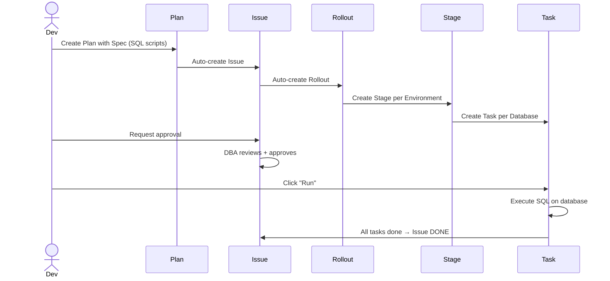
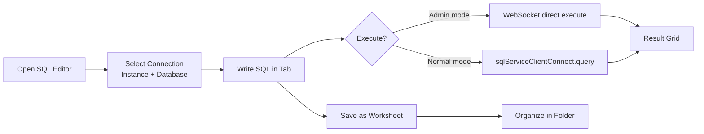

# SOL-AI-010 — Domain Knowledge Base for AI

> **Resolves**: ISS-AI-010 (Domain Knowledge Gap: Database Admin Workflows Đặc Thù)  
> **Type**: Documentation  
> **Priority**: Medium  
> **Effort**: Medium (~2–3 weeks)  
> **Status**: Proposed

---

## 1. Mục Tiêu

Cung cấp cho AI đủ domain knowledge về Database DevOps để làm việc chính xác với các business workflows đặc thù của Bytebase — không cần AI phải "tự đoán" từ code.

---

## 2. Giải Pháp

### 2.1 Domain Glossary — `GLOSSARY.md`

Tạo `.ai-context/GLOSSARY.md` — định nghĩa tất cả domain terms:

```markdown
# Bytebase Domain Glossary

## Core Workflow Objects (quan trọng nhất)

### Plan
- Mô tả: Một database change plan — gồm nhiều Specs (change scripts)
- Resource name: `projects/{project}/plans/{plan}`
- Lifecycle: OPEN → DONE
- Relation: 1 Plan → 1 Issue (sau khi tạo)
- File: src/types/proto-es/v1/plan_service_pb.d.ts

### Issue  
- Mô tả: Công việc quản lý change — tracking, approval, comment
- Resource name: `projects/{project}/issues/{issue}`
- Lifecycle: OPEN → CANCELED / DONE
- Relation: 1 Issue ← 1 Plan, 1 Issue → 1 Rollout
- File: src/types/proto-es/v1/issue_service_pb.d.ts

### Rollout
- Mô tả: Execution plan — gồm nhiều Stages
- Resource name: `projects/{project}/rollouts/{rollout}`
- Relation: 1 Rollout = nhiều Stages
- File: src/types/proto-es/v1/rollout_service_pb.d.ts

### Stage
- Mô tả: Một environment stage trong Rollout (e.g., Dev → Staging → Prod)
- Thuộc Rollout
- Relation: 1 Stage = nhiều Tasks

### Task
- Mô tả: Một database operation cụ thể trong Stage
- Types: DDL, DML, BRANCH, RESTORE
- Relation: 1 Task → nhiều TaskRuns (lịch sử thực thi)

### TaskRun
- Mô tả: Một lần thực thi Task — có result, log, error
- States: PENDING → RUNNING → DONE / FAILED / CANCELED

### Release
- Mô tả: Snapshot tập hợp change files có version
- Dùng cho: deployment pipelines, release management
- Khác Plan/Issue: Release không cần approval workflow

### Sheet
- Mô tả: SQL script file — có thể là anonymous hoặc named Worksheet
- Types: SHEET_TYPE_SQL, SHEET_TYPE_SCHEMA_DESIGN

### Worksheet
- Mô tả: Named Sheet trong SQL Editor — có tên, có thể share
- Khác Sheet: Worksheet là persisted, named, có folder organization

## Object Hierarchy

```
Project
  ├── Plan (database change request)
  │   └── Spec[] (individual change scripts)
  ├── Issue (workflow management)
  │   └── Rollout
  │       └── Stage[] (per environment)
  │           └── Task[] (per database)
  │               └── TaskRun[] (execution history)
  ├── Release (versioned change package)
  ├── Database Group (dynamic set by CEL expression)
  └── Members/IAM

Instance
  └── Database[] (managed databases)
      └── Schema / Table / Column / Index

Workspace
  ├── Environment[] (e.g., Dev, Staging, Prod)
  ├── Setting[] (workspace config)
  ├── SQLReview Config[]
  └── User[] / Group[] / Role[]
```

## IAM Model

```
Workspace-level Roles:
  OWNER     → full admin
  DBA       → database operations
  DEVELOPER → limited access

Project-level Roles (override workspace):
  OWNER, DEVELOPER, VIEWER
  + Custom roles (defined in RoleService)

Permission Scopes:
  Workspace: bb.users.*, bb.instances.*, bb.settings.*
  Project: bb.databases.*, bb.issues.*, bb.plans.*
  
Check pattern:
  workspace perm → useWorkspacePermission("bb.users.list")
  project perm → useProjectPermission(project, "bb.databases.list")
```

## SQL Review Rules

```
Categories: NAMING, STATEMENT, TABLE, COLUMN, INDEX, SCHEMA, DATABASE, SYSTEM
Severity: ERROR (blocks), WARNING (warns), DISABLED
Engines: MYSQL, POSTGRESQL, TIDB, ORACLE, MSSQL, SNOWFLAKE, OCEANBASE, etc.

Rule format: {category}_{rule_name}
Example: naming.column.no-keyword, statement.select.no-select-star

Source: src/types/sql-review-schema.yaml (46KB)
```

## CEL Expressions

```
Used in: Database Groups (match databases), Data Masking conditions
Syntax: Google Common Expression Language
Examples:
  resource.database == "my-db"
  resource.environment == "environments/prod" && resource.labels["app"] == "backend"
  
Parser: src/plugins/cel/
Validator: celServiceClientConnect.batchParseExpressions()
```

## Database Engines (15+)

| Engine | Value | Notes |
|---|---|---|
| MYSQL | `Engine.MYSQL` | Most common |
| POSTGRESQL | `Engine.POSTGRES` | |
| TIDB | `Engine.TIDB` | MySQL-compatible |
| ORACLE | `Engine.ORACLE` | Enterprise |
| MSSQL | `Engine.MSSQL` | |
| MONGODB | `Engine.MONGODB` | NoSQL |
| REDIS | `Engine.REDIS` | |
| CLICKHOUSE | `Engine.CLICKHOUSE` | |
| SNOWFLAKE | `Engine.SNOWFLAKE` | |
| SPANNER | `Engine.SPANNER` | Google Cloud |

Engine-specific SQL features vary — always check engine compatibility for:
- Schema operations (not all engines support ADD COLUMN FIRST)
- Data types (INT vs INTEGER vs NUMBER)
- Transaction support
- DDL in transactions

## Data Masking

```
Masking Levels: NONE → PARTIAL → FULL
Column classification: semantic types + classification labels
Exemption: per-user, per-project access grants
CEL condition: applied to masking rule scope
```
```

### 2.2 Workflow Diagrams

Tạo `.ai-context/WORKFLOWS.md` với Mermaid diagrams:

```markdown
# Business Workflow Diagrams

## Database Change Workflow



## SQL Editor Workflow


```

### 2.3 Engine Compatibility Cheat Sheet

Tạo `.ai-context/ENGINE_COMPAT.md`:

```markdown
# Database Engine Compatibility Matrix

## DDL Support

| Operation | MySQL | PostgreSQL | TiDB | Oracle | MSSQL |
|---|---|---|---|---|---|
| ADD COLUMN | ✅ | ✅ | ✅ | ✅ | ✅ |
| ADD COLUMN FIRST | ✅ | ❌ | ✅ | ❌ | ❌ |
| RENAME COLUMN | ✅ 8.0+ | ✅ | ✅ | ✅ 12c+ | ✅ |
| DDL in transaction | ❌ | ✅ | ❌ | ❌ | ✅ |

## Schema Review Rules per Engine

Rules apply to specific engines — check rule.engineList before applying.
Example: `naming.table.case` applies to MySQL but not MongoDB.

Source: src/types/sql-review-schema.yaml → each rule has `engineList` field.
```

### 2.4 Domain Context Files per Module

Thêm domain context vào module `.ai-context.md` files (từ SOL-AI-005):

```markdown
# Module: Project → Plan/Issue (.ai-context.md)

## Domain Context
- Plan = database change request (has SQL scripts)
- Issue = workflow tracking (has approvals, comments)
- Rollout = execution plan (has stages + tasks)

## DO NOT confuse:
- Plan ≠ Issue (Plan is the "what", Issue is the "workflow")
- Task ≠ TaskRun (Task is the definition, TaskRun is one execution)
- Sheet ≠ Worksheet (Worksheet = named Sheet in SQL Editor)
```

---

## 3. Implementation Checklist

- [ ] Tạo `.ai-context/GLOSSARY.md` với đầy đủ domain terms
- [ ] Tạo `.ai-context/WORKFLOWS.md` với 5 Mermaid diagrams
- [ ] Tạo `.ai-context/ENGINE_COMPAT.md` với compatibility matrix
- [ ] Tạo `.ai-context/IAM_GUIDE.md` với permission model
- [ ] Thêm domain context vào module `.ai-context.md` files (từ SOL-AI-005)
- [ ] Review và validate với team DBA/product

---

## 4. Acceptance Criteria

| Metric | Current | Target |
|---|---|---|
| Plan/Issue/Rollout confusion | Frequent | Rare (glossary + diagram) |
| Wrong permission scope | ~40% | < 5% (IAM guide) |
| CEL syntax errors | Common | Rare (examples + validator) |
| Engine-specific SQL errors | Frequent | Rare (compatibility matrix) |
| Domain term misuse | Frequent | Near zero (glossary) |
