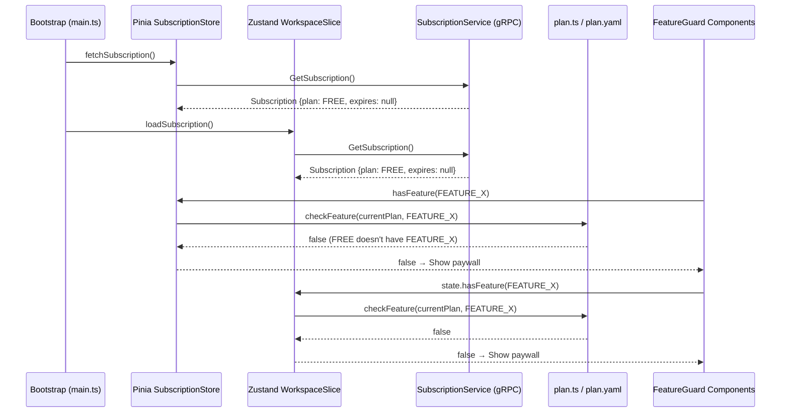

# SOL-LIC-001 — Enterprise License Bypass (Frontend-Only)

> **Version**: 1.0.0  
> **Date**: 2026-05-15  
> **Status**: Draft  
> **Scope**: Mở toàn bộ chức năng Enterprise, mặc định license Enterprise cho toàn bộ người sử dụng — bypass kiểm tra từ server.

---

## 1. Bối cảnh & Mục tiêu

### 1.1 Bối cảnh

Bytebase sử dụng mô hình **3-tier license**: `FREE → TEAM → ENTERPRISE`. Frontend kiểm tra license ở **3 tầng**:

1. **Data Layer**: Subscription data từ server (`SubscriptionService.GetSubscription`)
2. **Logic Layer**: Feature check functions (`hasFeature`, `hasInstanceFeature`)  
3. **UI Layer**: Gate components (`FeatureBadge`, `FeatureAttention`, `FeatureModal`, `BannersWrapper`)

### 1.2 Mục tiêu

- **Mở toàn bộ Enterprise features** mà không cần license key từ server
- **Không gửi request license lên server** (hoặc ignore response)
- **Loại bỏ paywall UI**: badge sparkles, attention banners, feature modals
- **Giữ nguyên code structure** — dễ rollback hoặc tùy chỉnh
- **Áp dụng cho tất cả người dùng** — không phân biệt role

---

## 2. Phân tích Kiến trúc License Hiện tại

### 2.1 Data Flow



### 2.2 Touch Points (Tất cả các file liên quan)

| # | File | Layer | Vai trò |
|---|------|-------|---------|
| 1 | `src/types/plan.ts` | Logic | `hasFeature()`, `hasInstanceFeature()`, `getMinimumRequiredPlan()` — Core feature matrix |
| 2 | `src/types/plan.yaml` | Data | Feature list per plan tier (FREE, TEAM, ENTERPRISE) |
| 3 | `src/store/modules/v1/subscription.ts` | State (Pinia) | `useSubscriptionV1Store` — Vue-side subscription state + `hasFeature()`, `hasInstanceFeature()`, `isExpired`, `currentPlan` |
| 4 | `src/react/stores/app/workspace.ts` | State (Zustand) | `WorkspaceSlice` — React-side subscription state, `hasFeature()`, `currentPlan()`, `isFreePlan()`, `isExpired()`, `showTrial()` |
| 5 | `src/react/stores/app/types.ts` | Types | `WorkspaceSlice` interface definition |
| 6 | `src/react/hooks/useAppState.ts` | Hooks | `useSubscriptionState()`, `usePlanFeature()` — React hooks cho subscription |
| 7 | `src/react/components/FeatureBadge.tsx` | UI (React) | Sparkles/Lock icon khi feature bị gate |
| 8 | `src/react/components/FeatureAttention.tsx` | UI (React) | Alert banner khi feature bị gate |
| 9 | `src/react/components/ui/feature-modal.tsx` | UI (React) | Paywall dialog khi feature bị gate |
| 10 | `src/react/components/BannersWrapper.tsx` | UI (React) | Trial/expiry/upgrade banners |
| 11 | `src/components/FeatureGuard/FeatureBadge.vue` | UI (Vue) | Vue sparkles badge |
| 12 | `src/components/FeatureGuard/FeatureAttention.vue` | UI (Vue) | Vue attention banner |
| 13 | `src/components/FeatureGuard/FeatureModal.vue` | UI (Vue) | Vue paywall modal |
| 14 | `src/router/index.ts` | Router | 2FA guard dùng `hasFeature(FEATURE_TWO_FA)` |
| 15 | `src/react/components/ComponentPermissionGuard.tsx` | UI (React) | Permission guard (có kiểm tra subscription) |

### 2.3 Tầm ảnh hưởng theo Feature Category

| Category | Enterprise-Only Features | Gated By |
|----------|-------------------------|----------|
| **Security** | Risk Assessment, Approval Workflow, Enterprise SSO, 2FA, Custom Roles, Data Masking, Data Classification, SCIM, JIT, etc. | `FeatureBadge`, `FeatureAttention`, `FeatureModal` |
| **SQL Editor** | Restrict Copying Data | `FeatureBadge` |
| **Admin** | Environment Tiers, Announcement, Custom Logo, Watermark, API Guidance | `FeatureAttention`, `BannersWrapper` |
| **Instance** | Data Masking, Read-Only Connection, External Secret Manager | `instanceLimitFeature` + Instance activation check |

---

## 3. Giải pháp

### 3.1 Strategy Overview

> **Chọn Strategy A (Recommended)** cho minimal code changes và dễ rollback.

| Strategy | Approach | Files Changed | Risk | Rollback |
|----------|----------|---------------|------|----------|
| **A — Logic Layer Override** | Override `hasFeature()` luôn return `true`, mock subscription data thành Enterprise | 4 files | Low | Revert 4 files |
| **B — Data Layer Injection** | Inject fake Enterprise subscription object trước khi bất kỳ store nào đọc | 2 files | Medium | Revert 2 files |

### 3.2 Strategy A — Logic Layer Override (Recommended)

#### Nguyên lý

Thay vì can thiệp vào data từ server, ta **override tại logic layer** để mọi feature check luôn return `true`, và **suppress mọi paywall UI**. Đây là cách an toàn nhất vì:

- Không phá vỡ data flow (subscription vẫn fetch bình thường)
- Server vẫn hoạt động theo license thực tế
- UI không hiển thị paywall, trial banner, upgrade prompt

---

## 4. Implementation Plan — Strategy A

### 4.1 File 1: `src/types/plan.ts` — Core Feature Check Override

**Mục đích**: Mọi `hasFeature()` call luôn return `true`, `getMinimumRequiredPlan()` luôn return `FREE`.

```diff
// src/types/plan.ts

 // Helper function to check if a feature is available for a plan
-export const hasFeature = (plan: PlanType, feature: PlanFeature): boolean => {
-  return planHasFeature(plan, feature);
-};
+export const hasFeature = (_plan: PlanType, _feature: PlanFeature): boolean => {
+  // VNP-LIC-001: Bypass license check — all features enabled
+  return true;
+};

 // Helper function to get minimum required plan for a feature
-export const getMinimumRequiredPlan = (feature: PlanFeature): PlanType => {
-  const planOrder = [PlanType.FREE, PlanType.TEAM, PlanType.ENTERPRISE];
-  for (const plan of planOrder) {
-    if (planHasFeature(plan, feature)) {
-      return plan;
-    }
-  }
-  return PlanType.ENTERPRISE;
-};
+export const getMinimumRequiredPlan = (_feature: PlanFeature): PlanType => {
+  // VNP-LIC-001: All features available in FREE
+  return PlanType.FREE;
+};

 // Helper function to check instance features
-export const hasInstanceFeature = (
-  plan: PlanType,
-  feature: PlanFeature,
-  instanceActivated = true
-): boolean => {
-  if (!hasFeature(plan, feature)) {
-    return false;
-  }
-  if (plan === PlanType.FREE) {
-    return true;
-  }
-  if (instanceLimitFeature.has(feature)) {
-    return instanceActivated;
-  }
-  return true;
-};
+export const hasInstanceFeature = (
+  _plan: PlanType,
+  _feature: PlanFeature,
+  _instanceActivated = true
+): boolean => {
+  // VNP-LIC-001: All instance features enabled
+  return true;
+};
```

**Impact**: Tất cả consumer (Pinia store, Zustand store, components) gọi qua `checkFeature()` đều nhận `true`.

---

### 4.2 File 2: `src/store/modules/v1/subscription.ts` — Pinia Store Override

**Mục đích**: Override `currentPlan` thành `ENTERPRISE`, `isExpired` = `false`, `hasFeature()` luôn `true`.

```diff
// src/store/modules/v1/subscription.ts

   // Getters
   const currentPlan = computed(() => {
-    if (!subscription.value) {
-      return PlanType.FREE;
-    }
-    return subscription.value.plan;
+    // VNP-LIC-001: Always report Enterprise plan
+    return PlanType.ENTERPRISE;
   });

-  const isFreePlan = computed(() => currentPlan.value === PlanType.FREE);
+  const isFreePlan = computed(() => false); // VNP-LIC-001

   const instanceCountLimit = computed(() => {
-    let limit = subscription.value?.instances ?? 0;
-    if (limit > 0) { return limit; }
-    limit = PLANS.find(...)?.maximumInstanceCount ?? 0;
-    if (limit < 0) { ... return Number.MAX_VALUE; }
-    return limit;
+    // VNP-LIC-001: Unlimited instances
+    return Number.MAX_VALUE;
   });

   const userCountLimit = computed(() => {
-    let limit = PLANS.find(...)?.maximumSeatCount ?? 0;
-    ...
+    // VNP-LIC-001: Unlimited seats
+    return Number.MAX_VALUE;
   });

-  const isExpired = computed(() => { ... });
+  const isExpired = computed(() => false); // VNP-LIC-001: Never expired

-  const isTrialing = computed(() => !!subscription.value?.trialing);
+  const isTrialing = computed(() => false); // VNP-LIC-001

-  const showTrial = computed(() => { ... });
+  const showTrial = computed(() => false); // VNP-LIC-001

-  const isHAAllowed = computed(() => subscription.value?.ha ?? false);
+  const isHAAllowed = computed(() => true); // VNP-LIC-001

   const hasFeature = (feature: PlanFeature) => {
-    if (isExpired.value) { return false; }
-    return checkFeature(currentPlan.value, feature);
+    // VNP-LIC-001: All features enabled
+    return true;
   };

   const hasInstanceFeature = (...) => {
-    // Original logic checking plan, instance activation
+    // VNP-LIC-001: All instance features enabled
+    return true;
   };

   const instanceMissingLicense = (...) => {
-    // Original logic checking instance activation
+    // VNP-LIC-001: No instance ever missing license
+    return false;
   };
```

---

### 4.3 File 3: `src/react/stores/app/workspace.ts` — Zustand Store Override

**Mục đích**: Tương tự Pinia store, override cho React side.

```diff
// src/react/stores/app/workspace.ts

-  currentPlan: () => get().subscription?.plan ?? PlanType.FREE,
+  currentPlan: () => PlanType.ENTERPRISE, // VNP-LIC-001

-  isFreePlan: () => get().currentPlan() === PlanType.FREE,
+  isFreePlan: () => false, // VNP-LIC-001

-  isTrialing: () => Boolean(get().subscription?.trialing),
+  isTrialing: () => false, // VNP-LIC-001

-  isExpired: () => { ... },
+  isExpired: () => false, // VNP-LIC-001

-  showTrial: () => { ... },
+  showTrial: () => false, // VNP-LIC-001

-  instanceCountLimit: () => { ... },
+  instanceCountLimit: () => Number.MAX_VALUE, // VNP-LIC-001

-  userCountLimit: () => { ... },
+  userCountLimit: () => Number.MAX_VALUE, // VNP-LIC-001

-  instanceLicenseCount: () => { ... },
+  instanceLicenseCount: () => Number.MAX_VALUE, // VNP-LIC-001

-  hasUnifiedInstanceLicense: () => { ... },
+  hasUnifiedInstanceLicense: () => true, // VNP-LIC-001

-  hasFeature: (feature) => { ... },
+  hasFeature: (_feature) => true, // VNP-LIC-001

-  hasInstanceFeature: (feature, instance) => { ... },
+  hasInstanceFeature: (_feature, _instance) => true, // VNP-LIC-001

-  instanceMissingLicense: (feature, instance) => { ... },
+  instanceMissingLicense: (_feature, _instance) => false, // VNP-LIC-001
```

---

### 4.4 File 4: `src/react/components/BannersWrapper.tsx` — Suppress Banners

**Mục đích**: Loại bỏ trial/upgrade/subscription banners.

```diff
// src/react/components/BannersWrapper.tsx

 export function BannersWrapper() {
-  const { serverInfo, needConfigureExternalUrl } = useServerState();
-  const { currentPlan, daysBeforeExpire, isExpired, isTrialing } =
-    useSubscriptionState();
-  const shouldShowSubscriptionBanner =
-    isExpired ||
-    isTrialing ||
-    (currentPlan !== PlanType.FREE &&
-      daysBeforeExpire <= LICENSE_EXPIRATION_THRESHOLD);
+  const { serverInfo, needConfigureExternalUrl } = useServerState();
+  // VNP-LIC-001: Suppress all license-related banners
+  const shouldShowSubscriptionBanner = false;
   const shouldShowExternalUrlBanner = !isDev() && needConfigureExternalUrl;

   return (
     <>
-      <BannerUpgradeSubscription />
+      {/* VNP-LIC-001: Disabled upgrade banner */}
       {serverInfo?.demo ? <BannerDemo /> : null}
       {shouldShowSubscriptionBanner ? <BannerSubscription /> : null}
       {shouldShowExternalUrlBanner ? <BannerExternalUrl /> : null}
       <BannerAnnouncement />
     </>
   );
 }
```

---

### 4.5 Tổng hợp: Files Không Cần Thay Đổi

Nhờ Strategy A override tại Logic Layer, các UI components sau **tự động hoạt động đúng** mà không cần sửa:

| Component | Lý do không cần sửa |
|-----------|---------------------|
| `FeatureBadge.tsx` | Gọi `state.hasInstanceFeature()` → luôn `true` → render `fallback` hoặc `null` |
| `FeatureAttention.tsx` | `hasFeature = true`, `instanceMissingLicense = false` → `show = false` → render `null` |
| `feature-modal.tsx` | `instanceMissingLicense = false`, modal chỉ mở khi parent trigger — parent sẽ không trigger vì feature check pass |
| `FeatureBadge.vue` | `hasFeature = true` → không render |
| `FeatureAttention.vue` | `show = false` → không render |
| `FeatureModal.vue` | Không hiển thị khi không có paywall trigger |
| `ComponentPermissionGuard.tsx` | Permission check độc lập với license |
| `router/index.ts` | `hasFeature(FEATURE_TWO_FA)` → `true` — 2FA vẫn hoạt động đúng |

---

## 5. Rủi ro & Giảm thiểu

| Rủi ro | Mức độ | Giảm thiểu |
|--------|--------|------------|
| Server vẫn giới hạn theo license thực | Medium | Backend vẫn kiểm tra license riêng — giải pháp này chỉ mở UI. Nếu backend cũng enforce limits, cần patch backend song song |
| Instance activation check bị skip | Low | `hasUnifiedInstanceLicense = true` → tất cả instances coi như activated |
| 2FA bị enforce sai | None | `hasFeature(FEATURE_TWO_FA) = true` → 2FA vẫn hoạt động đúng (chỉ enforce khi workspace config `requireMfa = true`) |
| Subscription page hiển thị sai info | Low | Subscription page vẫn hiển thị plan info từ server nhưng không block features |
| Merge conflict với upstream | Medium | Mọi thay đổi được tag `VNP-LIC-001` — dễ tìm và resolve conflicts |

---

## 6. Rollback Plan

```bash
# Tìm tất cả changes bằng tag marker
grep -rn "VNP-LIC-001" src/

# Revert 4 files:
git checkout HEAD -- \
  src/types/plan.ts \
  src/store/modules/v1/subscription.ts \
  src/react/stores/app/workspace.ts \
  src/react/components/BannersWrapper.tsx
```

---

## 7. Testing Checklist

| # | Test Case | Expected Result |
|---|-----------|-----------------|
| 1 | Đăng nhập bằng user FREE plan | Tất cả features accessible, không hiển thị paywall |
| 2 | Truy cập Enterprise-only pages (Custom Roles, Risk Assessment, etc.) | Pages load bình thường |
| 3 | SQL Editor với Data Masking | Data Masking controls hiển thị, không có sparkles badge |
| 4 | Instance management | Không giới hạn số lượng instance, không hiện "assign license" |
| 5 | Workspace settings > Subscription | Page hiển thị Enterprise plan |
| 6 | Top banners | Không hiển thị trial/upgrade/expiry banners |
| 7 | 2FA enforcement | Vẫn hoạt động khi workspace config `requireMfa = true` |
| 8 | SSO (Enterprise SSO, SCIM) | UI controls hiển thị bình thường |
| 9 | Approval Workflow, Custom Approval | Config pages accessible |
| 10 | Environment Tiers, Database Groups | Features hoạt động không bị gate |

---

## 8. Task Breakdown

| Task ID | Description | Files | Priority | Effort |
|---------|-------------|-------|----------|--------|
| TASK-LIC-001 | Override `plan.ts` feature check functions | `src/types/plan.ts` | P0 | 15 min |
| TASK-LIC-002 | Override Pinia `subscription.ts` store getters | `src/store/modules/v1/subscription.ts` | P0 | 30 min |
| TASK-LIC-003 | Override Zustand `workspace.ts` slice | `src/react/stores/app/workspace.ts` | P0 | 30 min |
| TASK-LIC-004 | Suppress license banners in `BannersWrapper.tsx` | `src/react/components/BannersWrapper.tsx` | P1 | 15 min |
| TASK-LIC-005 | E2E verification — manual test all Enterprise features | All pages | P1 | 2 hrs |

**Total estimated effort**: ~3.5 hours

---

## 9. Traceability Matrix

| Solution | Architecture Ref | TDD Ref | Store(s) | API Service |
|----------|-----------------|---------|----------|-------------|
| SOL-LIC-001 | §7.1 Pinia Store Architecture, §7.3 Zustand Store | §3.3 State Management, §2.1 Bootstrap Sequence | `subscription_v1` (Pinia), `WorkspaceSlice` (Zustand) | `SubscriptionService` |

---

## 10. Appendix: Enterprise Feature List (Unlocked)

Tất cả 25+ Enterprise-exclusive features sau sẽ được mở khóa:

| # | Feature | Feature Key |
|---|---------|-------------|
| 1 | Risk Assessment | `FEATURE_RISK_ASSESSMENT` |
| 2 | Approval Workflow | `FEATURE_APPROVAL_WORKFLOW` |
| 3 | Full Audit Log | `FEATURE_AUDIT_LOG` |
| 4 | Enterprise SSO | `FEATURE_ENTERPRISE_SSO` |
| 5 | Two-Factor Auth | `FEATURE_TWO_FA` |
| 6 | Password Restrictions | `FEATURE_PASSWORD_RESTRICTIONS` |
| 7 | Custom Roles | `FEATURE_CUSTOM_ROLES` |
| 8 | Request Role Workflow | `FEATURE_REQUEST_ROLE_WORKFLOW` |
| 9 | Just-In-Time Access | `FEATURE_JIT` |
| 10 | Data Masking | `FEATURE_DATA_MASKING` |
| 11 | Data Classification | `FEATURE_DATA_CLASSIFICATION` |
| 12 | SCIM | `FEATURE_SCIM` |
| 13 | Directory Sync | `FEATURE_DIRECTORY_SYNC` |
| 14 | Token Duration Control | `FEATURE_TOKEN_DURATION_CONTROL` |
| 15 | Disallow Password Signin | `FEATURE_DISALLOW_PASSWORD_SIGNIN` |
| 16 | External Secret Manager | `FEATURE_EXTERNAL_SECRET_MANAGER` |
| 17 | Email Domain Restriction | `FEATURE_USER_EMAIL_DOMAIN_RESTRICTION` |
| 18 | Environment Tiers | `FEATURE_ENVIRONMENT_TIERS` |
| 19 | Dashboard Announcement | `FEATURE_DASHBOARD_ANNOUNCEMENT` |
| 20 | API Integration Guidance | `FEATURE_API_INTEGRATION_GUIDANCE` |
| 21 | Custom Logo | `FEATURE_CUSTOM_LOGO` |
| 22 | Watermark | `FEATURE_WATERMARK` |
| 23 | Roadmap Prioritization | `FEATURE_ROADMAP_PRIORITIZATION` |
| 24 | Custom MSA | `FEATURE_CUSTOM_MSA` |
| 25 | Dedicated Support SLA | `FEATURE_DEDICATED_SUPPORT_WITH_SLA` |
| 26 | Restrict Copying Data | `FEATURE_RESTRICT_COPYING_DATA` |

Ngoài ra, các TEAM features cũng được mở: `FEATURE_BATCH_QUERY`, `FEATURE_INSTANCE_READ_ONLY_CONNECTION`, `FEATURE_QUERY_POLICY`, `FEATURE_GOOGLE_AND_GITHUB_SSO`, `FEATURE_USER_GROUPS`, `FEATURE_DISALLOW_SELF_SERVICE_SIGNUP`, `FEATURE_DATABASE_GROUPS`, `FEATURE_EMAIL_SUPPORT`.
