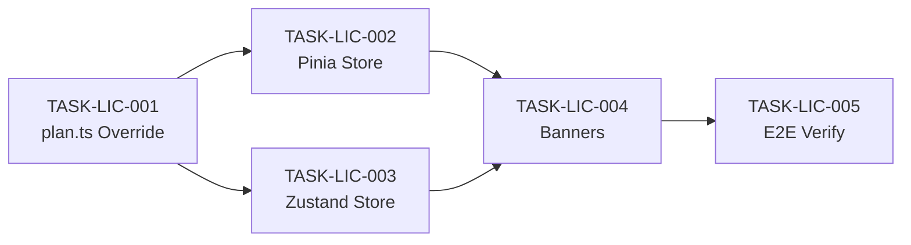

# License Tasks Index

> **Source**: [SOL-LIC-001](../solutions/SOL-LIC-001-enterprise-license-bypass.md)  
> **Total Tasks**: 5 | **Total Effort**: ~3.5h

| Task ID | Title | Priority | Effort | Status | Deps |
|---------|-------|----------|--------|--------|------|
| [TASK-LIC-001](./TASK-LIC-001.md) | Override Core Feature Check (`plan.ts`) | P0 | 15 min | DONE | — |
| [TASK-LIC-002](./TASK-LIC-002.md) | Override Pinia Subscription Store | P0 | 30 min | DONE | LIC-001 |
| [TASK-LIC-003](./TASK-LIC-003.md) | Override Zustand Workspace Slice | P0 | 30 min | DONE | LIC-001 |
| [TASK-LIC-004](./TASK-LIC-004.md) | Suppress License Banners | P1 | 15 min | DONE | LIC-002, LIC-003 |
| [TASK-LIC-005](./TASK-LIC-005.md) | E2E Verification — Enterprise Features | P1 | 2h | DONE | LIC-001~004 |

## Dependency Graph

