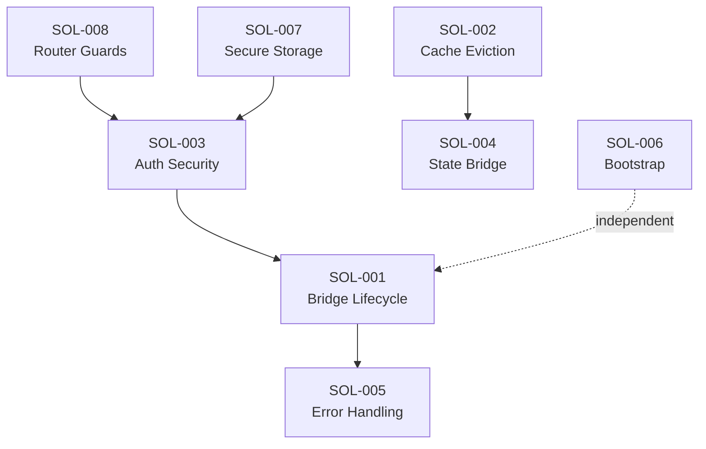

# Frontend Weakness Solutions — Index

> **Version**: 1.0.0 | **Date**: 2026-05-13  
> **Scope**: Bytebase Frontend (`vnp-bytebase/frontend/`)  
> **Source**: [Bug Registry](../bugs/README.md)

---

## Tổng quan

Tài liệu này liệt kê các giải pháp kỹ thuật cho 8 điểm yếu được phát hiện trong [Bug Registry](../bugs/README.md). Mỗi giải pháp bao gồm: thay đổi kiến trúc (nếu cần), thiết kế chi tiết, migration plan, và metrics.

---

## Solution Registry

| ID | Source Bug | Tên Giải pháp | Effort | Priority |
|---|---|---|---|---|
| **SOL-WEAK-001** | [BUG-WEAK-001](../bugs/BUG-WEAK-001-bridge-race-conditions.md) | [Bridge Lifecycle Manager](./SOL-WEAK-001-bridge-lifecycle-manager.md) | 16h | 🔴 P1 |
| **SOL-WEAK-002** | [BUG-WEAK-002](../bugs/BUG-WEAK-002-cache-unbounded-growth.md) | [Cache Eviction Engine](./SOL-WEAK-002-cache-eviction-engine.md) | 14h | 🟠 P2 |
| **SOL-WEAK-003** | [BUG-WEAK-003](../bugs/BUG-WEAK-003-auth-security-gaps.md) | [Auth Security Hardening](./SOL-WEAK-003-auth-security-hardening.md) | 8.5h | 🔴 P1 |
| **SOL-WEAK-004** | [BUG-WEAK-004](../bugs/BUG-WEAK-004-state-sync-dual-framework.md) | [Unified State Bridge](./SOL-WEAK-004-unified-state-bridge.md) | 7.5h | 🟠 P2 |
| **SOL-WEAK-005** | [BUG-WEAK-005](../bugs/BUG-WEAK-005-error-handling-antipatterns.md) | [Structured Error Handling](./SOL-WEAK-005-structured-error-handling.md) | 5h | 🟡 P3 |
| **SOL-WEAK-006** | [BUG-WEAK-006](../bugs/BUG-WEAK-006-performance-bundle.md) | [Progressive Bootstrap & Bundle](./SOL-WEAK-006-progressive-bootstrap-bundle.md) | 13.5h | 🟡 P3 |
| **SOL-WEAK-007** | [BUG-WEAK-007](../bugs/BUG-WEAK-007-localstorage-security.md) | [Secure Storage Service](./SOL-WEAK-007-secure-storage-service.md) | 16h | 🟡 P3 |
| **SOL-WEAK-008** | [BUG-WEAK-008](../bugs/BUG-WEAK-008-router-guard-complexity.md) | [Router Guard Refactoring](./SOL-WEAK-008-router-guard-refactoring.md) | 12h | 🟡 P3 |

---

## Total Effort Estimate

```
🔴 P1 (Security + Architecture): 24.5h  (~3 days)
🟠 P2 (State Management):        21.5h  (~3 days)
🟡 P3 (Quality + Performance):   46.5h  (~6 days)
─────────────────────────────────────────
Total:                            92.5h  (~12 days)
```

---

## Recommended Execution Order

### Sprint 1 — Security & Stability (Week 1)
1. **SOL-WEAK-003** (8.5h) — Auth security: open redirect, logout retry, token refresh resilience
2. **SOL-WEAK-001** (16h) — Bridge lifecycle: memory leaks, error boundary, type safety

### Sprint 2 — State & Data Integrity (Week 2)
3. **SOL-WEAK-002** (14h) — Cache eviction: TTL, LRU, consolidated cache layers
4. **SOL-WEAK-004** (7.5h) — State unification: single source of truth, typed bridge

### Sprint 3 — Quality & Performance (Week 3)
5. **SOL-WEAK-005** (5h) — Error handling: scoped suppression, structured logging
6. **SOL-WEAK-008** (12h) — Router guards: pipeline, registry, lazy reset

### Sprint 4 — Optimization (Week 4)
7. **SOL-WEAK-006** (13.5h) — Performance: progressive bootstrap, i18n merge, bundle
8. **SOL-WEAK-007** (16h) — Storage: centralized service, encryption, PII removal

---

## Cross-Solution Dependencies



- **SOL-003 → SOL-001**: Auth cleanup (`clearPageCache`) depends on bridge manager API
- **SOL-001 → SOL-005**: ReactErrorBoundary is shared between both solutions
- **SOL-002 → SOL-004**: Cache config feeds into state unification strategy
- **SOL-008 → SOL-003**: Lazy store reset aligns with logout retry logic
- **SOL-007 → SOL-003**: Encrypted token storage depends on auth hardening

---

## Architecture Document Impact Summary

| Section | Impact | Details |
|---------|--------|---------|
| §4.1 Bridge Pattern | 🔄 Major | New `BridgeLifecycleManager` with cancellation |
| §4.2 State Sharing | 🔄 Major | Pinia as sole domain state owner |
| §6.3 Token Refresh | 🔄 Moderate | Broadcast failure, Web Locks fallback |
| §7.2 Cache Strategy | 🔄 Major | TTL + LRU eviction engine |
| §9.2 Dual Auth | 🔧 Minor | Encrypted refresh token storage |
| §9.3 Security | 🔧 Minor | Open redirect validation |
| §13.2 Constraints | 🔄 Moderate | Progressive bootstrap removes blank-page constraint |

## TDD Impact Summary

| Section | Impact | Details |
|---------|--------|---------|
| §2 Bootstrap Sequence | 🔄 Major | Progressive mount with skeleton |
| §3.1 Bridge Design | 🔄 Major | AbortController lifecycle, typed props |
| §3.3 State Management | 🔄 Moderate | Cache config, eviction engine |
| §3.5 Auth Module | 🔧 Minor | Error logging, logout retry |
| §3.6 Router Module | 🔄 Moderate | Guard pipeline, registry |
| §7 Error Handling | 🔄 Moderate | Scoped suppression, React error boundary |
