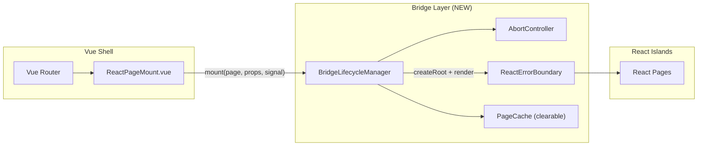

# SOL-WEAK-001: Bridge Lifecycle Manager — Race Condition & Memory Leak Elimination

> **Source**: [BUG-WEAK-001](../bugs/BUG-WEAK-001-bridge-race-conditions.md)  
> **Severity**: HIGH → **Target**: RESOLVED  
> **Category**: Architecture Fix  
> **Status**: PROPOSED  
> **Created**: 2026-05-13

---

## 1. Tóm tắt Giải pháp

Thay thế bridge hiện tại (fire-and-forget async mount) bằng **BridgeLifecycleManager** — một lớp quản lý vòng đời React root có hỗ trợ cancellation, type-safe props, error boundary, và automatic cleanup.

---

## 2. Thay đổi Kiến trúc

### 2.1 Architecture Document — Cập nhật Section 4.1 Bridge Pattern

**Trước:**
```
ReactPageMount.vue → mountReactPage() [async, no cancellation]
```

**Sau:**
```
ReactPageMount.vue → BridgeLifecycleManager.mount() [cancellable, typed, bounded]
```

**Mermaid cập nhật:**



### 2.2 TDD — Cập nhật Section 3.1 Vue ↔ React Bridge

Thêm mô tả `BridgeLifecycleManager` class contract.

---

## 3. Thiết kế Chi tiết

### 3.1 BridgeLifecycleManager Class

```typescript
// src/react/BridgeLifecycleManager.ts

import type { Root } from "react-dom/client";

interface MountOperation {
  root: Root;
  pageName: string;
  abortController: AbortController;
}

interface BridgePageProps<T = Record<string, unknown>> {
  pageName: string;
  props: T;
}

class BridgeLifecycleManager {
  private currentOp: MountOperation | null = null;
  private pendingOp: AbortController | null = null;

  /**
   * Mount a React page into a container.
   * If a previous mount is in progress, it will be cancelled.
   * If a previous mount completed, the root will be unmounted first.
   */
  async mount<T extends Record<string, unknown>>(
    container: HTMLElement,
    page: BridgePageProps<T>,
    signal?: AbortSignal
  ): Promise<Root | null> {
    // 1. Cancel any pending mount operation
    this.pendingOp?.abort();
    
    // 2. Create new AbortController for this operation
    const controller = new AbortController();
    this.pendingOp = controller;
    
    // Link with external signal if provided
    signal?.addEventListener("abort", () => controller.abort());

    try {
      // 3. Load dependencies (cached, non-cancellable)
      const deps = await loadCoreDeps();
      if (controller.signal.aborted) return null;  // ← CHECK after every await

      // 4. Load page component (cached)
      const Component = await loadPage(page.pageName);
      if (controller.signal.aborted) return null;  // ← CHECK

      // 5. Unmount previous root if exists
      this.unmountCurrent();

      // 6. Create and render new root WITH ErrorBoundary
      const root = deps.createRoot(container);
      root.render(
        deps.createElement(deps.StrictMode, null,
          deps.createElement(ReactErrorBoundary, { pageName: page.pageName },
            deps.createElement(deps.I18nextProvider, { i18n: deps.i18n },
              deps.createElement(Component, page.props)
            )
          )
        )
      );

      // 7. Track current operation
      this.currentOp = {
        root,
        pageName: page.pageName,
        abortController: controller,
      };

      this.pendingOp = null;
      return root;
    } catch (error) {
      if (controller.signal.aborted) return null;
      // Re-throw for caller to handle (render queue error handling)
      throw error;
    }
  }

  /**
   * Update props on current React root without remount.
   */
  update<T extends Record<string, unknown>>(props: T): void {
    if (!this.currentOp) return;
    // Use React 19 root.render() for prop updates
    // (implementation delegates to existing updateReactPage pattern)
  }

  /**
   * Unmount current React root and cleanup.
   */
  unmountCurrent(): void {
    if (this.currentOp) {
      this.currentOp.root.unmount();
      this.currentOp = null;
    }
  }

  /**
   * Full cleanup — cancel pending, unmount current, clear page cache.
   * Called on logout.
   */
  destroy(): void {
    this.pendingOp?.abort();
    this.pendingOp = null;
    this.unmountCurrent();
    clearPageCache();  // ← NEW: clear cachedPages Map
  }
}

// Singleton export
export const bridgeManager = new BridgeLifecycleManager();
```

### 3.2 ReactPageMount.vue — Simplified

```typescript
// Before (complex async logic with race conditions):
let root: Root | null = null;
let renderQueue = Promise.resolve();
function render() {
  const next = renderQueue.then(() => doRender());
  renderQueue = next.catch(() => undefined); // ← error swallowed
  return next;
}

// After (delegate to BridgeLifecycleManager):
import { bridgeManager } from "./BridgeLifecycleManager";

const abortController = new AbortController();

watch(() => [props.page, pageProps.value], async () => {
  try {
    await bridgeManager.mount(
      container.value,
      { pageName: props.page, props: pageProps.value },
      abortController.signal
    );
  } catch (error) {
    // Show error notification instead of swallowing
    useNotificationStore().pushNotification({
      module: "bytebase",
      style: "CRITICAL",
      title: `Failed to load page: ${props.page}`,
      description: String(error),
    });
  }
}, { immediate: true });

onUnmounted(() => {
  abortController.abort();  // Cancel any pending mount
  bridgeManager.unmountCurrent();
});
```

### 3.3 ReactErrorBoundary Component

```tsx
// src/react/components/ReactErrorBoundary.tsx

import { Component, type ReactNode, type ErrorInfo } from "react";

interface Props {
  pageName: string;
  children: ReactNode;
}

interface State {
  hasError: boolean;
  error: Error | null;
}

export class ReactErrorBoundary extends Component<Props, State> {
  state: State = { hasError: false, error: null };

  static getDerivedStateFromError(error: Error): State {
    return { hasError: true, error };
  }

  componentDidCatch(error: Error, info: ErrorInfo) {
    console.error(
      `[ReactErrorBoundary] Page "${this.props.pageName}" crashed:`,
      error,
      info.componentStack
    );
  }

  render() {
    if (this.state.hasError) {
      return (
        <div className="flex flex-col items-center justify-center h-full p-8">
          <div className="text-destructive text-lg font-semibold mb-2">
            Page Error
          </div>
          <p className="text-muted-foreground text-sm mb-4">
            The page "{this.props.pageName}" encountered an error.
          </p>
          <button
            onClick={() => this.setState({ hasError: false, error: null })}
            className="px-4 py-2 bg-primary text-primary-foreground rounded"
          >
            Retry
          </button>
          {import.meta.env.DEV && (
            <pre className="mt-4 text-xs text-destructive/70 max-w-lg overflow-auto">
              {this.state.error?.stack}
            </pre>
          )}
        </div>
      );
    }
    return this.props.children;
  }
}
```

### 3.4 Typed Bridge Props — Thay thế `any`

```typescript
// src/react/bridge-types.ts

/** Base interface for all React page props passed through bridge */
export interface BridgePageBaseProps {
  /** Unique key for React reconciliation */
  key?: string;
}

/** Generic mount function signature */
export type MountFunction<P extends BridgePageBaseProps = BridgePageBaseProps> = (
  container: HTMLElement,
  pageName: string,
  props: P,
  signal?: AbortSignal
) => Promise<Root | null>;

/** Page component type — replaces `(props: any) => any` */
export type ReactPageComponent<P extends BridgePageBaseProps = BridgePageBaseProps> = 
  React.ComponentType<P>;

/** Core dependencies type — replaces `ReactDeps = any` */
export interface ReactCoreDeps {
  React: typeof import("react");
  createRoot: typeof import("react-dom/client").createRoot;
  StrictMode: typeof import("react").StrictMode;
  createElement: typeof import("react").createElement;
  I18nextProvider: typeof import("react-i18next").I18nextProvider;
  i18n: import("i18next").i18n;
}
```

### 3.5 Page Cache Cleanup on Logout

```typescript
// src/react/mount.ts — additions

const cachedPages = new Map<string, ReactPageComponent>();

/** Clear all cached page components — called on logout */
export function clearPageCache(): void {
  cachedPages.clear();
}

// src/store/modules/v1/auth.ts — trong logout()
import { clearPageCache } from "@/react/mount";

const logout = async () => {
  // ... existing cleanup ...
  clearPageCache(); // ← Prevent stale closures persisting across sessions
};
```

---

## 4. Migration Plan

| Phase | Thay đổi | Risk | Effort |
|-------|----------|------|--------|
| **Phase 1** | Thêm `ReactErrorBoundary` vào `buildTree()` | LOW — additive only | 2h |
| **Phase 2** | Implement `BridgeLifecycleManager` class | MEDIUM — core change | 4h |
| **Phase 3** | Refactor `ReactPageMount.vue` để dùng manager | MEDIUM — regression risk | 4h |
| **Phase 4** | Thêm `clearPageCache()` vào logout flow | LOW | 1h |
| **Phase 5** | Replace `any` types với `bridge-types.ts` | LOW — type-only | 3h |
| **Phase 6** | Apply same pattern cho `mountSidebar.ts`, `mountProjectSidebar.ts` | LOW | 2h |

**Total Estimated Effort**: ~16h (2 developer-days)

---

## 5. Test Strategy

### 5.1 Unit Tests
- `BridgeLifecycleManager.test.ts`:
  - Mount → abort → verify root not leaked
  - Mount → mount (fast switch) → verify first root unmounted
  - Mount → error → verify error propagated (not swallowed)
  - `destroy()` → verify cachedPages cleared

### 5.2 Integration Tests
- Playwright test: Navigate rapidly between 5 React pages → heap snapshot → verify no orphaned ReactDOMRoot

### 5.3 Regression Tests
- Verify all existing React pages still mount correctly
- Verify sidebar mount/unmount cycle

---

## 6. Metrics & Validation

| Metric | Before | Target |
|--------|--------|--------|
| Orphaned ReactDOMRoot after 20 navigations | 5-10 | 0 |
| Memory growth per navigation cycle | ~2MB | <0.1MB |
| Bridge mount error visibility | Silent (blank page) | Error boundary with retry |
| Type safety coverage in bridge layer | 0% (all `any`) | 100% typed |
