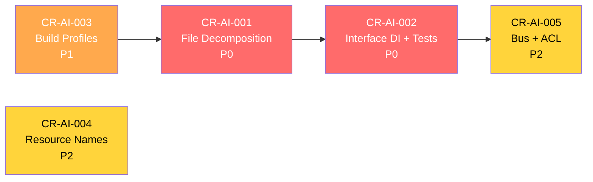

# Bytebase AI Readiness — Change Request Registry

| Field           | Value                                           |
|-----------------|--------------------------------------------------|
| **Domain**      | AI-Assisted Development Readiness                |
| **Scope**       | `backend/` codebase                              |
| **Total CRs**   | 5                                                |
| **Total Issues** | 9 (consolidated into 5 CRs)                    |
| **Created**     | 2026-05-09                                       |
| **PRD Version** | Latest (2026-05-08)                              |

---

## 1. Change Request Index

| CR ID | Title | Priority | Issues Addressed | Sprint |
|-------|-------|----------|------------------|--------|
| [CR-AI-001](CR-AI-001-service-decomposition.md) | Service & Model File Decomposition | P0 Critical | AI-BLOCKER-001, 008 | S1-S3 |
| [CR-AI-002](CR-AI-002-interface-di-and-mocks.md) | Interface-Based DI & Mock Infrastructure | P0 Critical | AI-BLOCKER-002, 006 | S1-S4 |
| [CR-AI-003](CR-AI-003-build-profiles-engine-matrix.md) | Build Profile Registry & Engine Matrix | P1 High | AI-BLOCKER-003, 004 | S1-S2 |
| [CR-AI-004](CR-AI-004-resource-name-simplification.md) | Resource Name Parser Simplification | P2 Medium | AI-BLOCKER-005 | S1-S2 |
| [CR-AI-005](CR-AI-005-bus-interface-acl-contract.md) | Event Bus Interface & ACL Contract | P2 Medium | AI-BLOCKER-007, 009 | S1-S3 |

---

## 2. Issue-to-CR Traceability

| Issue ID | Issue Title | CR ID |
|----------|-------------|-------|
| AI-BLOCKER-001 | Oversized Service Files (10 files > 1000 LOC) | CR-AI-001 |
| AI-BLOCKER-002 | Concrete `*store.Store` Dependency (76 files) | CR-AI-002 |
| AI-BLOCKER-003 | Build Tags Create Invisible Dependencies | CR-AI-003 |
| AI-BLOCKER-004 | Engine Capability Matrix Sprawl (11 switches) | CR-AI-003 |
| AI-BLOCKER-005 | Resource Name Parsing Complexity (50+ functions) | CR-AI-004 |
| AI-BLOCKER-006 | Missing Unit Test Coverage (0% critical services) | CR-AI-002 |
| AI-BLOCKER-007 | Bus Uses Untyped Channels (no interface) | CR-AI-005 |
| AI-BLOCKER-008 | Store Model Mega-File (1290 LOC) | CR-AI-001 |
| AI-BLOCKER-009 | ACL Proto Reflection (implicit contract) | CR-AI-005 |

---

## 3. PRD Feature Alignment

| PRD Section | Features Impacted | CRs |
|-------------|-------------------|-----|
| §2 API Layer (30+ gRPC Services) | Service modularization, ACL contract | CR-AI-001, 005 |
| §3.1 DCM (Issue/Plan/Rollout) | Rollout state machine, event bus | CR-AI-001, 005 |
| §3.2 SQL Editor | SQL service decomposition | CR-AI-001 |
| §3.3 Security (IAM, 2FA, SSO) | Auth service decomposition, ACL | CR-AI-001, 005 |
| §5 Database Engines (22+) | Engine matrix, build profiles | CR-AI-003 |
| §6 Deployment Options | Build profile documentation | CR-AI-003 |
| §7 Technology Stack (Go, ConnectRPC) | Interface DI, mock framework | CR-AI-002 |

---

## 4. Dependency Graph

---

## 5. Implementation Roadmap

### Sprint 1 (Week 1-2): Foundation
- **CR-AI-003 Phase 1**: Build profile documentation + AI-CONTEXT comments
- **CR-AI-002 Phase 1**: Generate `mock_store.go`
- **CR-AI-001 Phase 1**: Extract `auth_service.go` (highest LOC)

### Sprint 2 (Week 3-4): Core Migration
- **CR-AI-003 Phase 2-3**: Engine matrix refactor + DriverRegistry
- **CR-AI-002 Phase 2-3**: Migrate auth + SQL services to interfaces
- **CR-AI-001 Phase 2-4**: Extract remaining services + store model
- **CR-AI-004 Phase 1-3**: Typed resource parsers + documentation

### Sprint 3 (Week 5-6): Testing & Events
- **CR-AI-002 Phase 4-5**: Migrate remaining files + scaffold tests
- **CR-AI-005 Phase 1-3**: EventBus interface + event flow docs
- **CR-AI-005 Phase 4-6**: ACL static extractors + contract doc
- **CR-AI-001 Phase 6**: Full regression test suite

### Sprint 4 (Week 7-8): Polish & CI
- **CR-AI-002 Phase 6**: Coverage gate enforcement (≥60%)
- **CR-AI-005 Phase 7**: Runner migration to EventBus
- Final integration testing across all build profiles

---

## 6. Aggregate Success Metrics

| Metric | Current | After All CRs |
|--------|---------|----------------|
| Max service file LOC | 1930 | ≤500 |
| Files importing concrete `*store.Store` | 76 | ≤5 |
| Engine switch statements | 11 | 0 (data-driven) |
| Lines to add new engine | 22 | 1 |
| Service unit test coverage | 0% | ≥60% |
| Resource name parser functions | 50+ | ~15 |
| Bus `chan int` signals | 2 | 0 |
| ACL reflection probes | 4 | 0 |
| Build profiles documented | 0 | 3 |
| Event flow documentation | None | Complete |
| ACL contract documentation | None | Complete |
