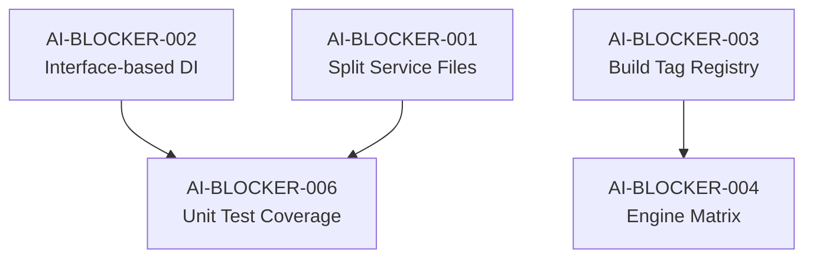

# Bytebase Backend — AI Blocker Issues Registry

> **Audit Date**: 2026-05-09  
> **Scope**: `backend/` directory  
> **Total Issues**: 9  

## Priority Matrix

| Priority | Issue | Severity | Category |
|----------|-------|----------|----------|
| P0 | [AI-BLOCKER-001](AI-BLOCKER-001-oversized-service-files.md) | 🔴 Critical | Service files exceed LLM context window (10 files > 1000 LOC) |
| P0 | [AI-BLOCKER-002](AI-BLOCKER-002-concrete-store-dependency.md) | 🔴 Critical | 76 files depend on concrete `*store.Store` instead of interfaces |
| P1 | [AI-BLOCKER-003](AI-BLOCKER-003-build-tag-hidden-deps.md) | 🟠 High | Build tags create invisible dependency graph (3 profiles) |
| P1 | [AI-BLOCKER-004](AI-BLOCKER-004-engine-capability-matrix-sprawl.md) | 🟠 High | 11 duplicate switch statements in engine.go (493 LOC) |
| P1 | [AI-BLOCKER-006](AI-BLOCKER-006-missing-unit-test-coverage.md) | 🟠 High | Zero unit tests for critical services, mocks not generated |
| P2 | [AI-BLOCKER-005](AI-BLOCKER-005-resource-name-parsing-complexity.md) | 🟡 Medium | 50+ resource name parsers with ambiguous naming (736 LOC) |
| P2 | [AI-BLOCKER-007](AI-BLOCKER-007-bus-channel-coupling.md) | 🟡 Medium | Event bus uses untyped channels, no interface |
| P2 | [AI-BLOCKER-008](AI-BLOCKER-008-store-model-mega-file.md) | 🟡 Medium | Store model database.go is 1290 LOC mega-file |
| P2 | [AI-BLOCKER-009](AI-BLOCKER-009-acl-proto-reflection.md) | 🟡 Medium | ACL uses proto reflection for implicit resource extraction |

## Dependency Graph

## Metrics Summary

| Metric | Current | Target |
|--------|---------|--------|
| Max service file LOC | 1930 | ≤500 |
| Files importing concrete `*store.Store` | 76 | 0 (use interfaces) |
| Engine switch functions | 11 | 1 (data-driven map) |
| Service test coverage | 0% | ≥60% |
| Resource name parser functions | 50+ | ≤15 (typed structs) |
| Store model max file LOC | 1290 | ≤400 |

## Implementation Phases

### Phase 1: Foundation (Week 1-2)
- Generate store mocks (`AI-BLOCKER-002`)
- Create build profile documentation (`AI-BLOCKER-003`)

### Phase 2: Decomposition (Week 3-4)
- Split `auth_service.go` and `sql_service.go` (`AI-BLOCKER-001`)
- Refactor engine capability matrix (`AI-BLOCKER-004`)

### Phase 3: Testing & Polish (Week 5-6)
- Scaffold service tests (`AI-BLOCKER-006`)
- Refactor resource name parsers (`AI-BLOCKER-005`)
- Split store model (`AI-BLOCKER-008`)
- Extract bus interface (`AI-BLOCKER-007`)
- Document ACL contract (`AI-BLOCKER-009`)
