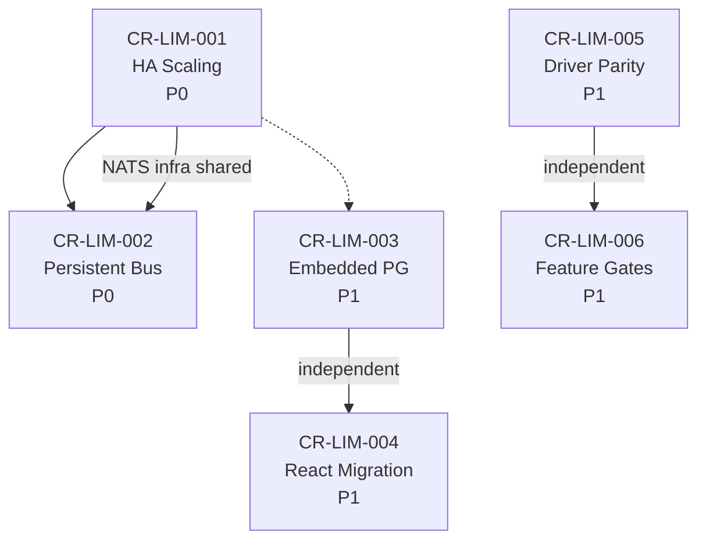

# Change Requests — Limitations Resolution

| Metadata       | Value                                                |
|----------------|------------------------------------------------------|
| Category       | Limitations                                          |
| Total CRs      | 6                                                    |
| Document Date  | 2026-05-08                                           |
| Status         | Draft — All CRs pending review                      |
| Source         | LIM-001 through LIM-006 limitation analysis          |

---

## Tổng quan

Thư mục này chứa các **Change Requests (CR)** được tạo để giải quyết các **Limitations** đã được phân tích và ghi nhận trong `limitation/`. Mỗi CR ánh xạ 1:1 với một Limitation document.

---

## CR Index

| CR ID       | Limitation  | Title                                          | Priority | Category                  |
|-------------|-------------|------------------------------------------------|----------|---------------------------|
| CR-LIM-001  | LIM-001     | Distributed Cache & HA Horizontal Scaling      | P0       | Architecture / Scalability|
| CR-LIM-002  | LIM-002     | Persistent Message Bus with Durability         | P0       | Reliability               |
| CR-LIM-003  | LIM-003     | Embedded PG Production Migration Toolkit       | P1       | Deployment                |
| CR-LIM-004  | LIM-004     | Frontend Framework Unification (React)         | P1       | Frontend / DX             |
| CR-LIM-005  | LIM-005     | Database Driver Feature Parity Enhancement     | P1       | Feature Coverage          |
| CR-LIM-006  | LIM-006     | Feature Gate Rebalancing & Pricing             | P1       | Licensing / Business      |

---

## Limitation → CR Mapping

```
LIM-001 (Monolith Horizontal Scaling)     → CR-LIM-001 (Redis cache, leader election, read replicas)
LIM-002 (Message Bus Durability)           → CR-LIM-002 (NATS JetStream, DLQ, idempotent consumers)
LIM-003 (Embedded PG Not Production-Ready) → CR-LIM-003 (Migration toolkit, health monitoring, backup)
LIM-004 (Frontend Dual Framework)          → CR-LIM-004 (Complete Vue→React migration plan)
LIM-005 (DB Driver Feature Parity Gap)     → CR-LIM-005 (Advisor expansion, PG OSC, parser fixes)
LIM-006 (Enterprise Feature Gating)        → CR-LIM-006 (FREE limit↑, 2FA→TEAM, audit 90d)
```

---

## Priority & Dependencies



- **CR-LIM-001** và **CR-LIM-002** cùng P0 và có thể share NATS infrastructure
- **CR-LIM-003 → CR-LIM-006** là P1, có thể triển khai song song

---

## External Dependencies Introduced

| Dependency       | Required By     | Mode          | Notes                              |
|------------------|-----------------|---------------|------------------------------------|
| Redis/Valkey 7+  | CR-LIM-001      | HA only       | Distributed cache                  |
| NATS 2.10+       | CR-LIM-002      | HA only       | Persistent message queue           |
| pgroll           | CR-LIM-005      | Optional      | PG online schema change            |

---

## Estimated Timeline

| Quarter   | CRs                              | Focus                                    |
|-----------|----------------------------------|------------------------------------------|
| Q3 2026   | CR-LIM-001, CR-LIM-006          | HA scaling + feature gate quick wins     |
| Q4 2026   | CR-LIM-002, CR-LIM-003          | Reliability + deployment tooling         |
| Q1 2027   | CR-LIM-005 (Phase 1-3)          | Driver parity — top engines              |
| Q2 2027   | CR-LIM-004 (Phase 1-4)          | React migration — core pages             |
| Q3 2027   | CR-LIM-004 (Phase 5-7), CR-LIM-005 (Phase 4-7) | Migration completion       |

---

## Directory Structure

```
specs/crs/v1/limitations/
├── README.md                                    ← This file
├── CR-LIM-001-distributed-cache-ha-scaling.md   ← Solves LIM-001
├── CR-LIM-002-persistent-message-bus.md         ← Solves LIM-002
├── CR-LIM-003-embedded-pg-migration-toolkit.md  ← Solves LIM-003
├── CR-LIM-004-frontend-framework-unification.md ← Solves LIM-004
├── CR-LIM-005-driver-feature-parity.md          ← Solves LIM-005
├── CR-LIM-006-feature-gate-rebalancing.md       ← Solves LIM-006
└── limitation/                                  ← Source limitation documents
    ├── LIM-001-monolith-horizontal-scaling.md
    ├── LIM-002-message-bus-durability.md
    ├── LIM-003-embedded-postgresql-production.md
    ├── LIM-004-frontend-dual-framework.md
    ├── LIM-005-database-driver-feature-parity.md
    └── LIM-006-enterprise-feature-gating.md
```
