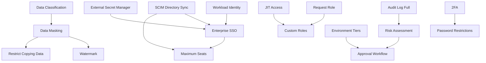

# Enterprise Change Requests — Index

| Metadata       | Value                              |
|----------------|--------------------------------------|
| **Version**    | v1                                   |
| **Plan**       | ENTERPRISE                           |
| **Total CRs**  | 21                                  |
| **Created**    | 2026-05-08                           |
| **Source**     | PRD.md — Pricing Tiers & Features    |

---

## Pricing Dimensions

| CR ID       | Feature ID          | Title                          | Priority | File |
|-------------|---------------------|--------------------------------|----------|------|
| CR-ENT-001  | PRICING-INSTANCES   | Maximum Instances — Unlimited  | P0       | [CR-ENT-001](CR-ENT-001-maximum-instances.md) |
| CR-ENT-002  | PRICING-SEATS       | Maximum Seats — Unlimited      | P0       | [CR-ENT-002](CR-ENT-002-maximum-seats.md) |

## SQL Editor & Development

| CR ID       | Feature ID | Title                          | Priority | File |
|-------------|------------|--------------------------------|----------|------|
| CR-ENT-005  | SQL-15     | Restrict Copying Data          | P1       | [CR-ENT-005](CR-ENT-005-restrict-copying-data.md) |

## Security & Compliance

| CR ID       | Feature ID | Title                          | Priority | File |
|-------------|------------|--------------------------------|----------|------|
| CR-ENT-003  | SEC-10     | Audit Log (Full)               | P0       | [CR-ENT-003](CR-ENT-003-audit-log-full.md) |
| CR-ENT-006  | SEC-08     | Risk Assessment                | P0       | [CR-ENT-006](CR-ENT-006-risk-assessment.md) |
| CR-ENT-007  | SEC-09     | Approval Workflow              | P0       | [CR-ENT-007](CR-ENT-007-approval-workflow.md) |
| CR-ENT-008  | SEC-11     | Enterprise SSO (OIDC/SAML/LDAP)| P0       | [CR-ENT-008](CR-ENT-008-enterprise-sso.md) |
| CR-ENT-009  | SEC-12     | Two-Factor Authentication (2FA)| P0       | [CR-ENT-009](CR-ENT-009-two-factor-auth.md) |
| CR-ENT-010  | SEC-13     | Password Restrictions          | P1       | [CR-ENT-010](CR-ENT-010-password-restrictions.md) |
| CR-ENT-011  | SEC-14     | Custom Roles                   | P1       | [CR-ENT-011](CR-ENT-011-custom-roles.md) |
| CR-ENT-012  | SEC-15     | Data Masking                   | P0       | [CR-ENT-012](CR-ENT-012-data-masking.md) |
| CR-ENT-013  | SEC-16     | Data Classification            | P1       | [CR-ENT-013](CR-ENT-013-data-classification.md) |
| CR-ENT-014  | SEC-17     | SCIM / Directory Sync          | P1       | [CR-ENT-014](CR-ENT-014-scim-directory-sync.md) |
| CR-ENT-015  | SEC-18     | External Secret Manager        | P1       | [CR-ENT-015](CR-ENT-015-external-secret-manager.md) |
| CR-ENT-016  | SEC-19     | Workload Identity (OIDC Fed.)  | P2       | [CR-ENT-016](CR-ENT-016-workload-identity.md) |
| CR-ENT-017  | SEC-20     | JIT (Just-In-Time) Access      | P1       | [CR-ENT-017](CR-ENT-017-jit-access.md) |
| CR-ENT-018  | SEC-21     | Request Role Workflow          | P2       | [CR-ENT-018](CR-ENT-018-request-role-workflow.md) |

## Administration & Integration

| CR ID       | Feature ID | Title                          | Priority | File |
|-------------|------------|--------------------------------|----------|------|
| CR-ENT-004  | PRICING-SUPPORT | Dedicated SLA Support     | P1       | [CR-ENT-004](CR-ENT-004-dedicated-sla-support.md) |
| CR-ENT-019  | ADM-05     | Environment Tiers              | P1       | [CR-ENT-019](CR-ENT-019-environment-tiers.md) |
| CR-ENT-020  | ADM-06     | Custom Logo / Branding         | P2       | [CR-ENT-020](CR-ENT-020-custom-branding.md) |
| CR-ENT-021  | ADM-07     | Watermark                      | P2       | [CR-ENT-021](CR-ENT-021-watermark.md) |

---

## Priority Summary

| Priority | Count | CRs |
|----------|-------|-----|
| **P0**   | 7     | ENT-001, 002, 003, 006, 007, 008, 009, 012 |
| **P1**   | 9     | ENT-004, 005, 010, 011, 013, 014, 015, 017, 019 |
| **P2**   | 4     | ENT-016, 018, 020, 021 |

## Cross-Dependencies

