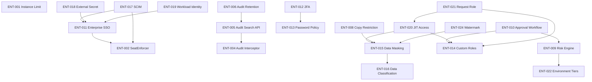

# Enterprise Tasks — Traceability Matrix

| Metadata | Value |
|---|---|
| **Version** | v1 |
| **Total Tasks** | 24 |
| **Total Solutions** | 21 |
| **Coverage** | 100% |
| **Created** | 2026-05-13 |

---

## Traceability: Solution → Task Mapping

| Solution | CR | Title | Task(s) | Coverage |
|---|---|---|---|---|
| SOL-ENT-001 | CR-ENT-001 | Maximum Instances (Unlimited) | TASK-ENT-001 | ✅ 100% |
| SOL-ENT-002 | CR-ENT-002 | Maximum Seats (Unlimited) | TASK-ENT-002, TASK-ENT-003 | ✅ 100% |
| SOL-ENT-003 | CR-ENT-003 | Audit Log (Full) | TASK-ENT-004, TASK-ENT-005, TASK-ENT-006 | ✅ 100% |
| SOL-ENT-004 | CR-ENT-004 | Dedicated SLA Support | TASK-ENT-007 | ✅ 100% |
| SOL-ENT-005 | CR-ENT-005 | Restrict Copying Data | TASK-ENT-008 | ✅ 100% |
| SOL-ENT-006 | CR-ENT-006 | Risk Assessment | TASK-ENT-009 | ✅ 100% |
| SOL-ENT-007 | CR-ENT-007 | Approval Workflow | TASK-ENT-010 | ✅ 100% |
| SOL-ENT-008 | CR-ENT-008 | Enterprise SSO | TASK-ENT-011 | ✅ 100% |
| SOL-ENT-009 | CR-ENT-009 | Two-Factor Auth | TASK-ENT-012 | ✅ 100% |
| SOL-ENT-010 | CR-ENT-010 | Password Restrictions | TASK-ENT-013 | ✅ 100% |
| SOL-ENT-011 | CR-ENT-011 | Custom Roles | TASK-ENT-014 | ✅ 100% |
| SOL-ENT-012 | CR-ENT-012 | Data Masking | TASK-ENT-015 | ✅ 100% |
| SOL-ENT-013 | CR-ENT-013 | Data Classification | TASK-ENT-016 | ✅ 100% |
| SOL-ENT-014 | CR-ENT-014 | SCIM Directory Sync | TASK-ENT-017 | ✅ 100% |
| SOL-ENT-015 | CR-ENT-015 | External Secret Manager | TASK-ENT-018 | ✅ 100% |
| SOL-ENT-016 | CR-ENT-016 | Workload Identity | TASK-ENT-019 | ✅ 100% |
| SOL-ENT-017 | CR-ENT-017 | JIT Access | TASK-ENT-020 | ✅ 100% |
| SOL-ENT-018 | CR-ENT-018 | Request Role Workflow | TASK-ENT-021 | ✅ 100% |
| SOL-ENT-019 | CR-ENT-019 | Environment Tiers | TASK-ENT-022 | ✅ 100% |
| SOL-ENT-020 | CR-ENT-020 | Custom Branding | TASK-ENT-023 | ✅ 100% |
| SOL-ENT-021 | CR-ENT-021 | Watermark | TASK-ENT-024 | ✅ 100% |

---

## Task Index

| Task ID | Title | Priority | Complexity | Sprint | Source |
|---|---|---|---|---|---|
| TASK-ENT-001 | [Instance Limit Feature Gate](TASK-ENT-001-instance-limit-feature-gate.md) | P0 | Low | Sprint 1 | SOL-ENT-001 |
| TASK-ENT-002 | [SeatEnforcer Backend](TASK-ENT-002-seat-enforcer-backend.md) | P0 | Medium | Sprint 1 | SOL-ENT-002 |
| TASK-ENT-003 | [Seat Billing Integration](TASK-ENT-003-seat-billing-integration.md) | P1 | Medium | Sprint 3 | SOL-ENT-002 |
| TASK-ENT-004 | [Audit Interceptor Expansion](TASK-ENT-004-audit-interceptor-expansion.md) | P0 | High | Sprint 1 | SOL-ENT-003 |
| TASK-ENT-005 | [Audit Search & Export API](TASK-ENT-005-audit-search-export-api.md) | P0 | High | Sprint 2 | SOL-ENT-003 |
| TASK-ENT-006 | [Audit Retention & Immutability](TASK-ENT-006-audit-retention-immutability.md) | P1 | Medium | Sprint 3 | SOL-ENT-003 |
| TASK-ENT-007 | [Support Ticket System](TASK-ENT-007-support-ticket-system.md) | P1 | High | Sprint 1–3 | SOL-ENT-004 |
| TASK-ENT-008 | [Copy Data Restriction](TASK-ENT-008-copy-data-restriction.md) | P1 | Medium | Sprint 1–2 | SOL-ENT-005 |
| TASK-ENT-009 | [Risk Assessment Engine](TASK-ENT-009-risk-assessment-engine.md) | P0 | High | Sprint 1–3 | SOL-ENT-006 |
| TASK-ENT-010 | [Approval Workflow Engine](TASK-ENT-010-approval-workflow-engine.md) | P0 | High | Sprint 1–4 | SOL-ENT-007 |
| TASK-ENT-011 | [Enterprise SSO Enhancement](TASK-ENT-011-enterprise-sso-enhancement.md) | P0 | High | Sprint 1–4 | SOL-ENT-008 |
| TASK-ENT-012 | [Two-Factor Authentication](TASK-ENT-012-two-factor-auth.md) | P0 | Medium | Sprint 1–3 | SOL-ENT-009 |
| TASK-ENT-013 | [Password Policy Engine](TASK-ENT-013-password-policy-engine.md) | P1 | Medium | Sprint 1–3 | SOL-ENT-010 |
| TASK-ENT-014 | [Custom Roles & Permissions](TASK-ENT-014-custom-roles-permissions.md) | P1 | Medium | Sprint 1–3 | SOL-ENT-011 |
| TASK-ENT-015 | [Data Masking Pipeline](TASK-ENT-015-data-masking-pipeline.md) | P0 | Very High | Sprint 1–4 | SOL-ENT-012 |
| TASK-ENT-016 | [Data Classification](TASK-ENT-016-data-classification.md) | P1 | Medium | Sprint 1–3 | SOL-ENT-013 |
| TASK-ENT-017 | [SCIM Directory Sync](TASK-ENT-017-scim-directory-sync.md) | P1 | High | Sprint 1–3 | SOL-ENT-014 |
| TASK-ENT-018 | [External Secret Manager](TASK-ENT-018-external-secret-manager.md) | P1 | High | Sprint 1–3 | SOL-ENT-015 |
| TASK-ENT-019 | [Workload Identity](TASK-ENT-019-workload-identity.md) | P2 | Medium | Sprint 1–3 | SOL-ENT-016 |
| TASK-ENT-020 | [JIT Access](TASK-ENT-020-jit-access.md) | P1 | Medium | Sprint 1–2 | SOL-ENT-017 |
| TASK-ENT-021 | [Request Role Workflow](TASK-ENT-021-request-role-workflow.md) | P2 | Medium | Sprint 1–2 | SOL-ENT-018 |
| TASK-ENT-022 | [Environment Tiers](TASK-ENT-022-environment-tiers.md) | P1 | Medium | Sprint 1–2 | SOL-ENT-019 |
| TASK-ENT-023 | [Custom Branding](TASK-ENT-023-custom-branding.md) | P2 | Low | Sprint 1–2 | SOL-ENT-020 |
| TASK-ENT-024 | [Watermark Overlay](TASK-ENT-024-watermark-overlay.md) | P2 | Low | Sprint 1–2 | SOL-ENT-021 |

---

## Priority Summary

| Priority | Count | Tasks |
|---|---|---|
| **P0** | 8 | ENT-001, 002, 004, 005, 009, 010, 011, 012, 015 |
| **P1** | 10 | ENT-003, 006, 007, 008, 013, 014, 016, 017, 018, 020, 022 |
| **P2** | 4 | ENT-019, 021, 023, 024 |

---

## Execution Order (Token-Optimized)

### Sprint 1 — Foundation (Independent Tasks First)
1. TASK-ENT-001 — Instance Limit (P0, Low, no deps)
2. TASK-ENT-002 — SeatEnforcer (P0, Medium, no deps)
3. TASK-ENT-004 — Audit Interceptor (P0, High, no deps)
4. TASK-ENT-022 — Environment Tiers Phase 1 (P1, feeds risk/approval)
5. TASK-ENT-013 — Password Policy Phase 1 (P1, no deps)
6. TASK-ENT-023 — Custom Branding Phase 1 (P2, Low, no deps)
7. TASK-ENT-024 — Watermark Phase 1 (P2, Low, no deps)

### Sprint 2 — Core Security
8. TASK-ENT-009 — Risk Assessment Engine (P0, depends on ENV tiers)
9. TASK-ENT-010 — Approval Workflow Phase 1-2 (P0, depends on risk)
10. TASK-ENT-011 — Enterprise SSO Phase 1-2 (P0, OIDC+SAML)
11. TASK-ENT-012 — 2FA Phase 1 (P0, TOTP setup)
12. TASK-ENT-005 — Audit Search API (P0, depends on interceptor)
13. TASK-ENT-016 — Data Classification Phase 1-2 (P1)
14. TASK-ENT-015 — Data Masking Phase 1-2 (P0, depends on classification)

### Sprint 3 — Advanced Features
15. TASK-ENT-014 — Custom Roles Phase 2-3 (P1)
16. TASK-ENT-017 — SCIM Directory Sync (P1)
17. TASK-ENT-018 — External Secret Manager (P1)
18. TASK-ENT-020 — JIT Access (P1, depends on custom roles)
19. TASK-ENT-006 — Audit Retention (P1)
20. TASK-ENT-008 — Copy Data Restriction (P1)
21. TASK-ENT-003 — Seat Billing Integration (P1)

### Sprint 4 — Polish & Integration
22. TASK-ENT-019 — Workload Identity (P2)
23. TASK-ENT-021 — Request Role Workflow (P2)
24. TASK-ENT-007 — Support Ticket System (Phase 4)

---

## Cross-Dependencies

