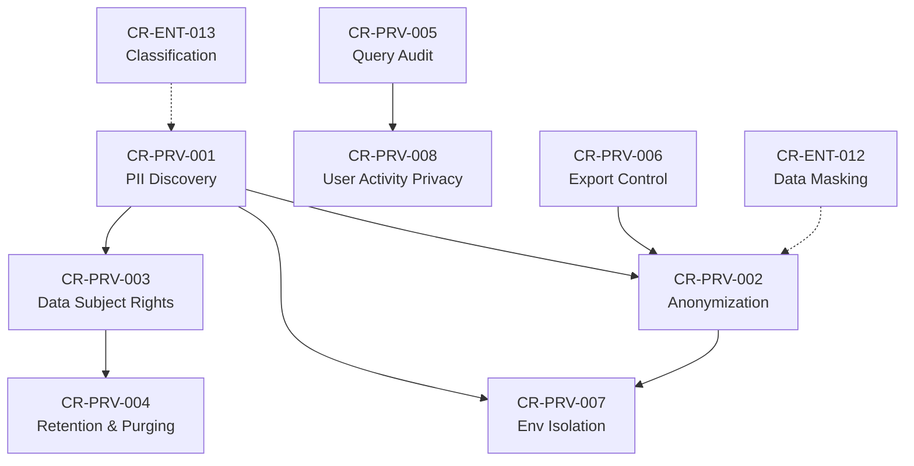

# Change Requests — Privacy (v2)

| Metadata       | Value                                   |
|----------------|-----------------------------------------|
| Category       | Privacy & Data Protection               |
| Version        | v2                                      |
| Created        | 2026-05-13                              |
| Author         | VNP AI Ops Team                         |
| Source Docs    | PRD.md, URD.md                          |

---

## Tổng quan

Nhóm Change Requests này tập trung vào **đảm bảo quyền riêng tư (privacy)** cho dữ liệu và người sử dụng trong hệ thống Bytebase. Các CR được xây dựng dựa trên phân tích PRD (tính năng SEC-15, SEC-16, SQL-15, ADM-07) và URD (yêu cầu UR-S01 → UR-S15, NF-SE01 → NF-SE05), nhằm bổ sung các khả năng bảo vệ quyền riêng tư mà hệ thống hiện tại chưa bao phủ hoặc cần tăng cường.

---

## Danh sách Change Requests

| CR ID       | Title                                        | Priority     | Traceability (PRD/URD)                     |
|-------------|----------------------------------------------|--------------|--------------------------------------------|
| CR-PRV-001  | PII Data Discovery & Inventory               | P0 — Critical| SEC-16, UR-S06, UR-D07                     |
| CR-PRV-002  | Data Anonymization & Pseudonymization        | P0 — Critical| SEC-15, UR-S02, DCM-07                     |
| CR-PRV-003  | User Consent & Data Subject Rights (GDPR/PDPA)| P1 — High   | UR-S03, UR-S14, NF-SE01                    |
| CR-PRV-004  | Data Retention & Automated Purging           | P1 — High    | UR-D11, NF-SE01, UR-S03                    |
| CR-PRV-005  | Privacy-Preserving Query Audit               | P1 — High    | SEC-07, SEC-10, UR-S03, UR-D05             |
| CR-PRV-006  | Data Export Access Control                   | P0 — Critical| SQL-15, SQL-09, UR-S02                     |
| CR-PRV-007  | Environment Data Isolation                   | P1 — High    | ADM-05, UR-D06, UR-S02, NF-SE03           |
| CR-PRV-008  | User Activity Privacy                        | P2 — Medium  | UR-S03, ADM-07, SEC-10, NF-SE04           |

---

## Dependency Map

---

## Cross-References (Enterprise CRs)

| Privacy CR   | Related Enterprise CR                       | Relationship          |
|-------------|---------------------------------------------|-----------------------|
| CR-PRV-001  | CR-ENT-013 (Data Classification)            | Extends               |
| CR-PRV-002  | CR-ENT-012 (Data Masking)                   | Extends               |
| CR-PRV-003  | CR-ENT-003 (Audit Log Full)                 | Depends On            |
| CR-PRV-005  | CR-ENT-003 (Audit Log Full)                 | Extends               |
| CR-PRV-006  | CR-ENT-005 (Restrict Copying Data)          | Extends               |
| CR-PRV-007  | CR-ENT-019 (Environment Tiers)              | Extends               |
| CR-PRV-008  | CR-ENT-021 (Watermark)                      | Complements           |
