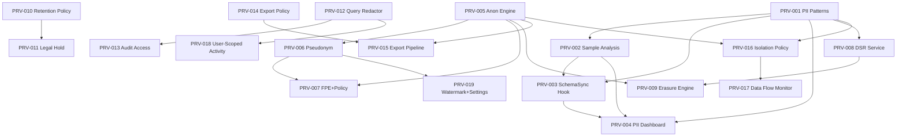

# Privacy Tasks — Traceability Matrix

| Metadata | Value |
|---|---|
| **Version** | v1 |
| **Total Tasks** | 19 |
| **Total Solutions** | 8 |
| **Coverage** | 100% |
| **Created** | 2026-05-13 |

---

## Traceability: Solution → Task Mapping

| Solution | CR | Title | Task(s) | Coverage |
|---|---|---|---|---|
| SOL-PRV-001 | CR-PRV-001 | PII Data Discovery & Inventory | TASK-PRV-001, 002, 003, 004 | ✅ 100% |
| SOL-PRV-002 | CR-PRV-002 | Data Anonymization & Pseudonymization | TASK-PRV-005, 006, 007 | ✅ 100% |
| SOL-PRV-003 | CR-PRV-003 | User Consent & DSR | TASK-PRV-008, 009 | ✅ 100% |
| SOL-PRV-004 | CR-PRV-004 | Data Retention & Purging | TASK-PRV-010, 011 | ✅ 100% |
| SOL-PRV-005 | CR-PRV-005 | Privacy-Preserving Audit | TASK-PRV-012, 013 | ✅ 100% |
| SOL-PRV-006 | CR-PRV-006 | Export Access Control | TASK-PRV-014, 015 | ✅ 100% |
| SOL-PRV-007 | CR-PRV-007 | Environment Data Isolation | TASK-PRV-016, 017 | ✅ 100% |
| SOL-PRV-008 | CR-PRV-008 | User Activity Privacy | TASK-PRV-018, 019 | ✅ 100% |

---

## Task Index

| Task ID | Title | Priority | Complexity | Sprint | Source |
|---|---|---|---|---|---|
| TASK-PRV-001 | [PII Pattern Registry](TASK-PRV-001-pii-pattern-registry.md) | P0 | Medium | Sprint 1 | SOL-PRV-001 |
| TASK-PRV-002 | [PII Sample Analysis](TASK-PRV-002-pii-sample-analysis.md) | P0 | High | Sprint 2 | SOL-PRV-001 |
| TASK-PRV-003 | [PII SchemaSync Hook](TASK-PRV-003-pii-schemasync-hook.md) | P1 | Medium | Sprint 2 | SOL-PRV-001 |
| TASK-PRV-004 | [PII Dashboard](TASK-PRV-004-pii-dashboard.md) | P1 | Medium | Sprint 3 | SOL-PRV-001 |
| TASK-PRV-005 | [Anonymization Engine](TASK-PRV-005-anonymization-engine.md) | P0 | High | Sprint 1 | SOL-PRV-002 |
| TASK-PRV-006 | [Pseudonymization Engine](TASK-PRV-006-pseudonymization-engine.md) | P0 | High | Sprint 2 | SOL-PRV-002 |
| TASK-PRV-007 | [FPE + Policy + Export](TASK-PRV-007-fpe-policy-export.md) | P1 | High | Sprint 3–4 | SOL-PRV-002 |
| TASK-PRV-008 | [DSR Service](TASK-PRV-008-dsr-service.md) | P1 | High | Sprint 1–2 | SOL-PRV-003 |
| TASK-PRV-009 | [Erasure Engine](TASK-PRV-009-erasure-engine.md) | P1 | High | Sprint 3–4 | SOL-PRV-003 |
| TASK-PRV-010 | [Retention Policy](TASK-PRV-010-retention-policy.md) | P1 | Medium | Sprint 1–2 | SOL-PRV-004 |
| TASK-PRV-011 | [Legal Hold](TASK-PRV-011-legal-hold.md) | P1 | Medium | Sprint 3 | SOL-PRV-004 |
| TASK-PRV-012 | [Query Redactor](TASK-PRV-012-query-redactor.md) | P1 | High | Sprint 1–2 | SOL-PRV-005 |
| TASK-PRV-013 | [Audit Access Control](TASK-PRV-013-audit-access-control.md) | P2 | Medium | Sprint 3 | SOL-PRV-005 |
| TASK-PRV-014 | [Export Policy Engine](TASK-PRV-014-export-policy-engine.md) | P0 | High | Sprint 1–2 | SOL-PRV-006 |
| TASK-PRV-015 | [Export Privacy Pipeline](TASK-PRV-015-export-privacy-pipeline.md) | P1 | Medium | Sprint 2–3 | SOL-PRV-006 |
| TASK-PRV-016 | [Isolation Policy](TASK-PRV-016-isolation-policy.md) | P1 | Very High | Sprint 1–2 | SOL-PRV-007 |
| TASK-PRV-017 | [Data Flow Monitor](TASK-PRV-017-data-flow-monitor.md) | P2 | Medium | Sprint 3 | SOL-PRV-007 |
| TASK-PRV-018 | [User-Scoped Activity](TASK-PRV-018-user-scoped-activity.md) | P2 | Medium | Sprint 1–2 | SOL-PRV-008 |
| TASK-PRV-019 | [Privacy Watermark + Settings](TASK-PRV-019-privacy-watermark-settings.md) | P2 | Medium | Sprint 2–3 | SOL-PRV-008 |

---

## Priority Summary

| Priority | Count | Tasks |
|---|---|---|
| **P0** | 5 | PRV-001, 002, 005, 006, 014 |
| **P1** | 9 | PRV-003, 004, 007, 008, 009, 010, 011, 012, 015, 016 |
| **P2** | 5 | PRV-013, 017, 018, 019 |

---

## Execution Order (Token-Optimized)

### Sprint 1 — Foundation (No Dependencies)
1. **TASK-PRV-001** — PII Pattern Registry (P0, Medium, foundation)
2. **TASK-PRV-005** — Anonymization Engine (P0, High, foundation)
3. **TASK-PRV-010** — Retention Policy Phase 1 (P1, Medium, extends existing cleaner)
4. **TASK-PRV-012** — Query Redactor Phase 1 (P1, High, modifies existing audit)
5. **TASK-PRV-014** — Export Policy Engine Phase 1 (P0, High, new component)
6. **TASK-PRV-018** — User-Scoped Activity Phase 1 (P2, Medium, store modifications)

### Sprint 2 — Core Integration
7. **TASK-PRV-002** — PII Sample Analysis (P0, depends: PRV-001)
8. **TASK-PRV-003** — PII SchemaSync Hook (P1, depends: PRV-001, 002)
9. **TASK-PRV-006** — Pseudonymization Engine (P0, depends: PRV-005)
10. **TASK-PRV-008** — DSR Service Phase 1 (P1, depends: PRV-001)
11. **TASK-PRV-016** — Isolation Policy Phase 1 (P1, depends: PRV-005, 001)
12. **TASK-PRV-015** — Export Privacy Pipeline (P1, depends: PRV-014, 005)
13. **TASK-PRV-019** — Privacy Watermark Phase 1 (P2, depends: PRV-006)

### Sprint 3 — Advanced Features
14. **TASK-PRV-004** — PII Dashboard (P1, depends: PRV-001, 002, 003)
15. **TASK-PRV-007** — FPE + Policy + Export (P1, depends: PRV-005, 006)
16. **TASK-PRV-009** — Erasure Engine (P1, depends: PRV-008, 005)
17. **TASK-PRV-011** — Legal Hold (P1, depends: PRV-010)
18. **TASK-PRV-013** — Audit Access Control (P2, depends: PRV-012)
19. **TASK-PRV-017** — Data Flow Monitor (P2, depends: PRV-016)

---

## Cross-Dependencies

---

## Solution Coverage Verification

### SOL-PRV-001 — PII Data Discovery (6 phases → 4 tasks)
| Phase | Scope | Task |
|-------|-------|------|
| 1 | Pattern registry + column name scanner | TASK-PRV-001 |
| 2 | Sample data analysis + DB driver | TASK-PRV-002 |
| 3 | SchemaSync hook + incremental | TASK-PRV-003 |
| 4 | PII Inventory dashboard | TASK-PRV-004 |
| 5 | Compliance mapping + reports | TASK-PRV-004 |
| 6 | Multi-engine testing | TASK-PRV-004 |

### SOL-PRV-002 — Data Anonymization (6 phases → 3 tasks)
| Phase | Scope | Task |
|-------|-------|------|
| 1 | Suppression + Generalization | TASK-PRV-005 |
| 2 | Pseudonymization + key mgmt | TASK-PRV-006 |
| 3 | FPE engine (FF1) | TASK-PRV-007 |
| 4 | Policy engine + env integration | TASK-PRV-007 |
| 5 | Synthetic data generator | TASK-PRV-007 |
| 6 | Export pipeline + dry-run | TASK-PRV-007 |

### SOL-PRV-003 — DSR & Consent (5 phases → 2 tasks)
| Phase | Scope | Task |
|-------|-------|------|
| 1 | DSR Service + DB schema | TASK-PRV-008 |
| 2 | Consent management | TASK-PRV-008 |
| 3 | Erasure engine | TASK-PRV-009 |
| 4 | SLA runner + dashboard | TASK-PRV-009 |
| 5 | Verification + compliance | TASK-PRV-009 |

### SOL-PRV-004 — Data Retention (4 phases → 2 tasks)
| Phase | Scope | Task |
|-------|-------|------|
| 1 | Retention policy CRUD | TASK-PRV-010 |
| 2 | Automated purging engine | TASK-PRV-010 |
| 3 | Legal hold mechanism | TASK-PRV-011 |
| 4 | Compliance dashboard | TASK-PRV-011 |

### SOL-PRV-005 — Privacy Audit (5 phases → 2 tasks)
| Phase | Scope | Task |
|-------|-------|------|
| 1 | Query text redaction | TASK-PRV-012 |
| 2 | Audit detail levels | TASK-PRV-012 |
| 3 | Parameter filtering | TASK-PRV-012 |
| 4 | Tiered access control | TASK-PRV-013 |
| 5 | FORENSIC encryption | TASK-PRV-013 |

### SOL-PRV-006 — Export DLP (5 phases → 2 tasks)
| Phase | Scope | Task |
|-------|-------|------|
| 1 | Export approval workflow | TASK-PRV-014 |
| 2 | Export-time masking | TASK-PRV-015 |
| 3 | Rate limiting + DLP | TASK-PRV-014 |
| 4 | Export audit trail | TASK-PRV-015 |
| 5 | Approval workflow | TASK-PRV-015 |

### SOL-PRV-007 — Environment Isolation (4 phases → 2 tasks)
| Phase | Scope | Task |
|-------|-------|------|
| 1 | Isolation policy engine | TASK-PRV-016 |
| 2 | Cross-env sync pipeline | TASK-PRV-016 |
| 3 | Post-sync verification | TASK-PRV-017 |
| 4 | Data flow monitoring | TASK-PRV-017 |

### SOL-PRV-008 — User Activity Privacy (4 phases → 2 tasks)
| Phase | Scope | Task |
|-------|-------|------|
| 1 | User-scoped activity | TASK-PRV-018 |
| 2 | Data minimization | TASK-PRV-018 |
| 3 | Privacy watermark | TASK-PRV-019 |
| 4 | User privacy settings | TASK-PRV-019 |
