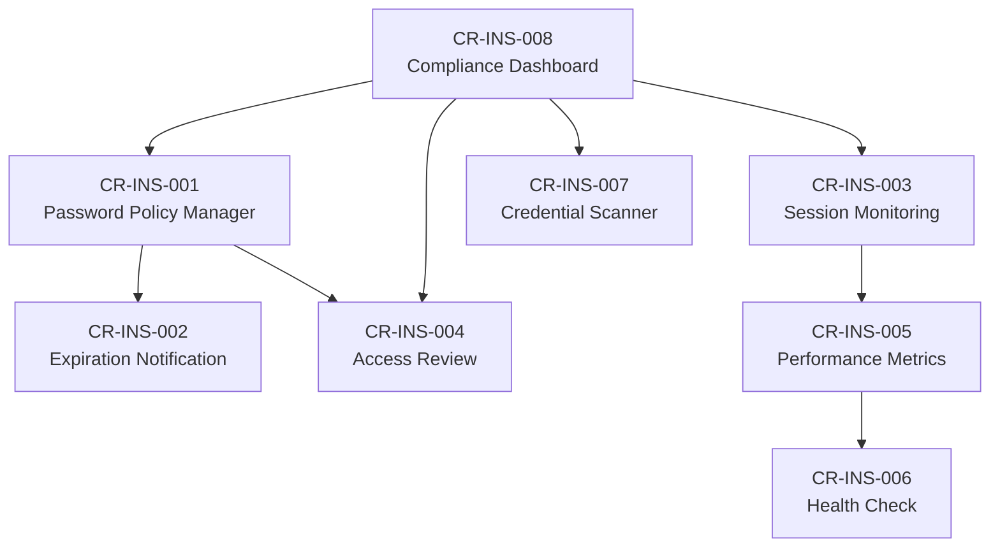

# Change Requests — V3 Inside (Native Bytebase Enhancements)

| Metadata | Value |
|---|---|
| Version | v3 |
| Scope | Tính năng mở rộng bên trong Bytebase để giảm phụ thuộc tool bên ngoài |
| Source | Gap Analysis từ `docs/solutions/3. complementary-opensource-tools.md` |
| Created | 2026-05-15 |

---

## Tổng quan

Các CR trong thư mục này nhằm **mở rộng Bytebase** để hỗ trợ trực tiếp các tính năng mà hiện tại cần tool bên ngoài. Mục tiêu là **giảm thiểu số lượng tool** trong stack và tập trung quản lý vào một nền tảng duy nhất.

---

## Danh sách Change Requests

| CR ID | Title | Gap | Priority | Status |
|---|---|---|---|---|
| CR-INS-001 | DB Password Policy Lifecycle Manager | G1 | P0 — Critical | Draft |
| CR-INS-002 | Password Expiration Notification Engine | G2 | P0 — Critical | Draft |
| CR-INS-003 | Active Session Monitoring Dashboard | G3 | P1 — High | Draft |
| CR-INS-004 | Periodic Access Review Automation | G4 | P1 — High | Draft |
| CR-INS-005 | Database Performance Metrics Collector | G5 | P1 — High | Draft |
| CR-INS-006 | Service Health Check Monitor | G6 | P1 — High | Draft |
| CR-INS-007 | Hardcode Credential Scanner | G7 | P2 — Medium | Draft |
| CR-INS-008 | Compliance Dashboard & Reporting Engine | G8 | P2 — Medium | Draft |

---

## Nguyên tắc thiết kế

1. **Plugin Architecture** — Mỗi tính năng mới được triển khai dưới dạng plugin/module có thể bật/tắt
2. **Multi-DB Engine** — Hỗ trợ tất cả 5 DB engine mà VNPAY sử dụng (Oracle, PostgreSQL, MongoDB, MSSQL, MySQL)
3. **API-First** — Mọi tính năng đều expose REST API để cho phép automation
4. **Enterprise Feature Gating** — Các tính năng nâng cao chỉ khả dụng với license Enterprise
5. **Backward Compatible** — Không breaking change đối với existing workflows

---

## Dependency Graph

