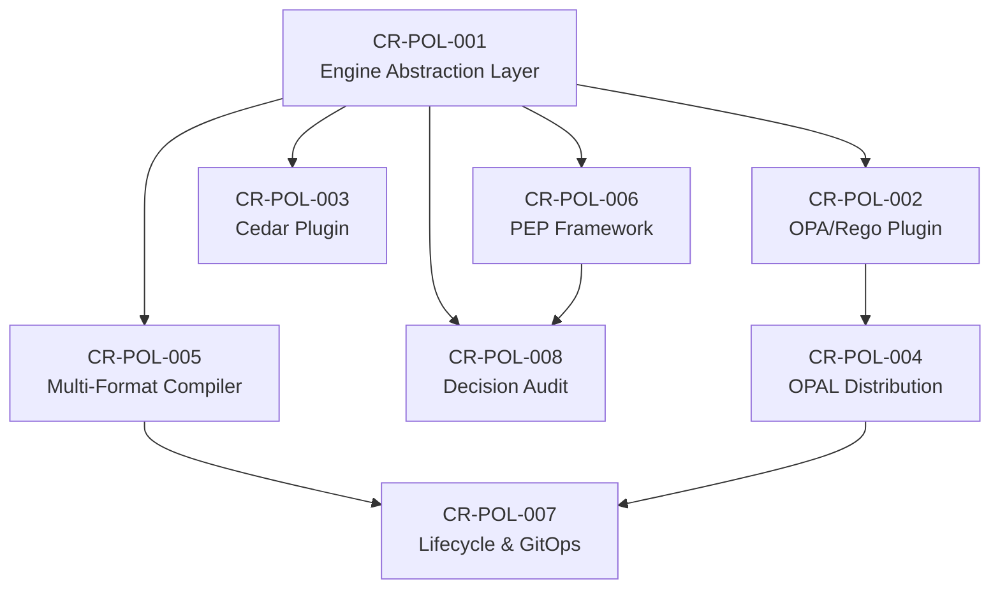

# Change Requests — V3 Policy (Multi-Engine Policy Management Integration)

| Metadata | Value |
|---|---|
| Version | v3 |
| Scope | Tích hợp hệ thống quản lý chính sách đa nền tảng (OPAL, Cedar, OPA, Kyverno...) |
| Source | Gap Analysis từ architecture.md, TDD.md, PRD.md + vnp-policy ecosystem |
| Created | 2026-05-17 |

---

## Tổng quan

Các CR trong thư mục này nhằm **mở rộng khả năng quản lý và thực thi chính sách** của Bytebase, chuyển từ mô hình policy nội bộ (JSONB trong PostgreSQL) sang mô hình **multi-engine policy management** hỗ trợ nhiều hệ thống quản lý chính sách và nhiều nền tảng thực thi khác nhau.

### Hiện trạng (Current State)

| Thành phần | Cách hoạt động hiện tại | Hạn chế |
|---|---|---|
| OrgPolicyService | CRUD policy lưu JSONB trong `policy` table | Chỉ hỗ trợ internal policy types (masking, access, rollout) |
| Policy Types | Hardcoded enum: MASKING, ACCESS, ROLLOUT, WATERMARK, COPY_DATA | Không extensible cho external policy engines |
| Policy Language | CEL (Common Expression Language) cho IAM conditions | Không hỗ trợ Rego, Cedar DSL, YAML-based policies |
| Policy Distribution | Không có — policy chỉ tồn tại trong PostgreSQL | Không real-time sync, không multi-environment |
| Policy Enforcement | Inline trong ACL interceptor + MaskingEvaluator | Không pluggable, không hỗ trợ external engines |
| Audit Trail | AuditInterceptor ghi API calls | Không ghi policy decision logs chi tiết |

### Mục tiêu (Target State)

- **Multi-engine support** — tích hợp OPA (Rego), Cedar (Cedar DSL), OPAL (policy distribution), Kyverno (K8s-native), OpenFGA (ReBAC)
- **Multi-format support** — Rego, Cedar DSL, CEL, YAML, JSON policy definitions
- **Policy Abstraction Layer** — unified interface cho tất cả policy engines
- **Centralized Policy Management** — quản lý tập trung, phân phối real-time qua OPAL
- **External Policy Enforcement Points (PEP)** — pluggable enforcement cho API, database, K8s, CI/CD
- **Policy Lifecycle** — versioning, testing, staging, rollout, audit cho policies
- **GitOps Integration** — policy-as-code workflow từ Git repositories
- **Enterprise Feature** — multi-engine policies là ENTERPRISE plan feature

---

## Danh sách Change Requests

| CR ID | Title | Priority | Status | Dependencies |
|---|---|---|---|---|
| CR-POL-001 | Policy Engine Abstraction Layer | P0 — Critical | Draft | — |
| CR-POL-002 | OPA/Rego Policy Engine Plugin | P0 — Critical | Draft | CR-POL-001 |
| CR-POL-003 | Cedar Policy Engine Plugin | P1 — High | Draft | CR-POL-001 |
| CR-POL-004 | OPAL Policy Distribution Integration | P0 — Critical | Draft | CR-POL-001, CR-POL-002 |
| CR-POL-005 | Multi-Format Policy Compiler | P1 — High | Draft | CR-POL-001 |
| CR-POL-006 | Policy Enforcement Point Framework | P1 — High | Draft | CR-POL-001 |
| CR-POL-007 | Policy Lifecycle & GitOps Pipeline | P2 — Medium | Draft | CR-POL-004, CR-POL-005 |
| CR-POL-008 | Policy Decision Audit & Analytics | P2 — Medium | Draft | CR-POL-001, CR-POL-006 |

---

## Nguyên tắc thiết kế

1. **Engine-Agnostic Interface** — Business logic không phụ thuộc vào policy engine cụ thể (OPA, Cedar, hay internal CEL)
2. **Format-Agnostic Storage** — Policy definitions lưu trữ agnostic, compile on-demand sang engine-specific format
3. **Pluggable Enforcement** — Enforcement points có thể swap giữa local (in-process) và remote (sidecar/external) evaluation
4. **Backward Compatible** — Existing internal policies (masking, access, rollout) vẫn hoạt động qua CEL engine
5. **Enterprise Feature Gating** — External engine integration chỉ cho Enterprise plan; internal CEL cho tất cả plans
6. **GitOps-First** — Policy-as-code là first-class citizen, Git là single source of truth
7. **Real-time Distribution** — Policy changes phải propagate trong < 5 giây qua OPAL hoặc equivalent
8. **Observable** — Mọi policy decision phải được log, traceable, auditable

---

## Dependency Graph

---

## Mối quan hệ với các CR khác

| CR liên quan | Mối quan hệ |
|---|---|
| CR-VLT-001 (Vault Abstraction) | Policy engine credentials lưu trong vault |
| CR-INT-* (Integration Agents) | Policy enforcement cho integration agents |
| OrgPolicyService (existing) | Backward compatible, extended bởi CR-POL-001 |
| IAM Manager (existing) | CEL-based IAM policies wrapped bởi engine abstraction |
