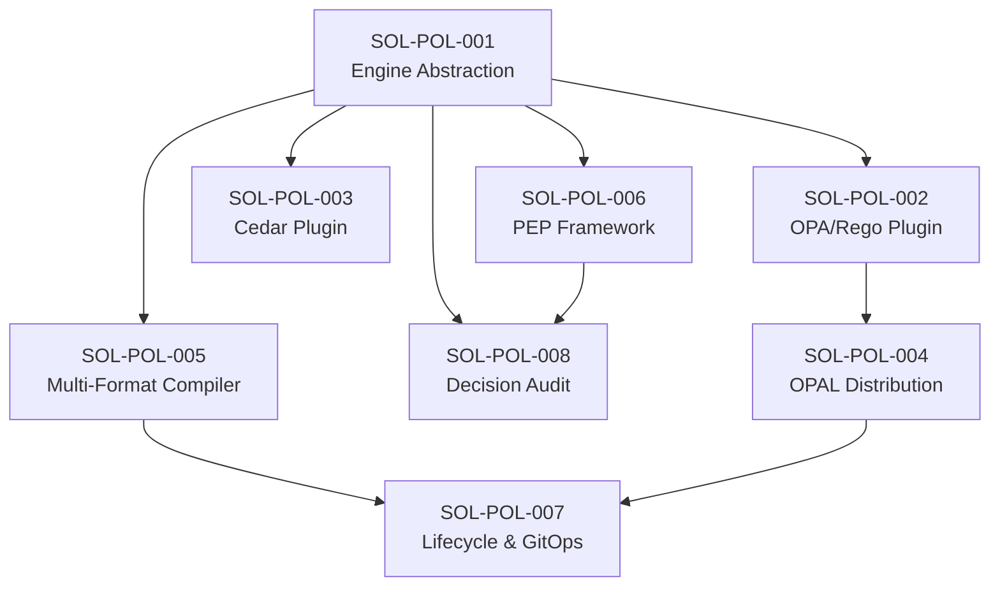

# Solutions — V3 Policy (Multi-Engine Policy Management)

| Metadata | Value |
|---|---|
| Version | v3 |
| Created | 2026-05-17 |
| Source | architecture.md + TDD.md → CR-POL-00x analysis |

---

## Solution Index

| SOL ID | CR Reference | Title | Status |
|---|---|---|---|
| SOL-POL-001 | CR-POL-001 | Policy Engine Abstraction Layer | Proposed |
| SOL-POL-002 | CR-POL-002 | OPA/Rego Policy Engine Plugin | Proposed |
| SOL-POL-003 | CR-POL-003 | Cedar Policy Engine Plugin | Proposed |
| SOL-POL-004 | CR-POL-004 | OPAL Policy Distribution Integration | Proposed |
| SOL-POL-005 | CR-POL-005 | Multi-Format Policy Compiler | Proposed |
| SOL-POL-006 | CR-POL-006 | Policy Enforcement Point Framework | Proposed |
| SOL-POL-007 | CR-POL-007 | Policy Lifecycle & GitOps Pipeline | Proposed |
| SOL-POL-008 | CR-POL-008 | Policy Decision Audit & Analytics | Proposed |

---

## Architecture Layer Mapping Summary

```
┌──────────────────────────────────────────────────────────────────────┐
│ L2 — API Gateway                                                      │
│   └── policy_webhook.go (SOL-007: Git webhook handler)                │
├──────────────────────────────────────────────────────────────────────┤
│ L3 — Security Layer                                                    │
│   └── APIPep (SOL-006: replaces inline ACL checks)                    │
├──────────────────────────────────────────────────────────────────────┤
│ L4 — Service Layer                                                     │
│   ├── DatabaseQueryPEP (SOL-006: masking enforcement)                 │
│   └── AnalyticsService (SOL-008: decision analytics API)              │
├──────────────────────────────────────────────────────────────────────┤
│ L5 — Component Layer                                                   │
│   ├── PolicyManager (SOL-001: multi-engine orchestrator)              │
│   ├── PolicyDecisionCache (SOL-001: LRU+TTL cache)                    │
│   ├── CELEngine adapter (SOL-001: backward compat bridge)             │
│   ├── OPADataLoader (SOL-002: Bytebase → OPA sync)                   │
│   ├── CedarDataLoader (SOL-003: Bytebase → Cedar sync)               │
│   ├── PolicyCompiler (SOL-005: multi-format compilation)              │
│   ├── PEPRegistry (SOL-006: enforcement point routing)                │
│   ├── LifecycleManager (SOL-007: state machine + GitOps)              │
│   └── DecisionLogger (SOL-008: async decision logging)                │
├──────────────────────────────────────────────────────────────────────┤
│ L6 — Runner Layer                                                      │
│   ├── OPALRunner (SOL-004: OPAL data publisher runner)                │
│   ├── MigrationPEP (SOL-006: task execution gate)                     │
│   └── DecisionLogger.Run() (SOL-008: async log consumer)              │
├──────────────────────────────────────────────────────────────────────┤
│ L7 — Plugin Layer                                                      │
│   ├── OPAEmbeddedEngine (SOL-002: in-process OPA)                     │
│   ├── OPASidecarEngine (SOL-002: REST API to OPA server)              │
│   ├── OPALClientEngine (SOL-004: OPA + OPAL distribution)            │
│   ├── CedarEngine (SOL-003: Cedar authorization)                      │
│   ├── ExternalPEP (SOL-006: Envoy/Kong sidecar)                      │
│   └── OPALogExporter (SOL-008: OPA Decision Log format)              │
├──────────────────────────────────────────────────────────────────────┤
│ L8 — Store Layer                                                       │
│   ├── policy_engine table (SOL-001)                                    │
│   ├── policy_definition table (SOL-001)                                │
│   ├── policy_version table (SOL-007)                                   │
│   └── policy_decision_log table (SOL-008)                              │
├──────────────────────────────────────────────────────────────────────┤
│ L10 — Infrastructure Layer                                             │
│   ├── Proto: policy_engine.proto (SOL-001)                             │
│   ├── Proto: policy_audit.proto (SOL-008)                              │
│   ├── Prometheus metrics (SOL-001, SOL-006, SOL-008)                   │
│   └── Docker Compose: OPAL sidecar (SOL-004)                          │
└──────────────────────────────────────────────────────────────────────┘
```

---

## Dependency Graph



---

## New Package Layout

```
backend/component/policy/
├── engine.go               ← SOL-001: PolicyEngine interface
├── manager.go              ← SOL-001: PolicyManager orchestrator
├── definition.go           ← SOL-001: PolicyDefinition types
├── evaluation.go           ← SOL-001: EvaluationRequest/PolicyDecision
├── cache.go                ← SOL-001: PolicyDecisionCache
├── cel_engine.go           ← SOL-001: CELEngine adapter
├── metrics.go              ← SOL-001: Prometheus metrics
├── registry.go             ← SOL-001: Engine factory registry
├── opa/                    ← SOL-002: OPA engine plugin
│   ├── init.go, embedded.go, sidecar.go, config.go
│   ├── input.go, data_loader.go, bundle.go
│   └── templates/
├── cedar/                  ← SOL-003: Cedar engine plugin
│   ├── init.go, engine.go, config.go, schema.go
│   ├── data_loader.go, analyzer.go
│   └── templates/
├── opal/                   ← SOL-004: OPAL distribution
│   ├── client.go, publisher.go, config.go
│   └── callbacks.go
├── compiler/               ← SOL-005: Multi-format compiler
│   ├── compiler.go, abstract.go, converter.go
│   ├── rego.go, cedar.go, cel.go, yaml.go
│   └── importer.go
├── pep/                    ← SOL-006: PEP framework
│   ├── pep.go, registry.go
│   ├── api.go, query.go, migration.go, export.go
│   └── external.go
├── lifecycle/              ← SOL-007: Lifecycle & GitOps
│   ├── manager.go, gitops.go, test_runner.go
│   ├── impact.go, version.go
│   └── webhook.go
└── audit/                  ← SOL-008: Decision audit
    ├── logger.go, analytics.go, metrics.go
    └── opa_export.go
```

---

## Server Bootstrap Changes

```
NewServer(ctx, profile)
  ├── 1.   StartMetadataInstance()
  ├── 2.   store.New(pgURL)
  ├── 2.5  secretManager = secret.NewManager(...)      ← CR-VLT-001
  ├── 3.   migrator.MigrateSchema()
  ├── 4.   enterprise.NewLicenseService()
  ├── 5.   iam.NewManager()
  ├── 5.5  policyManager = policy.NewManager(...)      ← SOL-001
  ├── 5.6  pepRegistry = pep.NewRegistry(policyManager) ← SOL-006
  ├── 5.7  decisionLogger = audit.NewDecisionLogger()   ← SOL-008
  ├── 6.   webhook.NewManager()
  ├── 7.   dbfactory.New()
  └── ...
```

---

## New Database Tables

| Table | SOL | PK Pattern | Purpose |
|---|---|---|---|
| `policy_engine` | SOL-001 | `id` (TEXT) | Engine configurations |
| `policy_definition` | SOL-001 | `(workspace, id)` | External policy definitions |
| `policy_version` | SOL-007 | `(workspace, id)` | Policy version history |
| `policy_decision_log` | SOL-008 | `(workspace, id)` | Decision audit trail |
