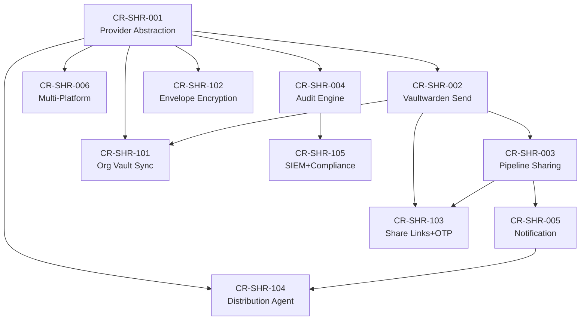

# Change Requests — V3 Sharing (Secure Sensitive Data Sharing via Intermediate Platforms)

| Metadata | Value |
|---|---|
| Version | v3 |
| Scope | Chia sẻ thông tin nhạy cảm an toàn qua các nền tảng trung gian (Vaultwarden, HashiCorp Vault, 1Password) |
| Source | Gap Analysis từ Architecture, TDD, PRD + Vaultwarden expertise |
| Created | 2026-05-17 |

---

## Tổng quan

Bytebase hỗ trợ **External Secret Manager** (SEC-18 — Enterprise) để lưu trữ credentials qua HashiCorp Vault, AWS SM, GCP SM. Tuy nhiên, hệ thống **chưa có khả năng chia sẻ thông tin nhạy cảm** giữa các team, môi trường, hoặc hệ thống bên ngoài một cách an toàn.

Các CR được chia thành **2 series**:
- **CR-SHR-001 → 006** (Foundation): Abstraction layer, Vaultwarden Send, pipeline integration, audit, notification, multi-platform
- **CR-SHR-101 → 105** (Extended): Organization vault sync, envelope encryption, public share links, cross-platform distribution, SIEM integration

---

## Danh sách Change Requests

### Foundation Series (CR-SHR-001 → 006)

| CR ID | Title | Priority | Status |
|---|---|---|---|
| CR-SHR-001 | [Sharing Provider Abstraction Layer](./CR-SHR-001-sharing-provider-abstraction.md) | P0 — Critical | Draft |
| CR-SHR-002 | [Vaultwarden Send Integration](./CR-SHR-002-vaultwarden-send-integration.md) | P0 — Critical | Draft |
| CR-SHR-003 | [Pipeline Credential Sharing Workflow](./CR-SHR-003-pipeline-credential-sharing.md) | P1 — High | Draft |
| CR-SHR-004 | [Sharing Audit & Compliance Engine](./CR-SHR-004-sharing-audit-compliance.md) | P1 — High | Draft |
| CR-SHR-005 | [Secure Credential Delivery Notification](./CR-SHR-005-secure-delivery-notification.md) | P2 — Medium | Draft |
| CR-SHR-006 | [Multi-Platform Sharing Federation](./CR-SHR-006-multi-platform-federation.md) | P2 — Medium | Draft |

### Extended Series (CR-SHR-101 → 105)

| CR ID | Title | Extends | Priority | Status |
|---|---|---|---|---|
| CR-SHR-101 | [Vaultwarden Organization Vault Sync](./CR-SHR-101-vaultwarden-credential-sharing.md) | CR-SHR-001, CR-SHR-002 | P0 — Critical | Draft |
| CR-SHR-102 | [Envelope & Transit Encryption (BEE)](./CR-SHR-102-envelope-transit-encryption.md) | CR-SHR-001 | P0 — Critical | Draft |
| CR-SHR-103 | [Secure Share Link with TTL & OTP](./CR-SHR-103-secure-share-link-generator.md) | CR-SHR-002, CR-SHR-003 | P1 — High | Draft |
| CR-SHR-104 | [Cross-Platform Secret Distribution Agent](./CR-SHR-104-cross-platform-distribution-agent.md) | CR-SHR-001, CR-SHR-005 | P1 — High | Draft |
| CR-SHR-105 | [Extended Audit, SIEM & Compliance](./CR-SHR-105-audit-siem-compliance.md) | CR-SHR-004 | P1 — High | Draft |

---

## Kiến trúc tổng quan

```
┌────────────────────────────────────────────────────────────────────────┐
│                    Bytebase Core Platform                              │
│  ┌──────────────────────────────────────────────────────────────────┐  │
│  │              Secure Sharing Layer                                 │  │
│  │  ┌───────────────┐ ┌──────────────┐ ┌────────────────────────┐  │  │
│  │  │ Share Link    │ │  Envelope    │ │  Distribution Agent   │  │  │
│  │  │ Generator     │ │  Encryption  │ │  (auto-sync targets)  │  │  │
│  │  │ (103)         │ │  (102)       │ │      (104)            │  │  │
│  │  └──────┬────────┘ └──────┬───────┘ └──────────┬─────────────┘  │  │
│  │         │                 │                    │                  │  │
│  │  ┌──────▼─────────────────▼────────────────────▼──────────────┐  │  │
│  │  │         Sharing Provider Abstraction (001)                  │  │  │
│  │  │   Pipeline Sharing (003)  |  Notification (005)            │  │  │
│  │  └──────┬──────────┬──────────┬──────────┬───────────────────┘  │  │
│  │         │          │          │          │                       │  │
│  │  ┌──────▼──┐ ┌─────▼──┐ ┌────▼──┐ ┌────▼──────┐              │  │
│  │  │Vaultwar │ │Vault   │ │1Pass  │ │ Azure KV  │              │  │
│  │  │den (002)│ │Transit │ │Connect│ │           │              │  │
│  │  │Org (101)│ │  (006) │ │ (006) │ │   (006)   │              │  │
│  │  └─────────┘ └────────┘ └───────┘ └───────────┘              │  │
│  │                                                                │  │
│  │  ┌──────────────────────────────────────────────────────────┐  │  │
│  │  │      Audit & Compliance (004) + SIEM Integration (105)   │  │  │
│  │  └──────────────────────────────────────────────────────────┘  │  │
│  └──────────────────────────────────────────────────────────────────┘  │
└────────────────────────────────────────────────────────────────────────┘
```

---

## Dependency Graph



---

## Nguyên tắc thiết kế

1. **Zero-Trust Sharing** — Mọi secret mã hóa end-to-end (BEE envelope); nền tảng trung gian chỉ thấy ciphertext
2. **Least Privilege** — Share link chỉ cấp quyền tối thiểu, có TTL, giới hạn access count
3. **Vaultwarden-First** — Ưu tiên Vaultwarden (self-hosted, Bitwarden-compatible, chi phí thấp)
4. **Plugin Architecture** — Mỗi sharing provider là plugin, dễ mở rộng (giống DB driver pattern)
5. **Full Auditability** — HMAC chain tamper-proof audit log + SIEM export
6. **Enterprise Feature Gating** — Tất cả features trong ENTERPRISE plan

---

## Tham chiếu kiến trúc

| Layer | Component | Relevance |
|---|---|---|
| L5 — Component | `component/secret/` | Base layer, extended by sharing providers |
| L3 — Security | Auth/ACL Interceptor | Access control cho sharing operations |
| L4 — Service | SettingService, InstanceService | Config + credential source |
| L6 — Runner | TaskRun, DataCleaner | Pipeline integration, TTL cleanup |
| L7 — Plugin | Plugin registry pattern | Sharing provider registration |
| L8 — Data Access | Store | Share metadata, audit events |
| L9 — Enterprise | License Service | Feature gate |
