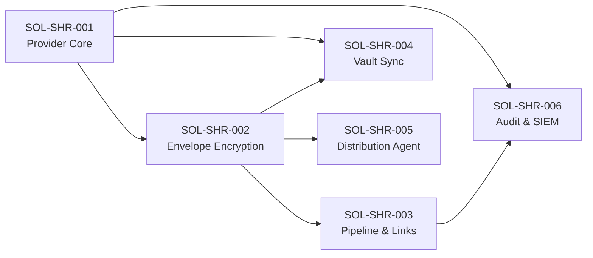

# Solutions — Secure Sensitive Data Sharing

| Metadata | Value |
|---|---|
| Source CRs | CR-SHR-001 → 006, CR-SHR-101 → 105 |
| Architecture | `specs/architecture.md` (L3-L8) |
| TDD | `specs/TDD.md` (Plugin pattern, Bus events, Runner architecture) |
| Created | 2026-05-17 |

---

## Tổng quan

Mỗi solution document mô tả **cách triển khai cụ thể** cho một hoặc nhiều CRs, bám sát kiến trúc Bytebase hiện tại:
- **Layered Architecture** (L1–L10)
- **Plugin registration via init()** (giống DB driver pattern)
- **Bus event-driven coordination** (Go channels)
- **Runner-based async processing** (background goroutines)
- **Protobuf-first API** (ConnectRPC + gRPC-Gateway)
- **Enterprise feature gating** (license service)

---

## Danh sách Solutions

| Solution ID | Title | CRs Covered | Scope |
|---|---|---|---|
| SOL-SHR-001 | [Sharing Provider Core & Plugin Registry](./SOL-SHR-001-sharing-provider-core.md) | CR-SHR-001, CR-SHR-002, CR-SHR-006 | L5 (Component) + L7 (Plugin) |
| SOL-SHR-002 | [Envelope Encryption Engine (BEE)](./SOL-SHR-002-envelope-encryption-engine.md) | CR-SHR-102 | L5 (Component) |
| SOL-SHR-003 | [Pipeline Sharing & Secure Links](./SOL-SHR-003-pipeline-sharing-secure-links.md) | CR-SHR-003, CR-SHR-103, CR-SHR-005 | L4 (Service) + L6 (Runner) |
| SOL-SHR-004 | [Vaultwarden Organization Vault Sync](./SOL-SHR-004-vaultwarden-org-vault-sync.md) | CR-SHR-101 | L5 (Component) + L6 (Runner) |
| SOL-SHR-005 | [Cross-Platform Distribution Agent](./SOL-SHR-005-distribution-agent.md) | CR-SHR-104 | L5 (Component) + L6 (Runner) |
| SOL-SHR-006 | [Audit Trail, Anomaly Detection & SIEM](./SOL-SHR-006-audit-anomaly-siem.md) | CR-SHR-004, CR-SHR-105 | L3 (Security) + L6 (Runner) |

---

## Implementation Order

Sprint 1-2 → SOL-SHR-001 → Sprint 3-4 → SOL-SHR-002 → Sprint 4-6 → SOL-SHR-003/004 → Sprint 7-9 → SOL-SHR-005/006
