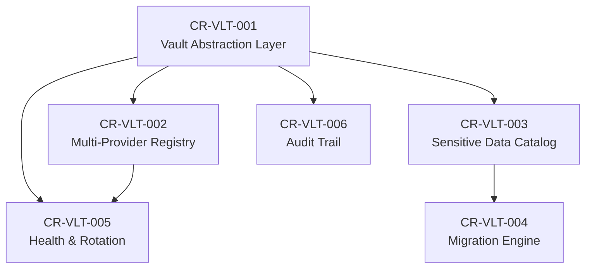

# Change Requests — V3 Vault (Centralized Secret Management)

| Metadata | Value |
|---|---|
| Version | v3 |
| Scope | Lưu trữ dữ liệu nhạy cảm vào Vault, hỗ trợ multi-provider |
| Source | Gap Analysis từ architecture.md, TDD.md, PRD.md |
| Created | 2026-05-17 |

---

## Tổng quan

Các CR trong thư mục này nhằm **mở rộng khả năng quản lý dữ liệu nhạy cảm** của Bytebase, chuyển từ mô hình obfuscation/plaintext lưu trong PostgreSQL sang mô hình **centralized vault** hỗ trợ nhiều nhà cung cấp.

### Hiện trạng (Current State)

| Dữ liệu nhạy cảm | Cách lưu hiện tại | Vị trí |
|---|---|---|
| DB Instance passwords | XOR obfuscation (base64) + optional external secret | `store/instance.go` |
| SSL certs/keys | XOR obfuscation | `store/instance.go` |
| SSH passwords/keys | XOR obfuscation | `store/instance.go` |
| SMTP password | Plaintext JSONB | `setting` table |
| IDP client secrets | Plaintext JSONB | `setting` table |
| AI API keys | Plaintext JSONB | `setting` table |
| Webhook tokens | Plaintext JSONB | `setting` table |
| Auth secret (JWT signing) | Plaintext | `server_config` table |
| IM notification tokens | Plaintext JSONB | `setting` table |
| License key | Plaintext | `setting` table |
| OAuth2 client secrets | Hashed (bcrypt) | `oauth2_client` table |

### Mục tiêu (Target State)

- **Tất cả** dữ liệu nhạy cảm có thể được lưu vào external vault
- Hỗ trợ **multi-provider vault**: HashiCorp Vault, Vaultwarden/Bitwarden, AWS SM, GCP SM, Azure Key Vault, CyberArk, K8s Secrets
- **Vault abstraction layer** giúp thêm provider mới không cần thay đổi business logic
- **Migration path** từ obfuscation/plaintext sang vault-backed storage
- **Fallback**: Vẫn hỗ trợ lưu local (obfuscation) cho deployment đơn giản

---

## Danh sách Change Requests

| CR ID | Title | Priority | Status | Dependencies |
|---|---|---|---|---|
| CR-VLT-001 | Vault Provider Abstraction Layer | P0 — Critical | Draft | — |
| CR-VLT-002 | Multi-Provider Vault Registry | P0 — Critical | Draft | CR-VLT-001 |
| CR-VLT-003 | Platform-Wide Sensitive Data Catalog | P0 — Critical | Draft | CR-VLT-001 |
| CR-VLT-004 | Sensitive Data Migration Engine | P1 — High | Draft | CR-VLT-001, CR-VLT-003 |
| CR-VLT-005 | Vault Health Monitor & Secret Rotation | P1 — High | Draft | CR-VLT-001, CR-VLT-002 |
| CR-VLT-006 | Vault Audit Trail & Access Logging | P2 — Medium | Draft | CR-VLT-001 |

---

## Nguyên tắc thiết kế

1. **Provider-Agnostic Interface** — Business logic không phụ thuộc vào vault provider cụ thể
2. **Zero Plaintext at Rest** — Tất cả secrets hoặc được encrypt hoặc delegate sang external vault
3. **Graceful Degradation** — Khi vault unavailable, fallback sang cached/obfuscated values với TTL
4. **Enterprise Feature Gating** — Multi-vault và advanced features chỉ cho Enterprise plan
5. **Backward Compatible** — Existing obfuscation model vẫn hoạt động cho FREE/TEAM plans
6. **Single Configuration Point** — Vault config tập trung tại workspace setting, không per-instance

---

## Dependency Graph

