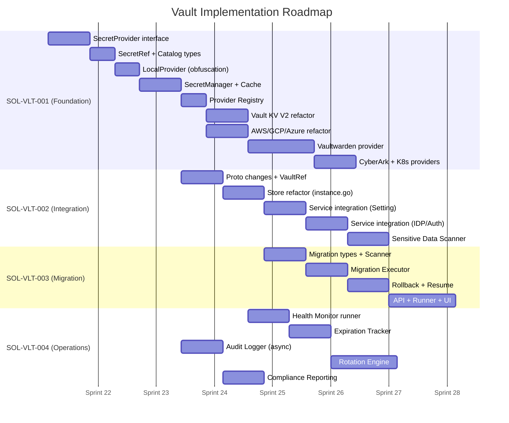

# Solutions — Vault Centralized Secret Management

| Metadata | Value |
|---|---|
| Version | v3 |
| Scope | Giải pháp triển khai cho CR-VLT-001 → CR-VLT-006 |
| Architecture Ref | `specs/architecture.md` (L5 Component Layer, L7 Plugin Layer) |
| TDD Ref | `specs/TDD.md` (Section 2: Bootstrap, Section 6: Plugin System) |
| Created | 2026-05-17 |

---

## Tổng quan

Bộ giải pháp này mô tả chi tiết cách triển khai 6 Change Requests cho hệ thống Vault Secret Management, tuân thủ nghiêm ngặt kiến trúc Layered Architecture hiện tại của Bytebase.

### Nguyên tắc thiết kế

1. **Respect Layer Boundaries** — Vault operations nằm tại L5 (Component Layer), register providers theo pattern L7 (Plugin Layer)
2. **Reuse Existing Patterns** — Factory pattern giống `plugin/db/`, caching giống `store.go`, runner giống `runner/`
3. **Backward Compatible** — XOR obfuscation (LocalProvider) vẫn là default, vault là opt-in Enterprise feature
4. **Single Binary** — Tất cả providers build vào cùng binary, chọn runtime qua config

### Architecture Placement

```
L5 — COMPONENT LAYER
  ├── component/secret/               # Core vault abstraction
  │   ├── provider.go                 # SecretProvider interface
  │   ├── manager.go                  # SecretManager orchestrator
  │   ├── registry.go                 # Provider factory registry
  │   ├── cache.go                    # Secret caching
  │   ├── ref.go                      # SecretRef types
  │   ├── catalog.go                  # Sensitive data catalog
  │   ├── metrics.go                  # Prometheus metrics
  │   ├── audit/                      # Audit trail subsystem
  │   │   ├── hook.go
  │   │   ├── logger.go
  │   │   └── analytics.go
  │   ├── migration/                  # Secret migration engine
  │   │   ├── executor.go
  │   │   ├── scanner.go
  │   │   └── rollback.go
  │   ├── rotation/                   # Secret rotation engine
  │   │   ├── executor.go
  │   │   └── lease.go
  │   └── providers/                  # Provider implementations
  │       ├── local.go                # XOR obfuscation wrapper
  │       ├── vault_kv.go             # HashiCorp Vault KV V2
  │       ├── vaultwarden.go          # Vaultwarden/Bitwarden
  │       ├── aws_sm.go               # AWS Secrets Manager
  │       ├── gcp_sm.go               # GCP Secret Manager
  │       ├── azure_kv.go             # Azure Key Vault
  │       ├── cyberark.go             # CyberArk Conjur
  │       └── k8s.go                  # Kubernetes Secrets
  │
L6 — RUNNER LAYER
  ├── runner/vaulthealth/             # Health monitor runner
  └── runner/vaultmigration/          # Migration background runner
  
L4 — SERVICE LAYER
  └── api/v1/vault_*_service.go       # gRPC API services
```

---

## Danh sách Solution Documents

| SOL ID | CR Reference | Title | File |
|---|---|---|---|
| SOL-VLT-001 | CR-VLT-001 + CR-VLT-002 | Vault Abstraction & Multi-Provider | [SOL-VLT-001](SOL-VLT-001-abstraction-and-providers.md) |
| SOL-VLT-002 | CR-VLT-003 | Sensitive Data Catalog & Service Integration | [SOL-VLT-002](SOL-VLT-002-catalog-and-integration.md) |
| SOL-VLT-003 | CR-VLT-004 | Sensitive Data Migration Engine | [SOL-VLT-003](SOL-VLT-003-migration-engine.md) |
| SOL-VLT-004 | CR-VLT-005 + CR-VLT-006 | Health, Rotation & Audit | [SOL-VLT-004](SOL-VLT-004-health-rotation-audit.md) |

> **Ghi chú**: CR-VLT-001 và CR-VLT-002 được gộp vào SOL-VLT-001 vì Provider Abstraction và Registry là tightly coupled. Tương tự CR-VLT-005 và CR-VLT-006 gộp vào SOL-VLT-004 vì cùng thuộc operational domain.

---

## Implementation Order


